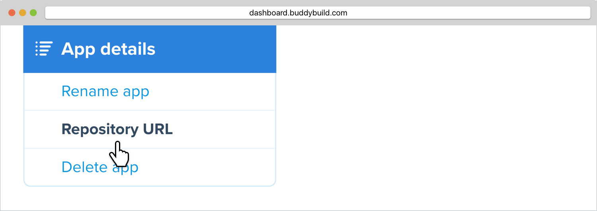
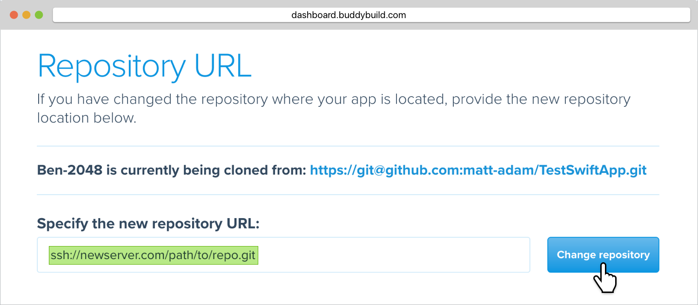
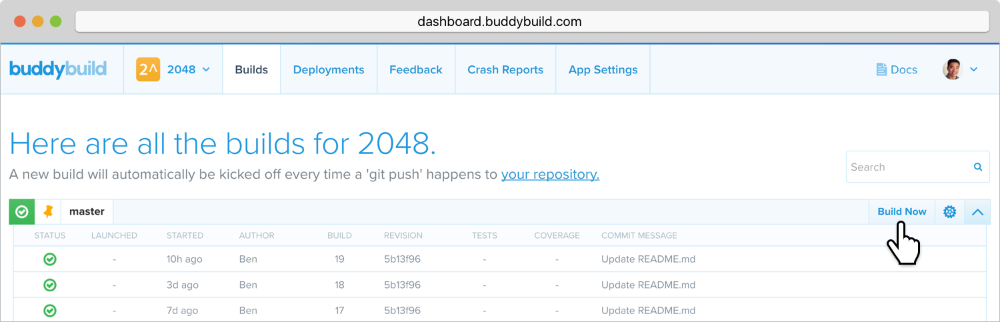

= Change your app's repo URL

If you've changed the location of your source code hosting provider to
another, or renamed the repo, the repo clone URL will need to be updated
in buddybuild as well.

Instead of deleting and re-adding the app and losing any buddybuild
settings, you can quickly update your repo's URL in buddybuild.

Here's how to change your apps's repo URL in buddybuild:

Click on **App Settings**.

image:img/Builds---Settings.png[The buddybuild dashboard", 1500, 483]

In the left navigation, click on **App details**, then **Repository
URL**.

Enter in the new URL for your repository, and click on **Change
repository**.

[NOTE]
======
**Finding the repository URL**

For GitHub, Bitbucket and GitLab repositories, you can use the HTTPS URL
for your repository, such as `\https://github.com/MyTeam/MyRepo`.

For other Source Control Systems, you can see our
link:../repository/README.adoc[Source Control Systems] documentation for
further instructions on finding the repository's clone URL.
======

You can now start a new build to verify that your app is being built
from the new repository. To do this, click on **Build Now**.

== Did you switch away from GitHub, Bitbucket or GitLab?

If you were previously using GitHub, Bitbucket or GitLab, and are now
using a different source control system, any collaborators that
previously had access from GitHub, Bitbucket or GitLab will no longer be
able to use buddybuild. In this case, you can invite collaborators to
use buddybuild directly in link:access.adoc#option2[Manage App Access].
