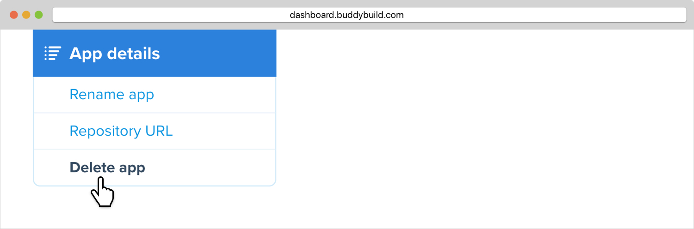
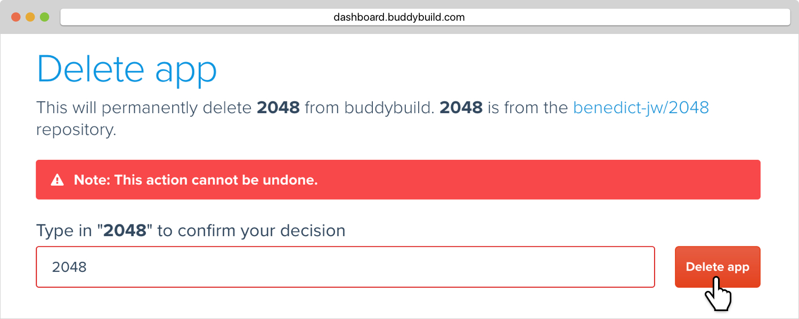

--- 
titletext: How to delete a mobile app from buddybuild
description: >
  You can delete apps you no longer need as part of your buddybuild mobile CI/CD
  process.
---
= Delete an app

Here's how to delete an app from buddybuild:

Click on **App Settings**.

image:img/Builds---Settings.png["The buddybuild dashboard", 1500, 483]

In the left navigation, click on **App details**, then **Delete app**.

Type in the app's name, then click on **Delete app**.

