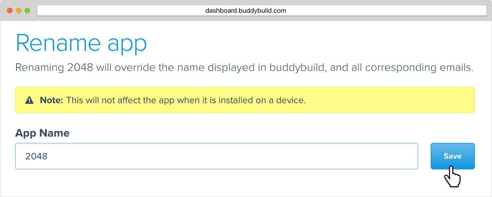

= Rename an app

By default buddybuild uses the same app name set in your project as the
app display name. However, you may want to change the name of your app
in buddybuild to help distinguish between different versions of your app
(alpha, beta, staging, etc.) in pre-production.

[NOTE]
======
**Renaming only affects the buddybuild interface**

Note that this change only affects the name of your app displayed in
buddybuild, in commit status messages and notifications. Renaming your
app in buddybuild does not affect the app when it is installed on a
device.
======

Here are the instructions to rename your app in buddybuild:

Click on **App Settings**:

image:img/Builds---Settings.png[,1500,483]

In the left navigation, click on **App details**, then **Rename app**.

Enter a new name, then click on **Save**. You can even enter
link:http://getemoji.com/[emojis] in the app name.

