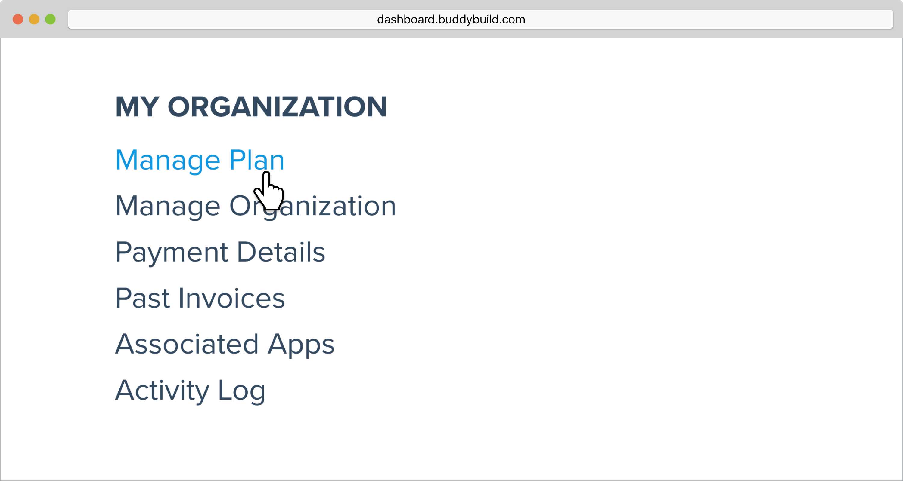
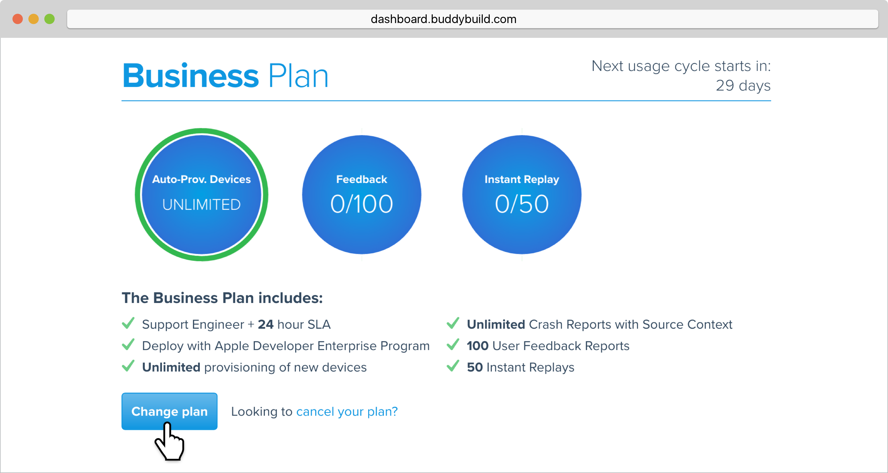
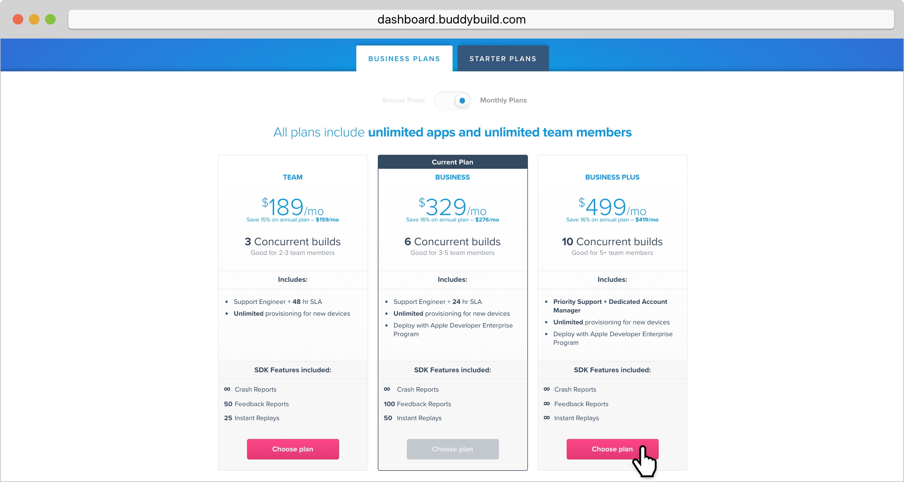
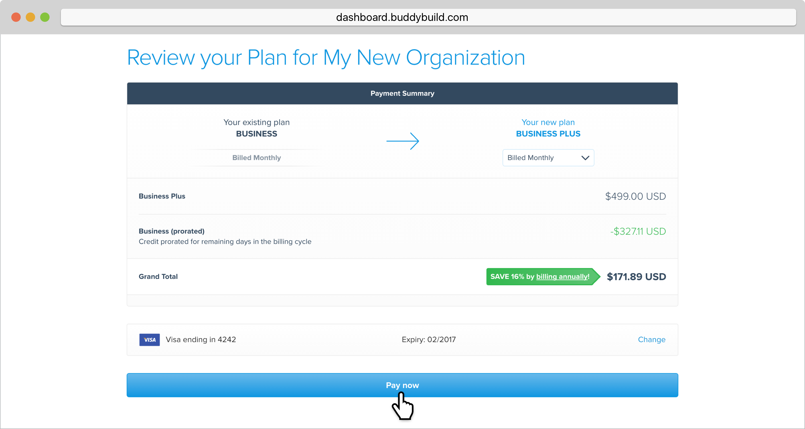
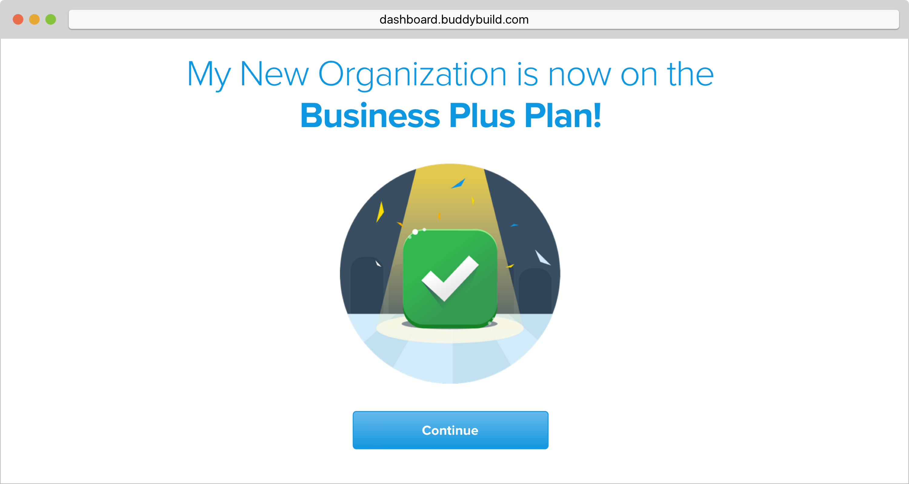

= Change your plan

If you'd like to change the number of concurrent builds, limits on
feedback and instant replays, or any other features, you can do so easily
by changing the plan associated with each organization.

== Let's get started!

Hover over your avatar and click **Billing & Plans.**

image:img/Billings-and-Plans---Menu.png[,1500,800]

In the left navigation, locate the organization for which you'd like to
change plans for, and select **Manage Plan.**

Under your current plan details, click on **Change Plan.** 

Next, select the new plan that you would like to change to. If you have
any questions about our plans, or would like to inquire about a custom
plan, please don't hesitate to link:mailto:support@buddybuild.com[get in
touch!]

[WARNING]
=========
**When does my plan change take effect?**

If you are **upgrading to a higher tier**, you will have access to the
new features and limits effective immediately.

If you are **downgrading to a lower tier**, the plan change will take
effect at the end of your billing cycle. This means you get to enjoy the
benefits of your higher tiered plan for a little longer!
=========

Next, confirm your payment summary and hit Pay Now.

That's it! You've now updated your organization's plan!

