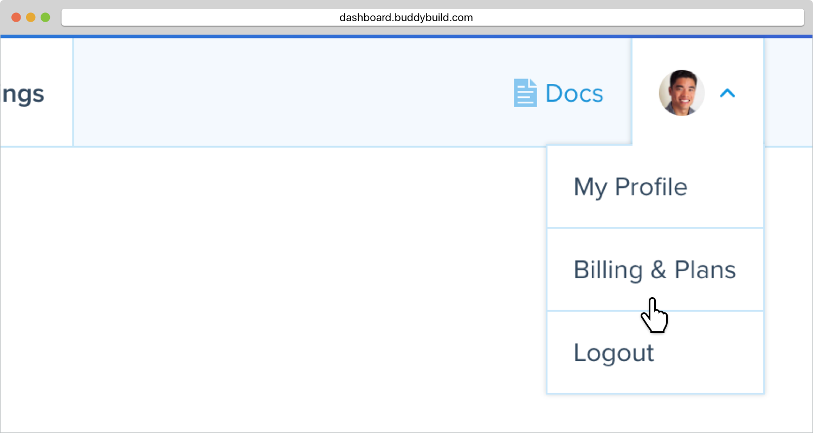
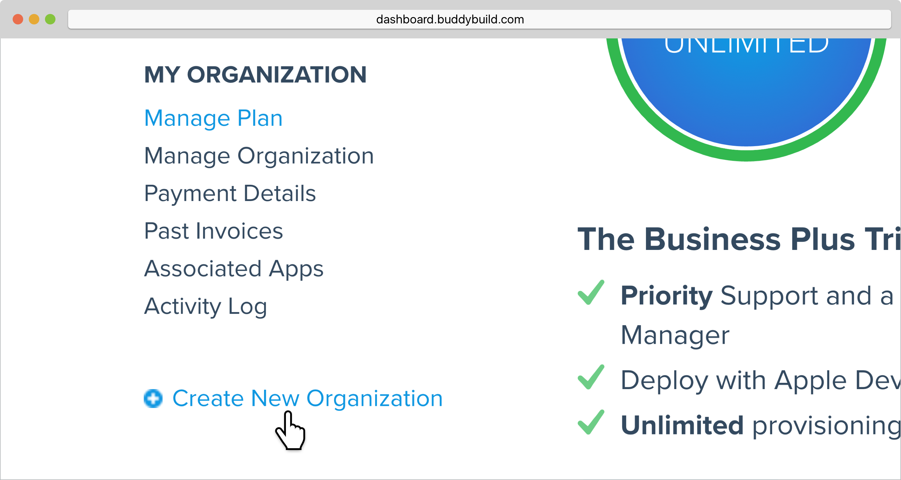
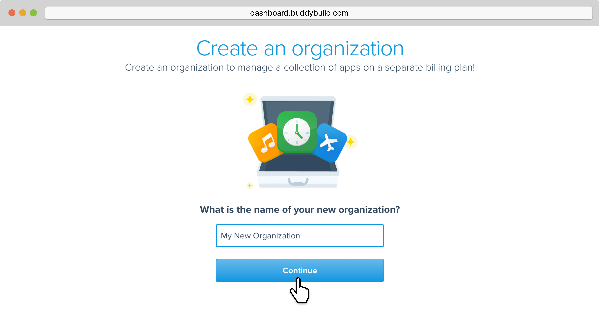
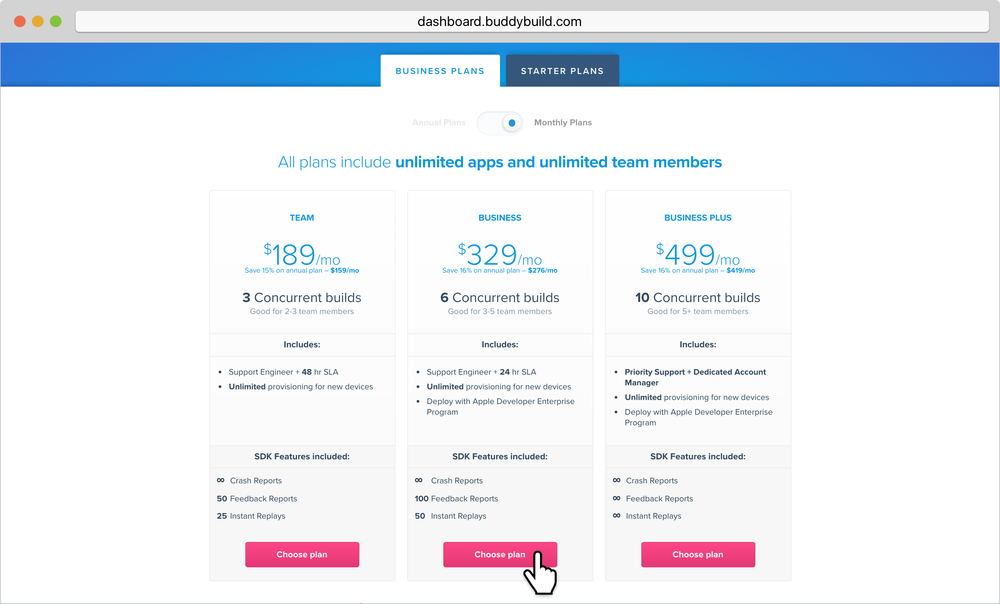
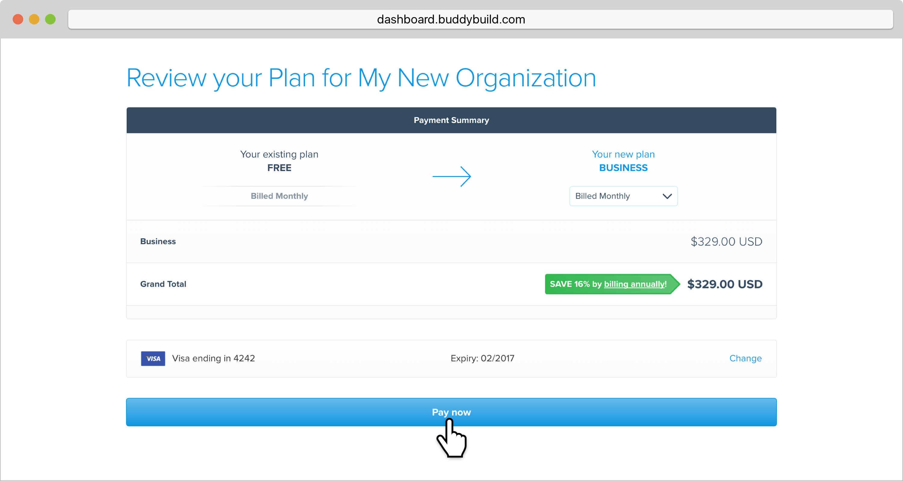
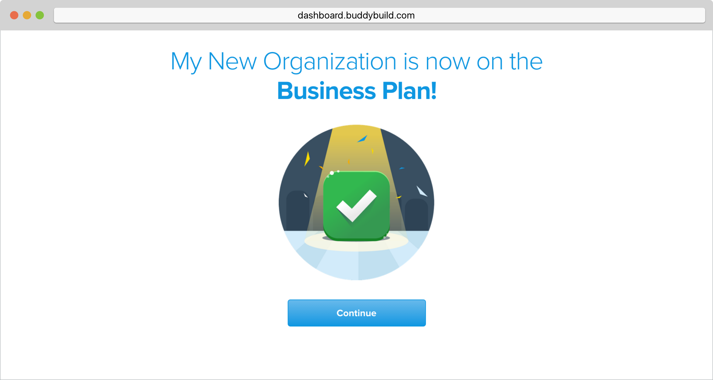

= Create an organization

A buddybuild organization ties together:

- An app (or collection of apps)
- The set of buddybuild features available to those apps though a usage
  plan
- A payment method

== Here's how to create an organization:

Hover over your avatar in the top left corner and select **Billings &
Plans**.

In the left navigation, you'll be presented with all of the
organizations you are currently a part of. At the bottom of the list,
click on **Create New Organization**.

Next, give your new organization a name and click **Continue**.

Then, **select from one of our several pricing plans** for your
organization (including our free tier).

If you have any questions about our plans, or would like to inquire
about a custom plan, please don't hesitate to
link:mailto:support@buddybuild.com[get in touch!]

Next, you'll be prompted to enter the payment details for your
organization. Once you're done, hit **Save Payment Info**.

Next, review your payment summary and click **Pay now**.

That's it! You have created a new organization. The next time you add an
app, you will have the option of adding it directly to your new
organization. Alternatively, you can also
link:transfer_apps.adoc[transfer apps from one organization to another.]

