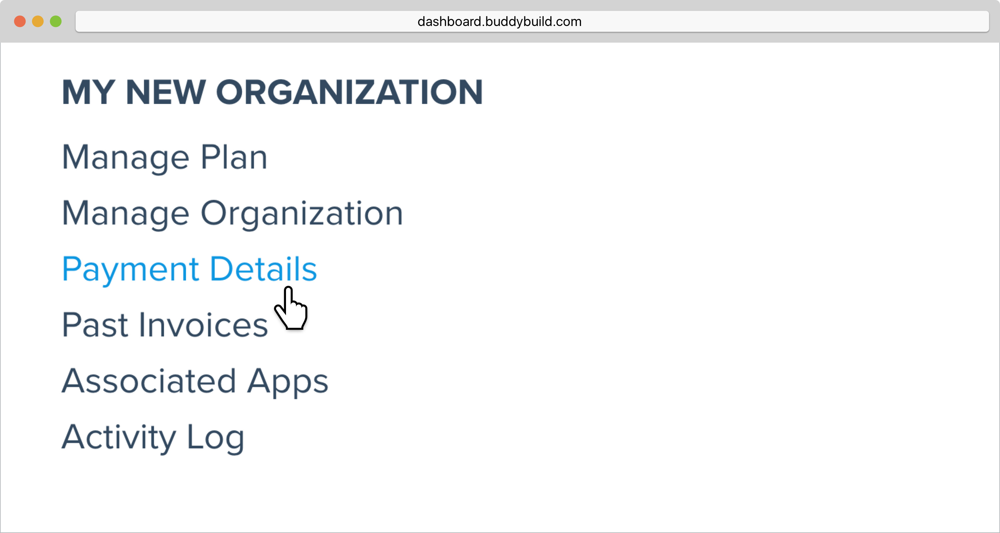
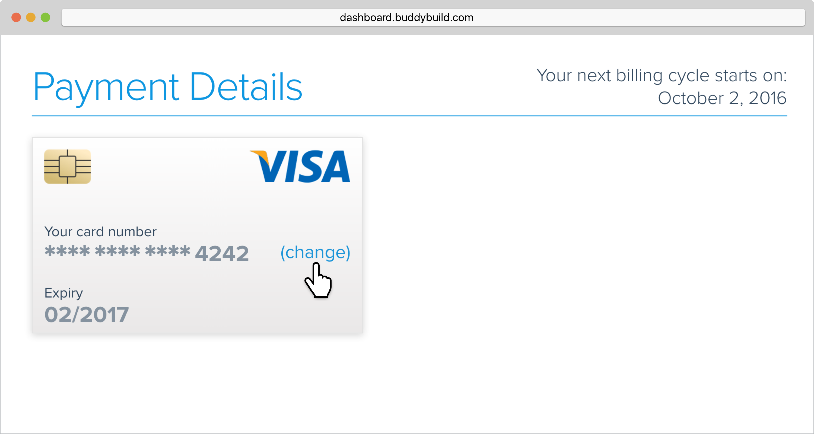
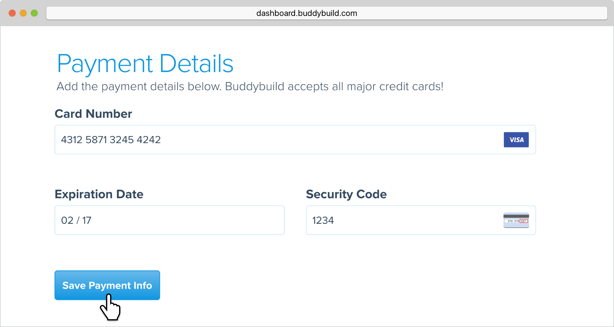
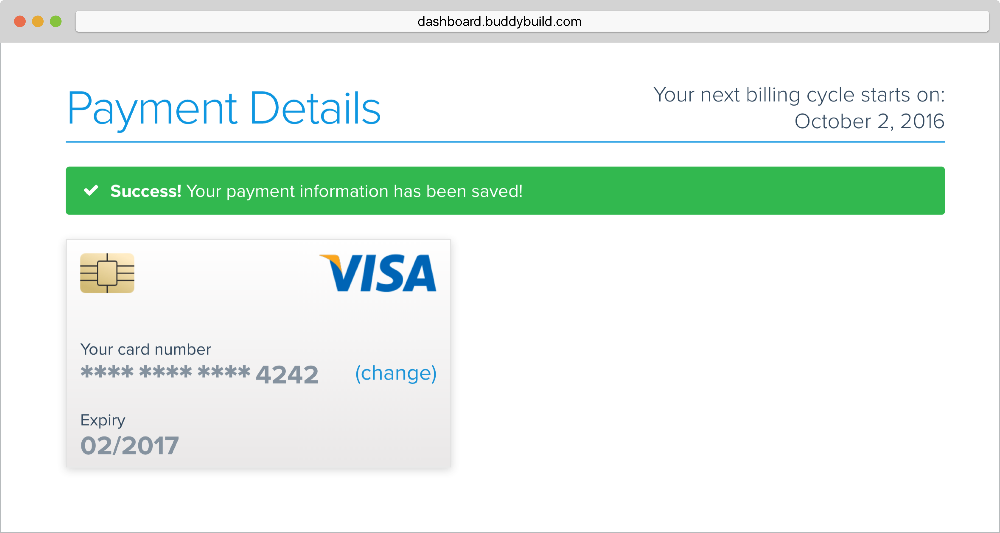

= Change payment details

Changing the payment details associated with an organization is a simple
4 step process. Follow along below to change your payment details!

First, hover over your avatar and select **Billing & Plans**.

image:img/Billings-and-Plans---Menu.png[,1500,800]

Next, locate the organization for which you would like to change payment
details for, and click **Payment Details**.

Then, on the credit card that displays your existing payment details,
click **Change**.

Re-enter your new payment details and click **Save Payment Info**.

That's it! Your new payment details have been saved and will be charged
at the beginning of your next billing cycle.

