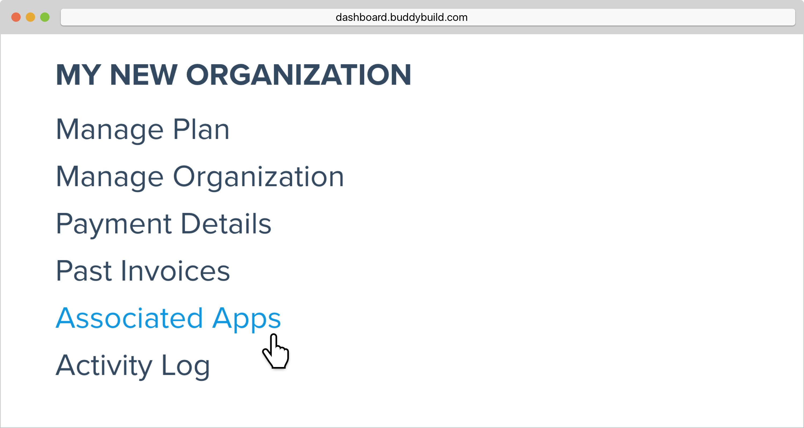
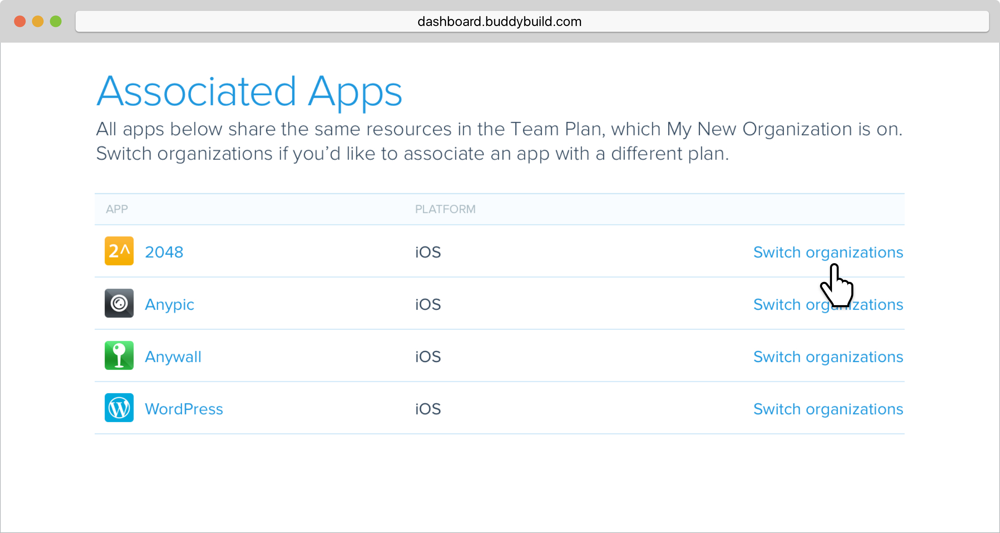
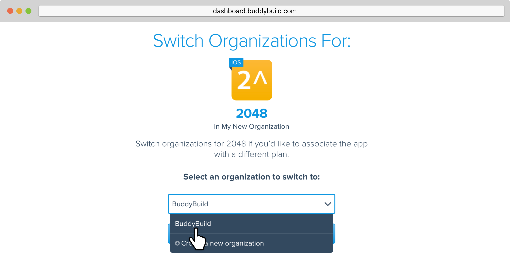
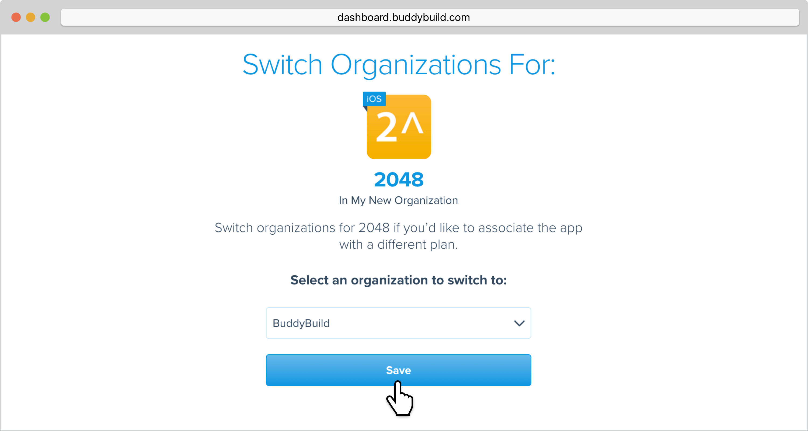
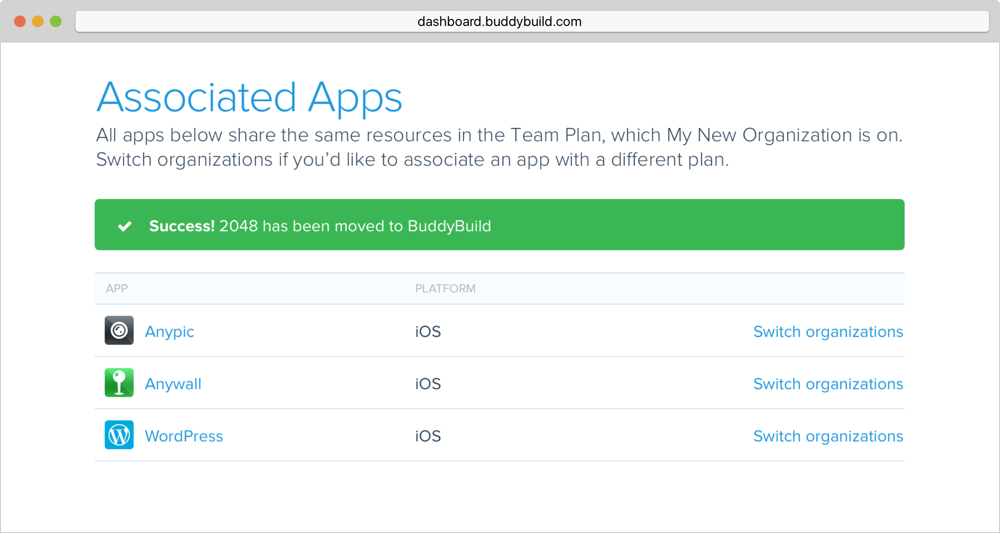

= Transfer apps between organizations

Apps that are associated with an organization consume the features and
limits of the plan which it is on. To transfer apps between
organizations, follow along below!

Hover over your avatar and select **Billing & Plans**.

image:img/Billings-and-Plans---Menu.png[,1500,800]

Locate the organization that contains the app you want to transfer and
select **Associated Apps**.

Next, locate the app you want to transfer and click **Switch
organizations**.

Click on the dropdown and **select the organization** you want to
transfer your app to.

Click **Save**, and you're done!

Your transferred app will start consuming the resources of the new
organization immediately!

