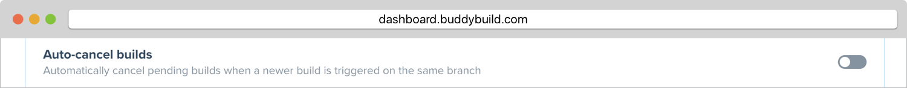

= Auto-cancel Builds

Builds can stack up when multiple commits are made in quick succession
on the same branch. If you are only interested in the most recent build,
then buddybuild can automatically cancel pending builds for you when a
new build request is received.

With this feature, buddybuild will automatically cancel all *queued* and
*running* webhook triggered builds on a branch when a newer build is
triggered by webhook for the same branch.

To enable this behavior go to *App Settings* for your app and enable
the *Auto-cancel builds* setting.

