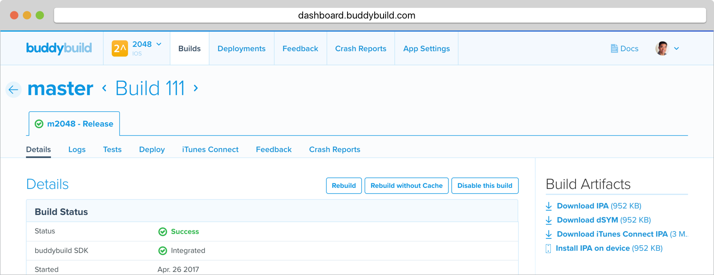
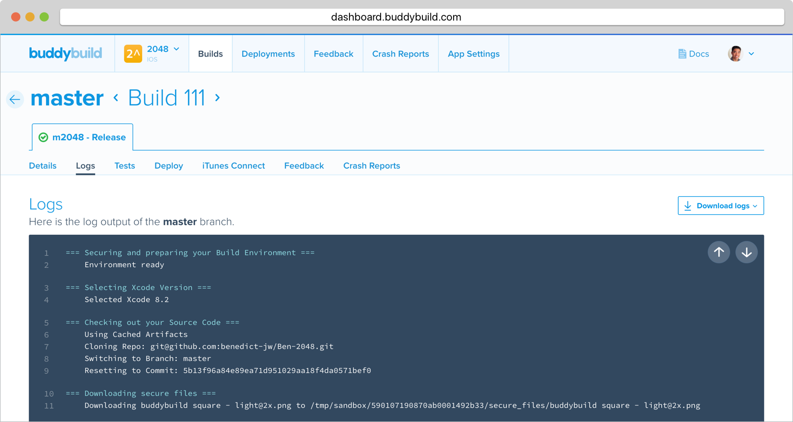

= Build Details and Logs

Which commit got built? Who pushed? How long did the build take? Which
scheme was built? Which provisioning profile did we use? How big is the
IPA file?

All are questions that can be answered by the **Build Details** page.
From the builds table, simply click on any particular build to open up
the **Build Details** page.

Here you'll find information about your build spread across the sections
below.

* Build Status
* Commit Info
* Build Inputs
* Code Signing and Versioning
* Build Artifacts

== Build Logs

Want to see exactly what happened during a build? Buddybuild shows live
build logs as they happen. Simply open a build from the builds page to
see its build log output.

The log is useful for debugging issues with your build. We automatically
parse out the relevant information in each build step.

You also have the option to download the build logs in plain text if you
want to analyze them yourself. Simply click on the **Download logs**
button to do so.
