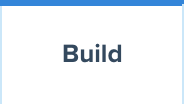
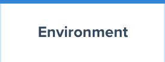
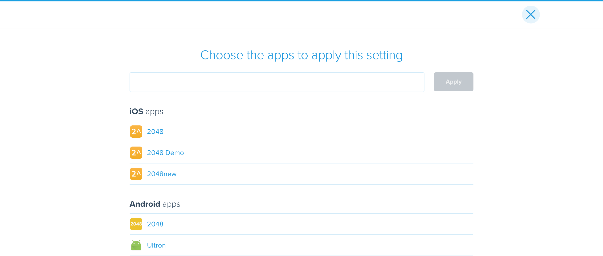

= Default build settings

Each of the available link:../README.adoc[build] settings are
app-specific. This section describes how you can specify default build
settings that automatically apply to new apps, or that can be applied to
any applications that already exist within an organization.

[IMPORTANT]
Default build settings are available for most, but not all, of the
available build settings. If you do not find a specific setting listed
in the default build settings, you need to configure that setting for
each individual app.

== How to access default app settings

. Log in to the link:https://dashboard.buddybuild.com/[buddybuild
  dashboard].

. image:../../_img/dropdown-user-manage_org.png["Select Manage Org in
  the avatar dropdown", 121, 207, role="right"]
  Move your mouse pointer over your avatar in the top right corner. A
  dropdown menu appears.

. Select **Manage Org**. The **Manage Organization** screen appears:
+
image:../../_img/screen-manage_org.png["The Manage Organization", 1280,
568, role="frame"]

. image:../../_img/dropdown-organizations.png["The current
organization", 206, 40, role="right"]
  In the left navigation, a dropdown menu exists with the current
  organization selected. Click the dropdown menu to list all of the
  organizations that you currently belong to.

. Select the organization that requires a change to the default app
  settings.

. image:img/panel-default_app_settings.png["Default App Settings", 206,
  102, role="right"]
  On the left side of screen, find the **Default App Settings** links.
  Click **Builds**. The **Build Configurations** screen is displayed:
+
image:img/screen-build_configurations.png["The Build Configurations
screen", role="frame"]

. Make adjustments as necessary to the default build settings.

Settings that enable or disable build features appear in the **Build**
tab.

Settings that apply throughout the build's execution appear in the
**Environment tab**:

image:img/screen-build_configurations-environment.png["The Environment
settings screen",role="frame"]

Generic app settings are grouped together under the **iOS & Android**
sub-heading. Settings specific to iOS builds or Android builds are
groups together under the **iOS-specific** and **Android-specific**
sub-headings respectively.

== How to apply default settings

Once default app settings are defined, they automatically apply to any
new applications that added to buddybuild.

To apply any specific setting to already-configured applications:

.  
  Click the **magic wand** button beside the setting you want to apply
  to one or more applications. A drop-down menu appears:
+
image:img/dropdown-magic_wand.png["The magic wand's dropdown menu",
230, 178]

. Select one of the options from the dropdown menu:
+
--
- **Apply to all existing apps**: applies the associated setting to
  all applications connected to the current organization.

- **Apply to all existing iOS apps**: applies the associated setting to
  all iOS applications connected to the current organization. Android
  application configuration is not affected.

- **Apply to all existing Android apps**: applies the associated setting
  to all Android applications connected to the current organization.
  iOS application configuration is not affected.

- **Select apps to apply to...***: lets you choose which apps should
  receive the new setting. When you choose this item, the **Select
  apps** screen is displayed:
+

+
Use the search field to show only matching apps.
+

When you hover your pointer over an app, an **Add** button appears.
Click the **Add** button to add the app to the list of apps to which the
new setting should apply. The list appears as highlighted items within
the input field:
+

+
Once the list of apps includes every app to which the new setting should
be applied, click the **Apply** button. The setting is applied to all of
the selected apps, and the **Setting applied** screen is displayed:
+
image:img/screen-setting_applied.png["The Setting applied screen",
1280, 454, role="frame"]
+
Click the **Done** button to return to the **Build configurations**
screen.
--

