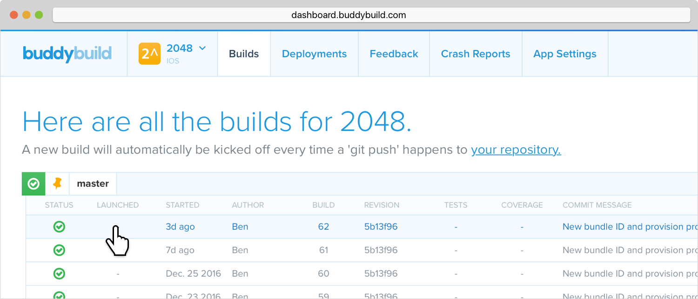
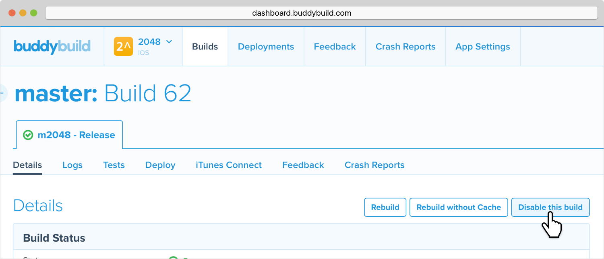
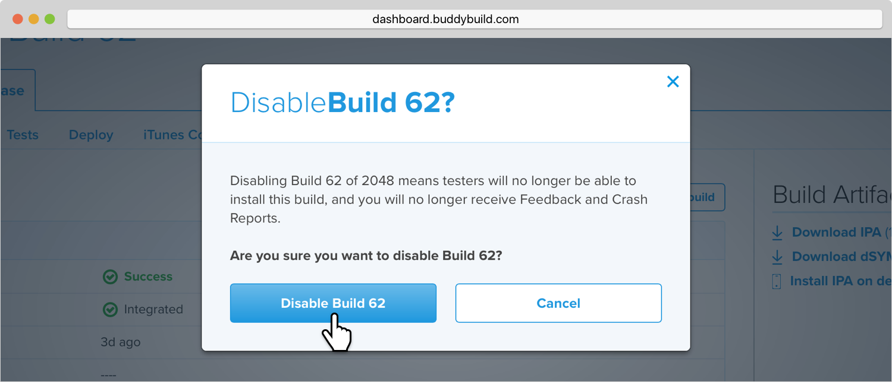
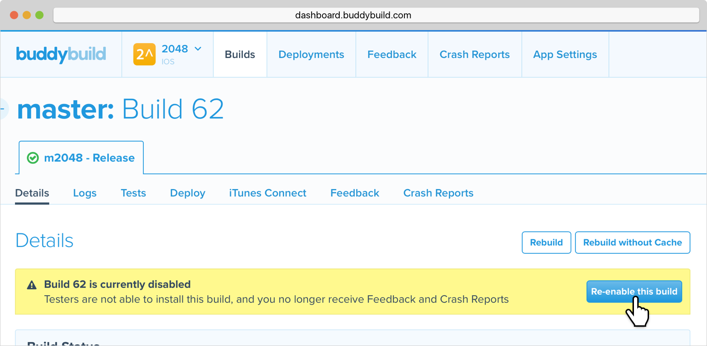

= Disable a Build

Buddybuild allows you to disable deployed builds. Disabling a build
prevents testers from installing that specific build and gives you a
quick way to prevent users from accessing a deployed build.

Disabled builds no longer receive Feedback and Crash Reports.

Here's how to disable a build:

**Step 1:** Select the build you wish to disable.

**Step 2:** Click on the **Disable this build** button.

**Step 3:** Confirm that you wish to disable the build.

== Re-enable a build

You can also re-enable a build you previously disabled. To do this just
click on the **Re-enable this build** button.

