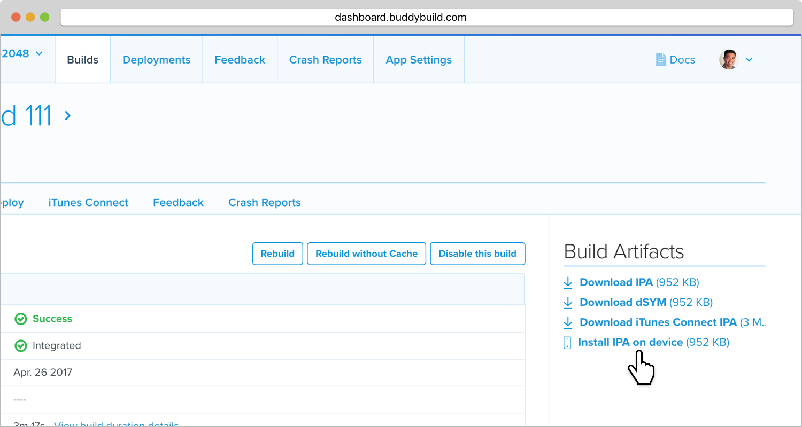

= Downloading Build Artifacts

Buddybuild will automatically manage your app bundles and dSYMs securely
for you. If you wish to deploy your app bundle to your testers and beta
users, use the **Deployments** tab.

Buddybuild can automatically collect your crash reports and symbolicate
them with your App's dSYMs producing human-readable crash reports. To
enable this feature, link:../quickstart/ios/integrate_sdk.adoc[integrate
the buddybuild SDK].

You'll never have to manage your artifacts yourself, however, If you
require access to them, download them from the build details page of a
specific build.

