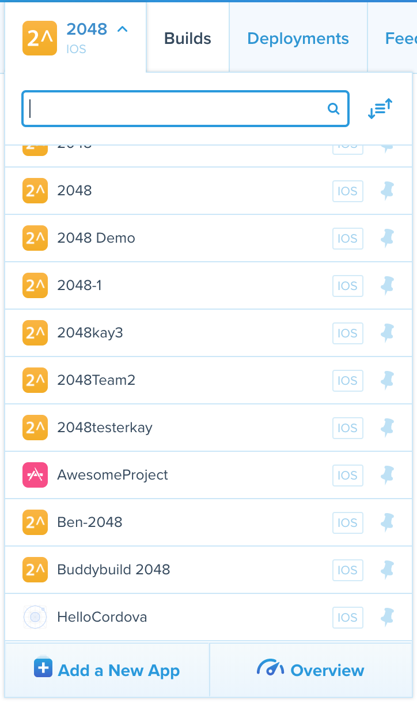
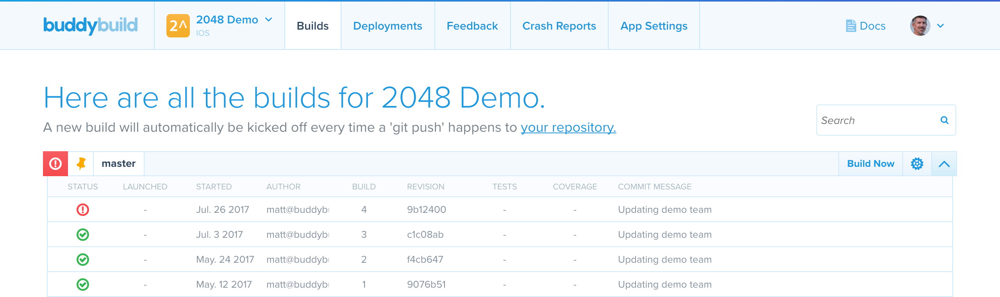

= Node version

node.js, or just _Node_, is a popular javascript runtime that can be
used for application development or system tools. Node itself is
evolving rapidly, which means that new features are available regularly.
It also means that existing features might change or become deprecated.
Your use of Node may depend on specific versions in order to function
correctly. This section describes how to use a specific version of Node.

== Specify the Node version

. Log in to the link:https://dashboard.buddybuild.com/[buddybuild
  dashboard].

.  image:img/button-current_app.png["The Current App button", 123, 64,
role="right"]
  Choose the app that requires a specific Node version by moving your
  pointer over the **current app** button in the top toolbar. The
  **Apps** dropdown appears:
+

. Select the app that needs a specific Node version by clicking it in
the dropdown. The **Builds** page for your app appears:
+

+
image:img/field-filter_apps.png["The App dropdown's filter field", 283,
32, role="right"]
If you have many apps, you can type the app's name (or portion thereof)
into the search field; only apps with matching names are displayed.
+
image:img/button-sort_order.png["The sort order button", 21, 18,
role="right"]
Or, you can click the sort order button to display a select menu of
sorting approaches. Click the select menu to display all of the
approaches:
+
--
- **Alphabetical (A-Z)** Select to show apps in normal, alphabetical
  order. This is the default.

- **Alphabetical (Z-A)** Select to show apps in reverse alphabetical
  order.

- **Created Date** Select to show the most recently added apps first.
--

. image:img/button-app_settings.png["The App Settings button", 118, 64,
role="right"]
  Click the **App Settings** button in the top toolbar.
  The **App Settings** screen is displayed:
+
image:img/screen-build_settings.png["The App Settings screen", 1280,
691, role="frame"]

. image:img/tab-environment.png["The Environment tab", 137, 53,
role="right"]
  Click the **Environment** tab. The **Environment** settings are
  displayed:
+
image:img/screen-environment_settings.png["The Environment
settings", 1280, 619, role="frame"]

. image:img/dropdown-node_versions.png["The Node versions select menu",
331, 275, role="right"]
  Click the **Node version** select menu to display the available Node
  versions.

. Click the version of Node that you need for your build.

That's it! From now on, builds of your app use the selected Node
version.
