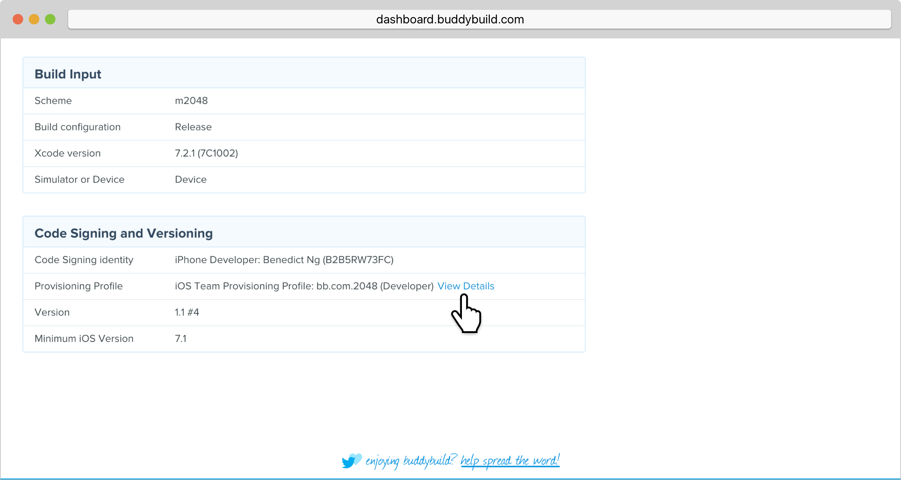
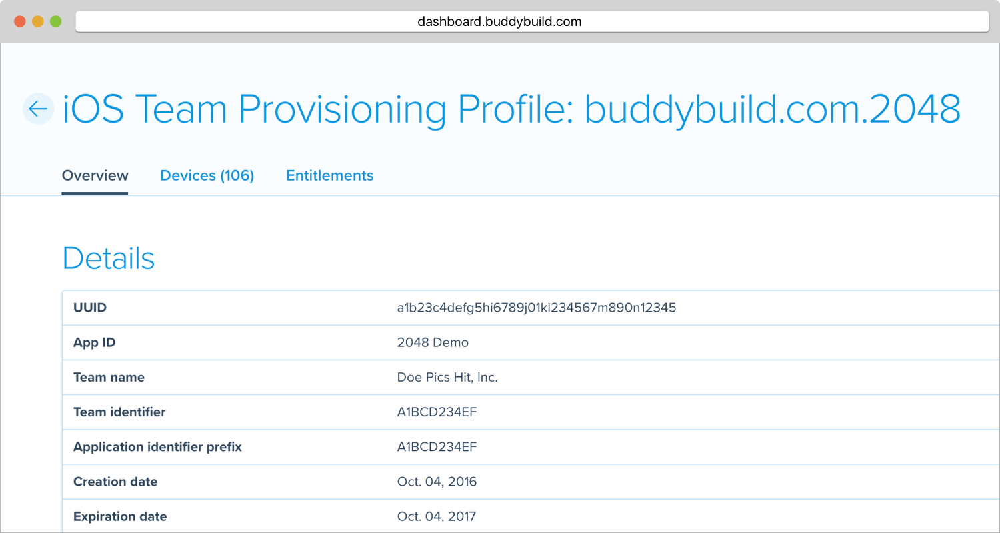
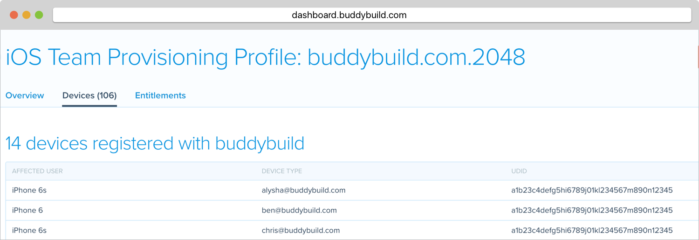
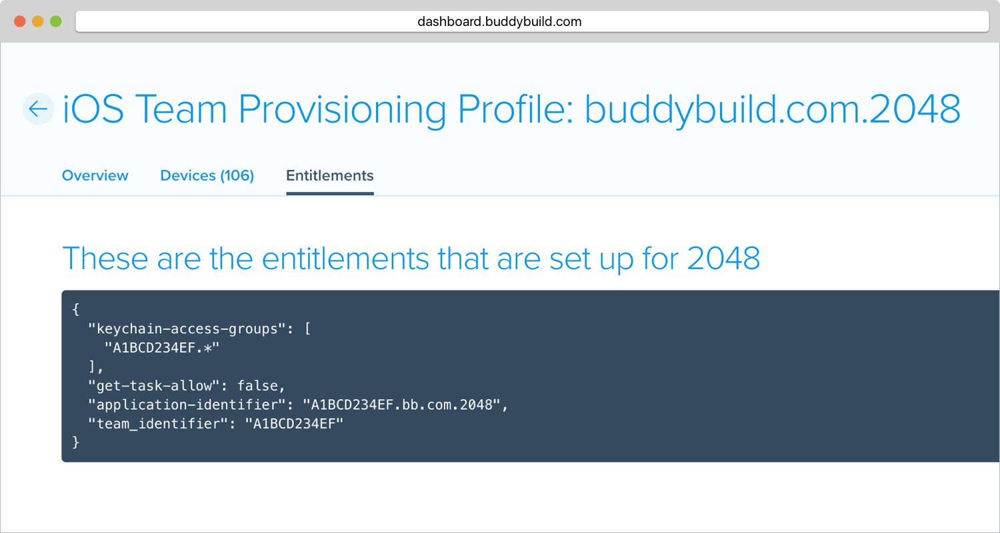

= Provisioning Profile Inspector

Buddybuild allows you to inspect the exact provisioning profile a
specific build was built with.

See exactly which devices are enabled, and the entitlements of your App.

Navigate to the build details page of a particular build and then click
on **View Details** under the **Code Signing and Versioning** section to
open the inspector.

Get details about the Provisioning Profile in the **Overview** tab.

Inspect the **devices** and their UDIDs included in the Provisioning
Profile.

Lastly, find out what **entitlements** are configured for your App!

