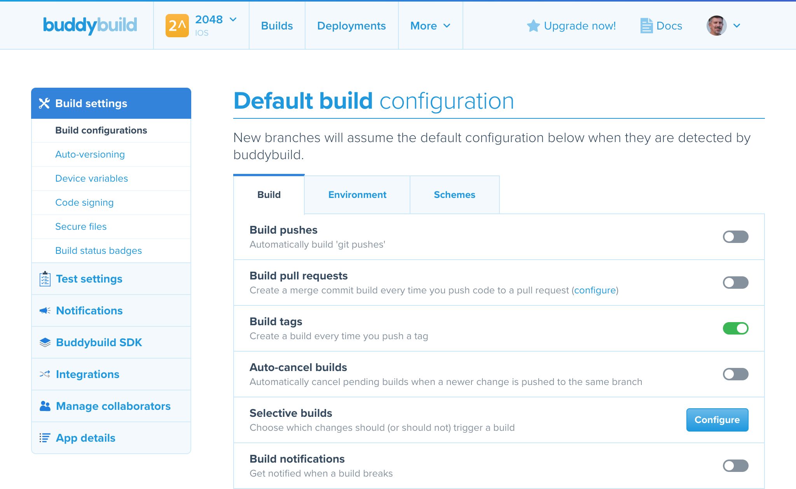
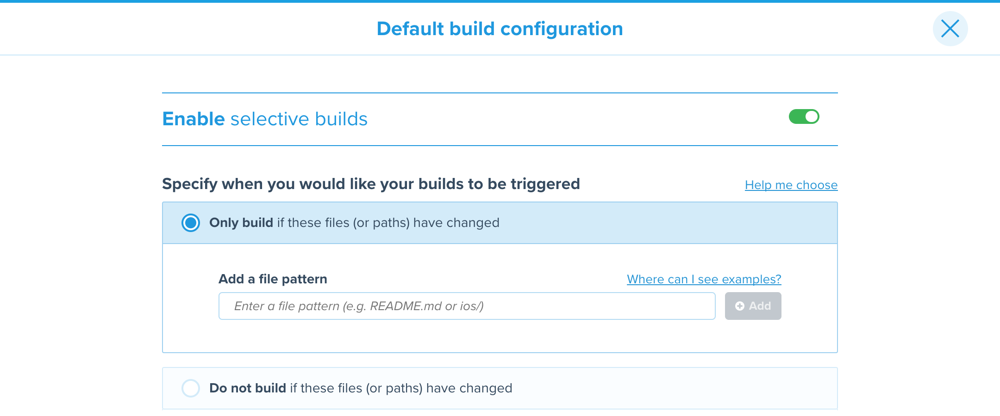

--- 
titletext: Trigger a mobile CI build only when certain files changes
description: >
  Selective Builds allows you to trigger an app build only when certain files
  are changed. Skipping builds for commits unrelated to the project’s source
  files
---
= Selective Builds

Selective Builds allows you to trigger a build of an app only when
certain files are changed.

This is useful when:

- You have multiple apps in single git repository (iOS and Android, or
  multiple apps share some common files in your repository).

- You want to skip builds for committed files that are unrelated to your
  project's source files. For example, `README.md` or `.gitignore`.

When determining the list of files that have changed for a pull request,
buddybuild considers all files associated with the pull request, from the
branch point to the latest change.

[TIP]
Do you want to avoid builds for specific commits? Check out
link:skip_a_build.adoc[Skipping a build].

== Steps to set up selective builds

. Visit link:https://dashboard.buddybuild.com/[the buddybuild dashboard].

. image:img/button-app_settings.png[App Settings
  button,118,64,role="right thumb"]
  Click **App Settings** in the top navigation bar. The **App Settings**
  page is displayed:
+

. 
  Find the **Selective Builds** row in the build configurations, and
  click the **Configure** button on the right side of the row. The
  **Enable selective builds** page is displayed:
+
image:img/page-build_skipping-disabled.png["Enable Selective Builds
page", role="frame"]

. 
  Click the toggle button to enable selective builds. One of the lower
  panels becomes enabled:
+

. Choose an approach: **Only build...** or **Do not build...**:
+
--
- Select **Only build ...** when you want to build only for files in
  some specific directories, or with some special extensions.

- Select **Do not build ...** when you __don't__ want to trigger a build
  when all of the files changed match at least one of the patterns (i.e.
  all the files fall in some specific directories, or with some special
  extensions)
--
+
Only one approach can be active — when you choose an approach, the
other approach becomes disabled.

. 
  To add a pattern, type the pattern into the input field and click the
  **Add** button. The pattern is added to the list of patterns.
+

Or to delete a pattern, click the **trashcan** icon beside the pattern
you wish to remove. The pattern is removed from the list of patterns.

. 
  Once you have finished configuring selective build patterns, click the
  **Close** button near the top-right of the page. The **App Settings**
  page is displayed, and the current approach and patterns are indicated
  in the **Selective Builds** row:
+
image:img/panel-selective_builds.png["The Selective Builds row,
indicating the active approach and patterns",990,60]

[[examples]]
== File pattern examples

- `ios/**`: all files with full path that starts with `ios/` (i.e. any
  files in the `ios` directory)

- `\**/*.java`: all files with full path that ends with `.java` (i.e. any
  files with the `.java` extension)

- `README.md`: the `README.md` file in the root directory of your repository
  (doesn't match `ios/README.md`)

- `**/README.md`: the `README.md` file in all directories (including
  `README.md` in root directory of your repository)

- `ios/\**/*.[mh]`: all files with the extension `.m` or `.h`, in the `ios`
  directory and all of its subdirectories

- `ios/*.[mh]`: files with the extension `.m` or `.h` only under the
  `ios` directory (but not its subdirectories)

- `configs/server[0-2].ini`: the files `server0.ini`, `server1.ini`,
  `server2.ini` in the directory `configs/`

More patterns can be found in the
link:https://git-scm.com/docs/gitignore#_pattern_format[gitignore
pattern format] documentation.
