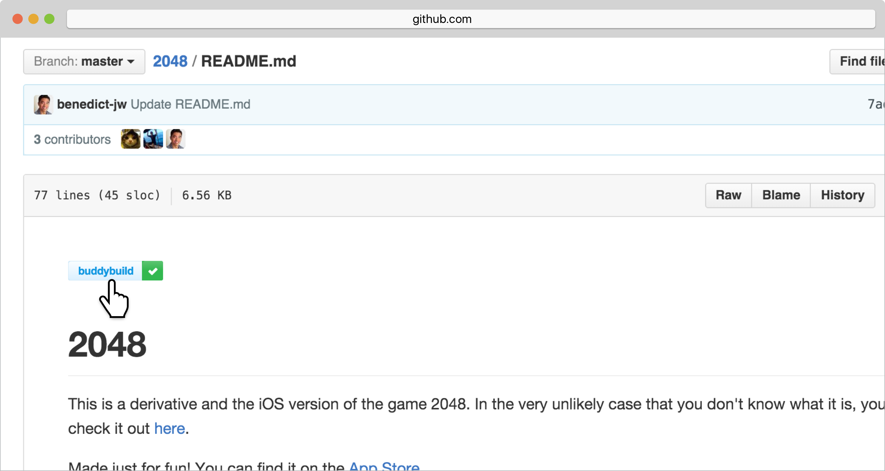
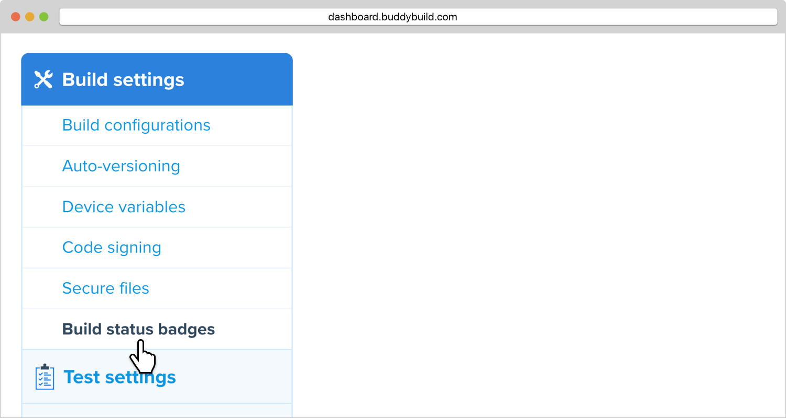
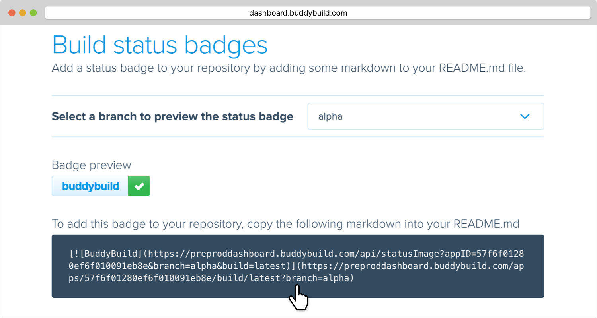

= Status Badges

Show up-to-date build status with a buddybuild badge in your
repository's `README.md` file. The badge also acts as a quick shortcut to
navigate between the repo and buddybuild.

The process for adding the badge is simple. Buddybuild will
automatically generate markdown code for your app. Simply copy-paste
this markdown to your `README.md`.

== Step 1: Open Status Badge Generator

Start by clicking on **App Settings**.

image:img/Builds---Settings.png[,1500,483]

In the left navigation, select **Build settings**, then **Build Status
Badges**.

== Step 2: Add badge to README.md

Status badges are specific to branches. Typically, you will want to
display your default branch status in your Repo. Select the specific
branch you would like to use.

Buddybuild will generate markdown for you.

Simply copy and paste the generated Markdown into your README.md -
ideally at the very top.

That's it! You're good to go! Try clicking on the badge and see what
happens! The build status page for your app is publicly accessible if
your Repo is publicly accessible.
