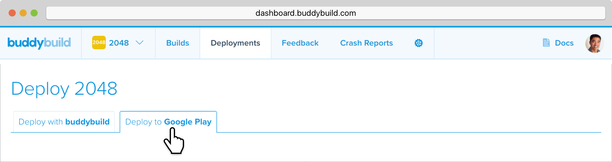
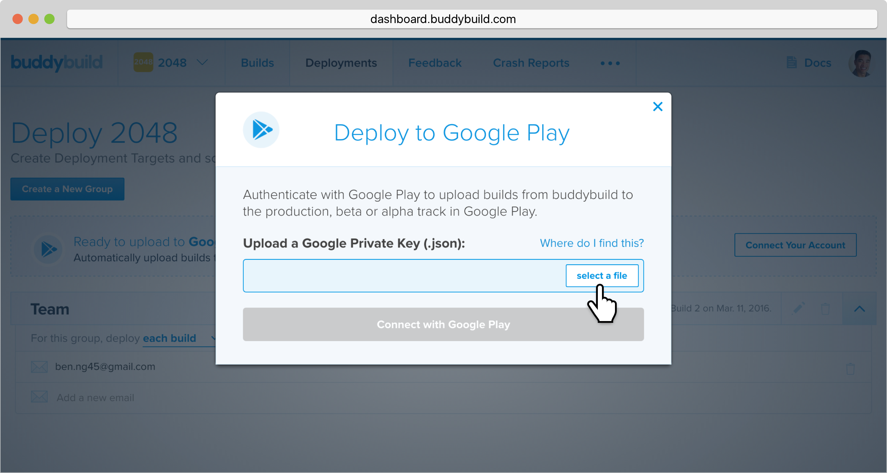
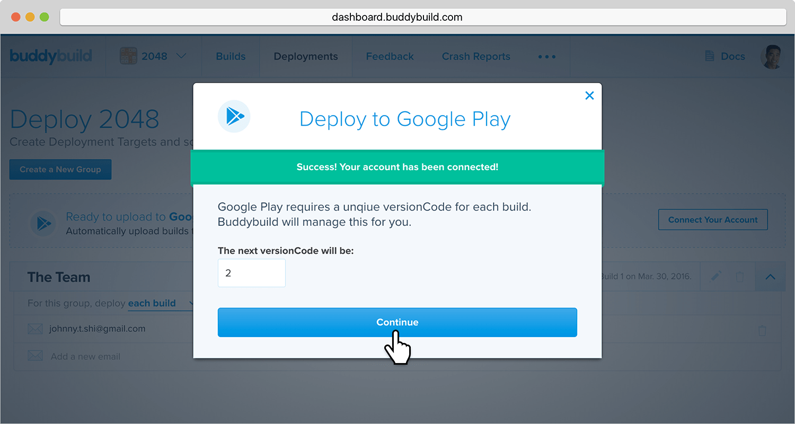
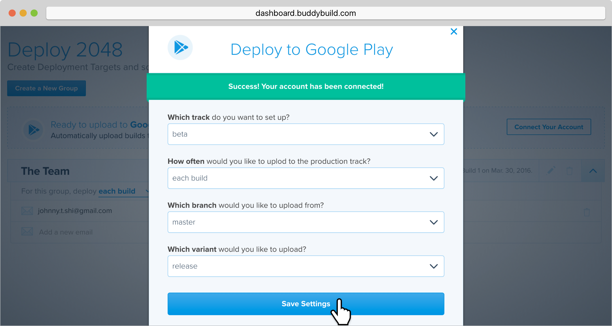

= Deploying automatically to Google Play

You have the ability to automatically deploy to Google Play -- either per
build or on a set schedule.

[CAUTION]
=========
**First ensure you have completed the following steps:**

. link:developer_console.adoc[Create a private key and setup
  permissions from the Google Play Developer Console]

. link:../keystores/manage.adoc[Upload Your APK Signing KeyStores]
=========

If you have already completed the pre-requisite steps, follow along
below to automatically deploy to Google Play!

Navigate to the Deployments page on buddybuild and select the **Deploy
to Google Play** tab.

Next, select **Connect Your Account**.

image:img/Deployments---auto-deploy-to-Google-Play---1.png[,1500,529]

Authenticate with Google Play by clicking **select a file**, and
locating the **Google Private Key (.JSON) **that you created and
downloaded in the previous step.

Once connected, you now have the option of changing the next
versionCode. You can also choose to leave the default value and click
**Continue**.

Next, select the track you want to deploy to, how often you want to
deploy to Google Play, and from which branch and variant.

Once you're done that, select **Save Settings**.

That's it! You're now ready to automatically deploy builds to Google
Play.

If you'd prefer to link:manual.adoc[manually deploy builds to Google
Play], buddybuild allows you to do that as well!

== Troubleshooting Errors

Listed below are a few of the common error messages that you may
encounter while attempting to setup deployments to Google Play, and how
to resolve them.

[CAUTION]
=========
**No application was found for the given package name:**

The APK must be uploaded to at least once manually through the Google
Play Developer Console, which creates the application inside Google Play
Developer Console.

If this is not done, you will get the following error message: "No
application was found for the given package name."
=========
