= Create a private key and setup permissions

To deploy builds to Google Play, the first step is to create a Private
Key (`.JSON`) and setup the appropriate permissions from the Google Play
Developer Console.

Lets get started!

Open the link:https://play.google.com/apps/publish[Google Play
Developers Console], and Log In with your email and password.

Next, select **Settings** from the left menu.

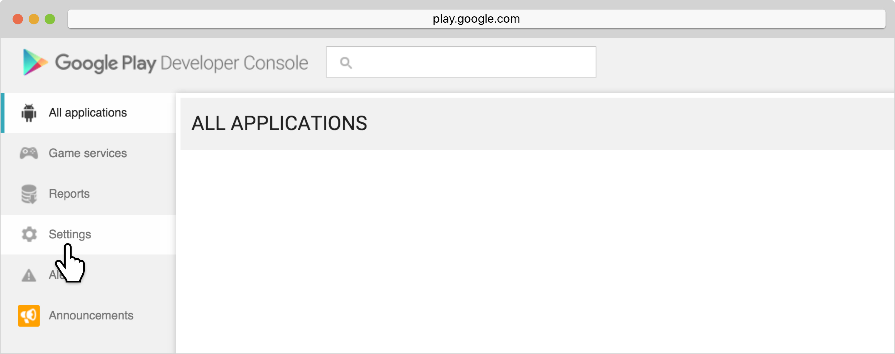

Select **API access**.

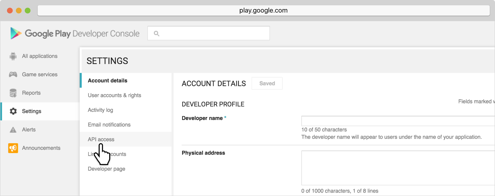

Next, select **Create Service Account**.

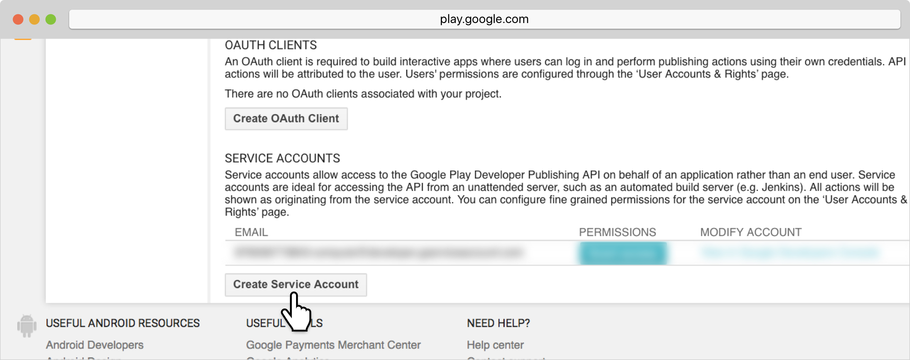

In the modal that pops up, select **Google API Console**.

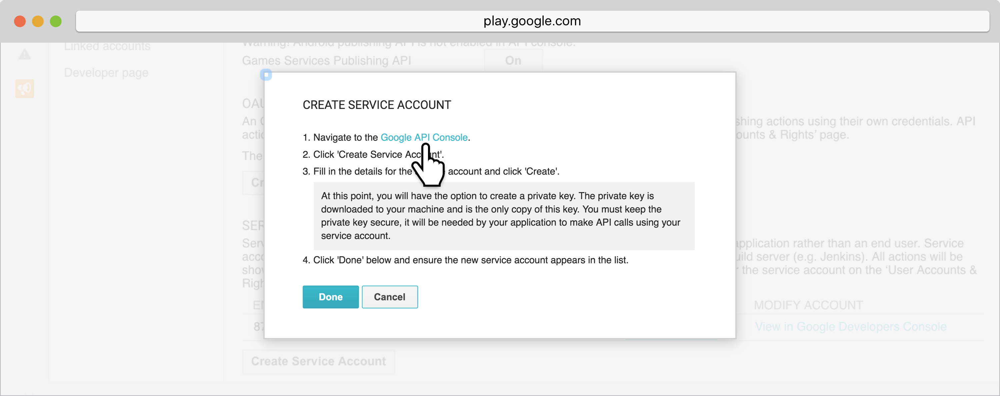

On the next page, select the **Create credentials** dropdown, and then **Service account key**.

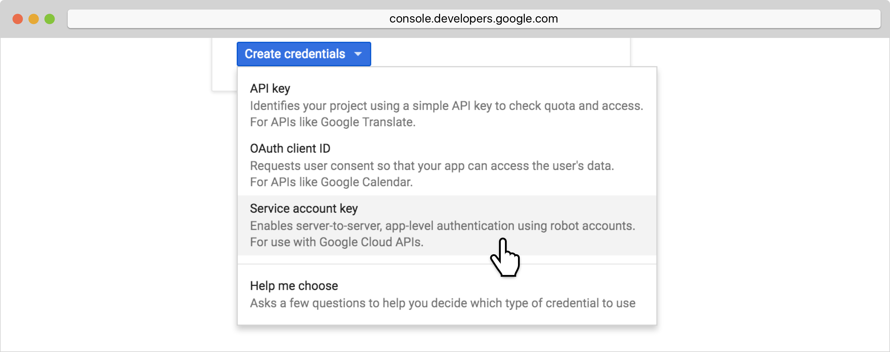

Select the **Service account** dropdown and select **New service account**.

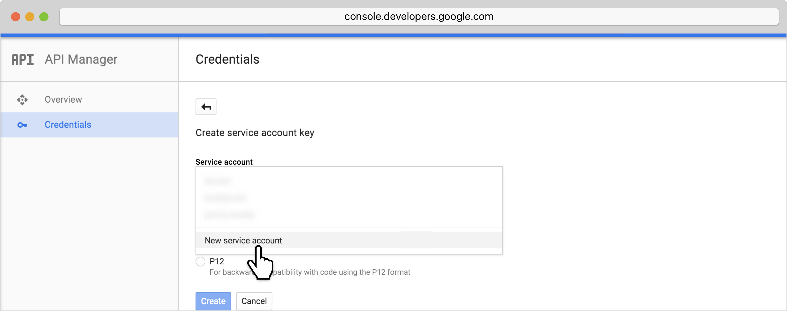

Next, fill in the **name** field.

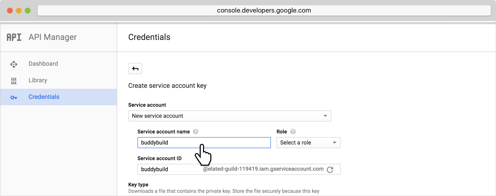

Next select a role by first highlighting **Project**, then selecting
**Owner**.

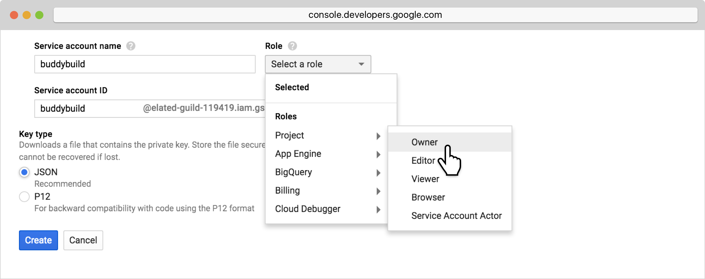

Ensure that **JSON** is selected and click **Create**.

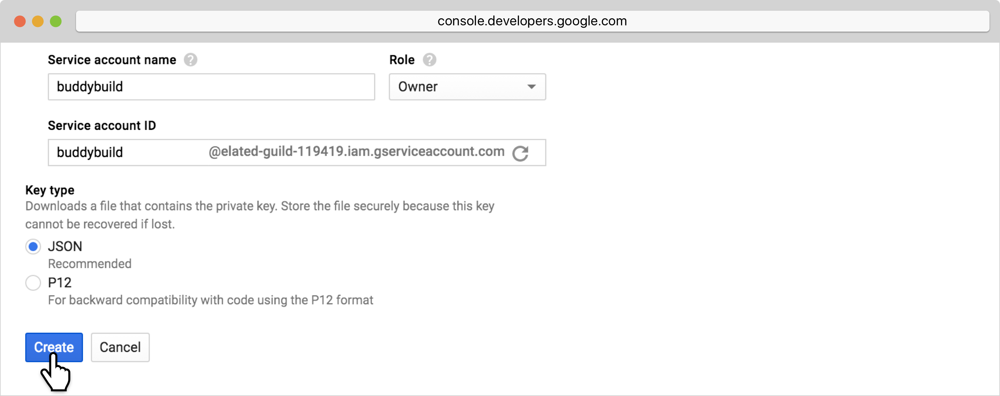

Next, a popup will appear letting you know that the Service account has
been created.

[NOTE]
======
**Note: at this point the JSON file has been downloaded to your
computer**

This will be the JSON file that needs to be uploaded to buddybuild in
the next step.
======

Next, select **Close**.

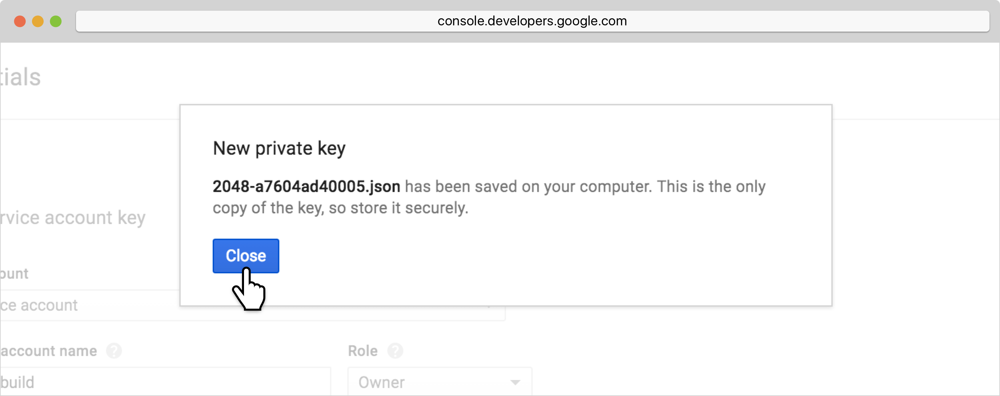

Head back to the Google Play Developers Console. The page will update
with the new service account you created.

Scroll down to the **Service Accounts** section, look for the unique
Service Account ID, and select **Grant**.

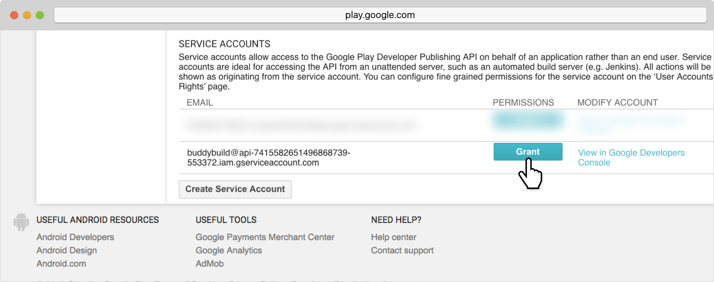

Ensure that **Release manager** is selected from the role dropdown, then
select **Add user**.

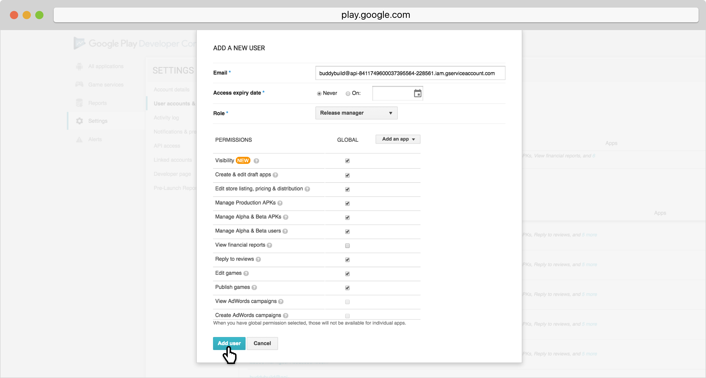

That's it for step 1! The next step is link:automatic.adoc[setting up buddybuild to automatically deploy to Google Play].
