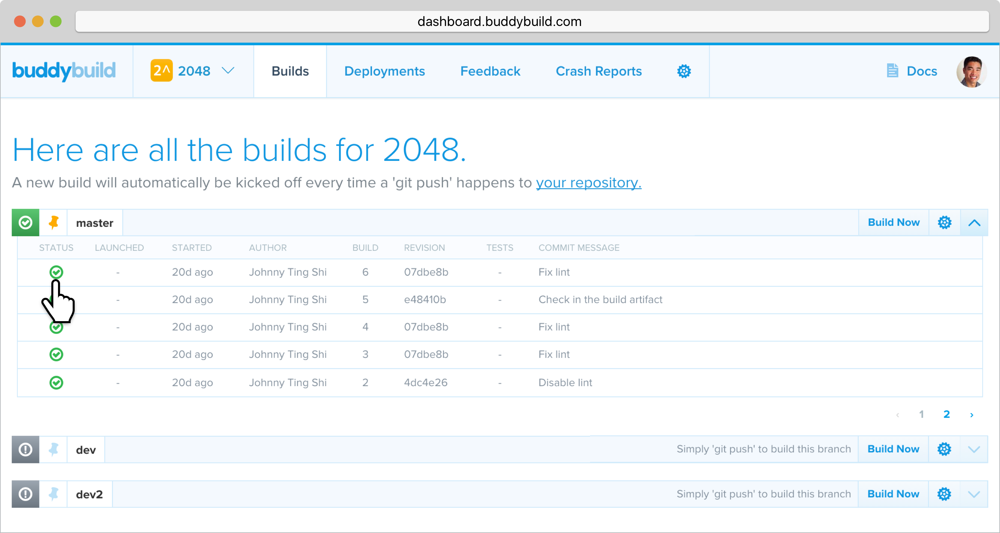
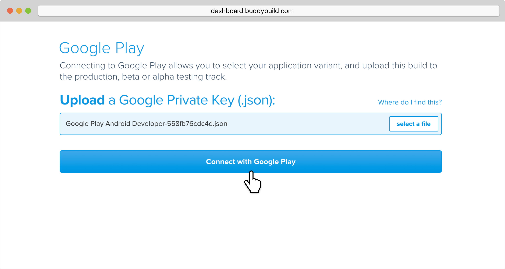
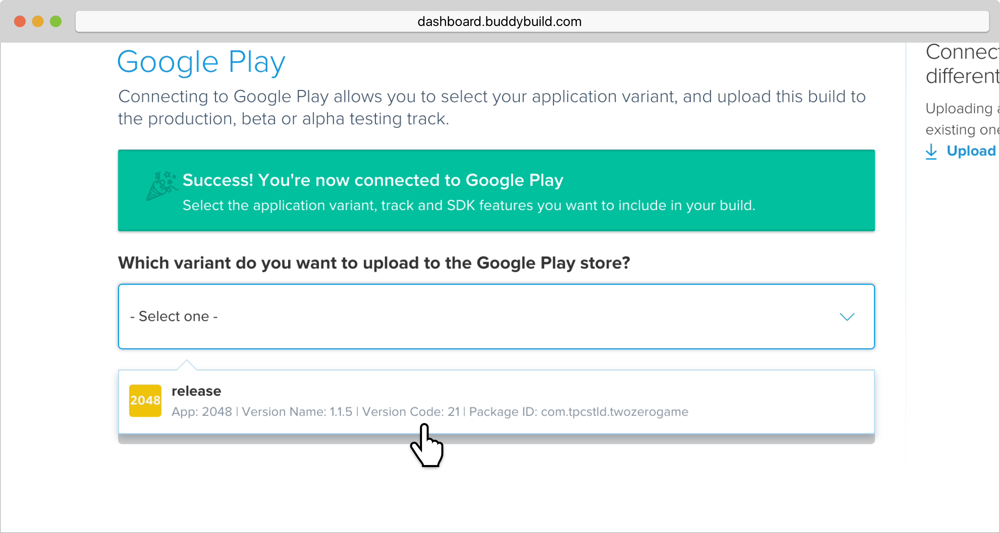
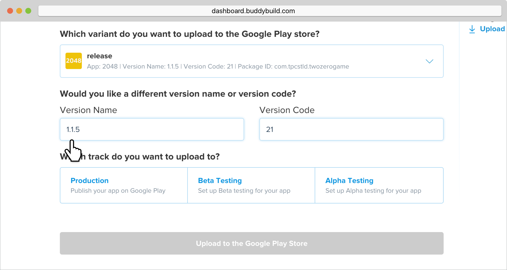
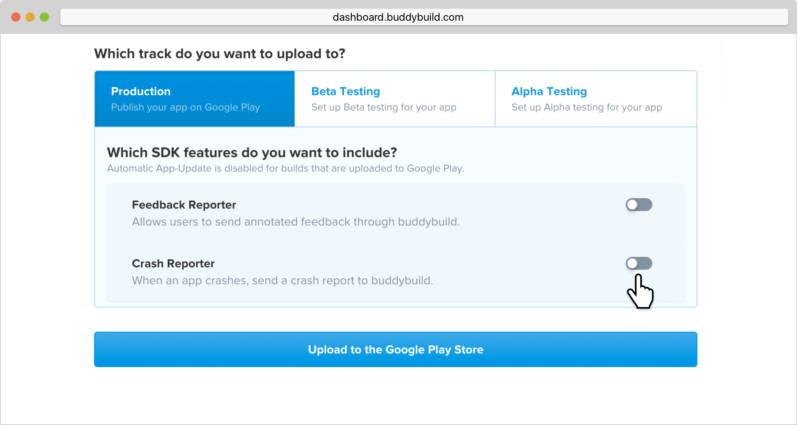
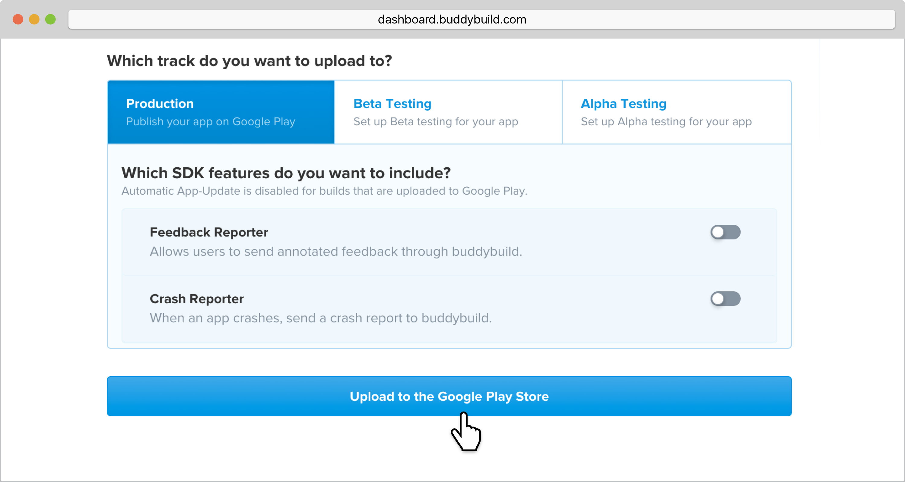
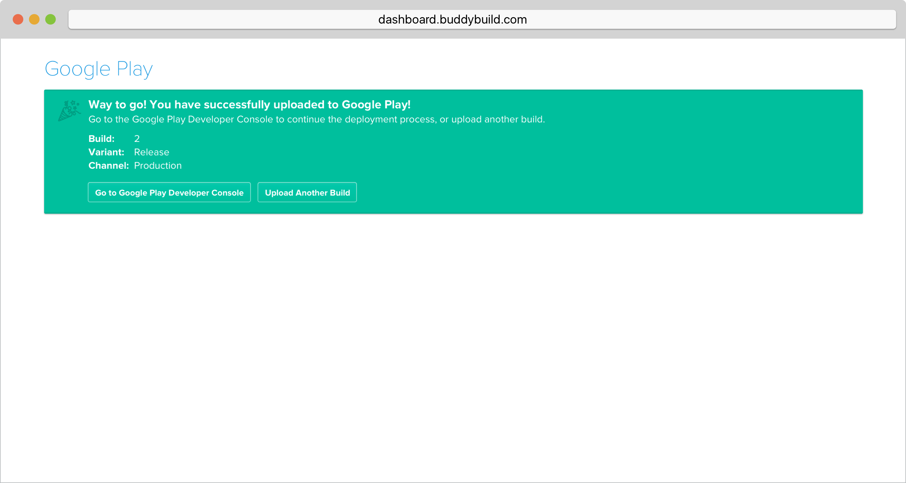

= Deploying manually to Google Play

With buddybuild, you have the ability to manually deploy to Google Play.

[NOTE]
======
**First ensure you have completed the following steps:**

. link:developer_console.adoc[Create a private key and setup
  permissions from the Google Play Developer Console]
. link:../keystores/manage.adoc[Upload Your APK Signing KeyStores]
======

If you have already completed the pre-requisite steps, follow along
below to manually deploy to Google Play!

Log in to buddybuild and head over to the Builds page by selecting
**Builds** in the global navigation menu.

Next, click on the successful build you want to deploy.

Navigate to the **Google Play** tab and click **select a file**. Locate
and upload the **Google Private Key (`.JSON` file)** that was
automatically downloaded when you created a Service Account.

Click **Connect with Google Play**.

Once the Google Private Key (`.JSON`) file has been uploaded
successfully, you'll see a success message.

Next, select the variant dropdown and **select the variant you want to
upload to Google Play**.

[NOTE]
======
**You must select a _release_ variant to deploy to the Google Play
store.**

If you do not see any release variants in the dropdown menu, it likely
means that no release variants have been built by buddybuild. Buddybuild
does not offer to deploy _debug_ variants to Google Play.
======

A Version Name and Version Code will be automatically filled in for you.
You may choose to give your build a unique Version Name and Version
Code, or choose to leave the default values.

Next, select either the **Production, Beta Testing or Alpha Testing
track** that you want to deploy to Google Play.

[NOTE]
======
**Buddybuild SDK**

If you have the buddybuild SDK installed, at this point you will be able
to select which SDK features to include in the build that you are
uploading to Google Play.
======

Next, select **Upload to the Google Play Store**.

[WARNING]
=========
**Warning: Uploading apps that are currently live in the Google Play
Store**

If your app is currently live in the Google Play Store, uploading to the
Production Track will **automatically publish your app and make it
live**.

Uploading to the Beta Testing or Alpha Testing Track will automatically
make your app available to your specified testers from the Google Play
Developer Console.
=========

If your app has not previously been published to the Google Play Store,
head over to the Google Play Developer Console to complete the
deployment process.

