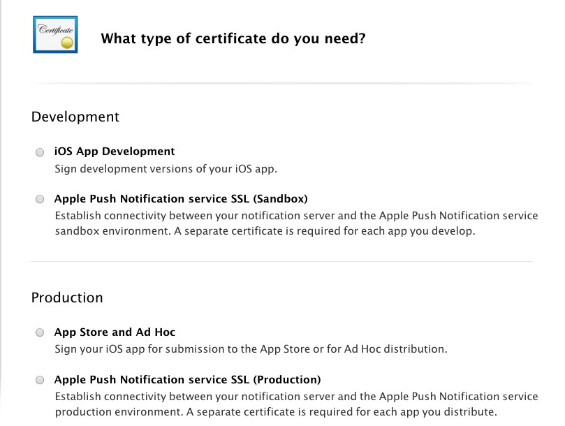
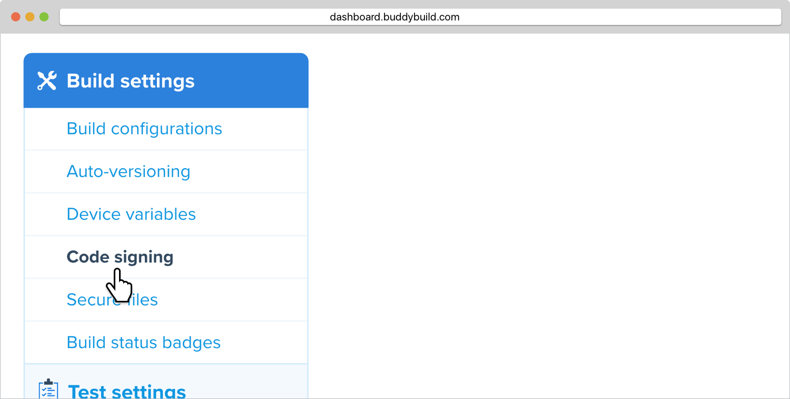

= Creating a Code Signing Identity

Sometimes you might need to regenerate your code signing identity : for
example if someone hits fix it in Xcode (don't do this!), or a code
signing identity expires. These steps will show you how to quickly do
that.

== Create a certificate signing request

First prepare a certificate signing request that you will later upload
to Apple's Developer Portal.

Open 'Keychain Access' then select Keychain Access -> Certificate
Assistant -> Request a Certificate from a Certificate Authority.

image:img/Screen-Shot-2015-12-11-at-11.32.36-AM.png[,619,440]

Save the certificate signing request to somewhere like your Desktop.

== Generate the new certificate

Go to https://developer.apple.com and log into the team you want the
certificate to belong to. Navigate to certificates on the left hand menu

You will see something like this. Hit the add button to get started
adding a new one.

image:img/Screen-Shot-2015-12-11-at-11.34.10-AM.png[,1366,324]

There are two types of certificates relevant to Code Signing

- iOS App Development
- App Store and Adhoc

If you're just doing local development and want to be able to debug then
'iOS App Development' is the right type for you. For the App Store, Test
Flight and buddybuild, 'App Store and Adhoc' is the best choice.

Once you've selected, you can upload the certificate signing request we
created earlier

image:img/Screen-Shot-2015-12-11-at-11.35.14-AM.png[,810,619]

When this is completed, download it, and then double-click on the file
which will import it into your keychain. You're all set up to code sign
locally now, but there's one more step to share that with buddybuild.

== Add the new code signing identity to buddybuild

Open Keychain and look for the certificate you just created (it will
have today's date to make it easier to find).

Also, make sure you have the Certificates category selected to make it
easier to find.

image:img/Screen-Shot-2015-12-11-at-11.51.41-AM.png[,147,164]

Then right click on it and chose export and save the `.p12` file
somewhere.

image:img/Screen-Shot-2015-12-11-at-11.36.55-AM.png[,1152,190]

Now go over to the buddybuild dashboard and click on **App Settings**.

image:img/Builds---Settings.png[,1500,483]

In the left navigation, click on Build settings, then **Code signing**.

Next, click on **Upload new certificates**.

image:img/Settings---Code-Signing.png[,1500,317]

Select **the Manual Way** tab, and upload your code signing identity.

image:img/Settings---Code-Signing---Manual.png[,1500,800]

You should be all set with your new code signing identity. You may have
to generate new provisioning profiles too. The easiest way to do this is
to link:../../../integrations/itunes_connect.adoc[connect buddybuild to
your Apple Developer account] and buddybuild will manage the
provisioning profiles for you.
