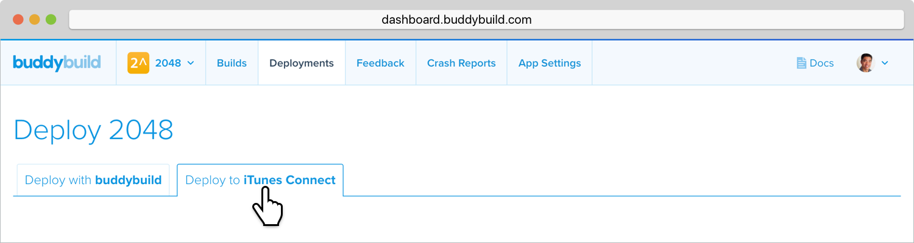
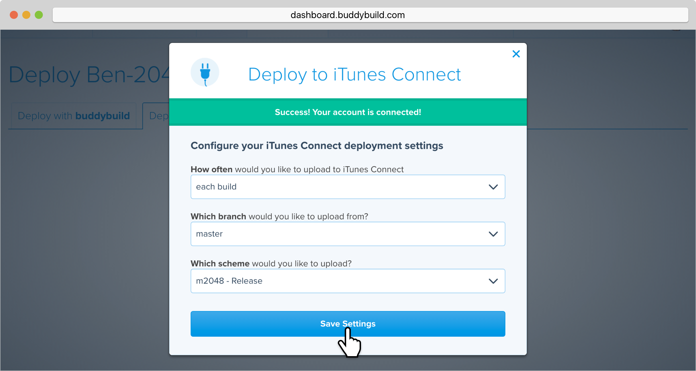
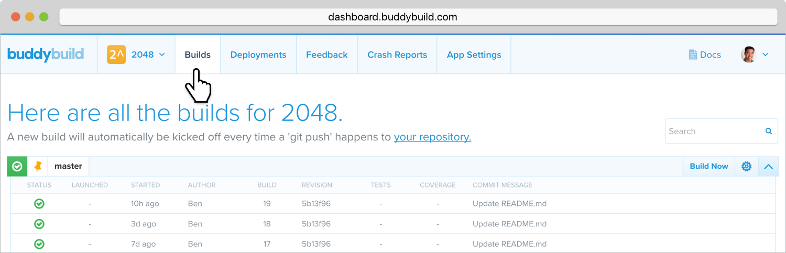

= Deploy to iTunes Connect

Buddybuild can automatically deploy successful builds to iTunes Connect
in order to submit your app to TestFlight or the App Store.

[NOTE]
======
**Quick Links:**

- link:#section1[Setting up deployments to iTunes Connect]

- link:#section2[Deploying automatically]

- link:#section3[Deploying manually]
======

[[section1]]
== Setting up deployments to iTunes Connect

The first step is to connect your Apple Developer Portal account with
buddybuild.

Select the **Deployments** section, then the **Deploy to iTunes
Connect** tab.

Next, connect your Apple Developer Portal account with buddybuild by
selecting **Connect Your Account**.

image:img/Deployments---auto-deploy-to-iTunes-Connect---1.png[,3000,1058]

Enter your Apple ID and Password, then click **Sync credentials**.

[WARNING]
=========
**Note: This account must have access to iTunes Connect and the Apple
Developer Portal.**
=========

image:img/Deployments---auto-deploy-to-iTunes-Connect---2.png[,3000,1600]

[NOTE]
======
**Apple ID with Two-Factor Authentication or Two-Step Verification**

If your Apple ID is protected using Two-Factor Authentication or
Two-Step Verification, you will need to create an
link:../../integrations/apple_2fa.adoc#app-specific-password[Create an
App-Specific Password] to deploy your app to iTunes Connect.
======

If you're a member of multiple development teams, you'll be prompted to
select the teams you want to connect with.

Once connected, you now have the option of changing the CFBundleVersion
Format, and the build number for your next build. You can also choose to
leave the default values and click **Continue**.

image:img/Deployments---auto-deploy-to-iTunes-Connect---3.png[,3000,1600]

Next, select how often you would like to deploy to iTunes Connect, and
from which branch and scheme.

Once you're done that, select **Save Settings**.

That's it! You're now ready to deploy builds to iTunes Connect. From
here, you can now choose to deploy the latest successful build.

image:img/Deployments---auto-deploy-to-iTunes-Connect---5.png[,3000,1600]

[[section2]]
== Deploying automatically to iTunes Connect

You have the ability to automatically deploy to iTunes Connect - either
per build or on a set schedule. Here's how!

First, ensure that you are on the **Deployments** page, with the
**Deploy to iTunes Connect** tab selected.

Next, select the first dropdown to reveal the deploy schedule options.
To automatically deploy to iTunes Connect, select either **each build**
or **scheduled**.

[NOTE]
======
**Each build:** automatically deploys to a group after each successful
build +
**Scheduled:** automatically deploys to a group at a specific time on
selected days of the week.
======

image:img/Deployments---auto-deploy-to-iTunes-Connect---6.png[,1500,600]

Next, select your branch targets by selecting the **branch** and
**scheme** you would like to automatically deploy from.

image:img/Deployments---auto-deploy-to-iTunes-Connect---7.png[,1500,600]

That's it! Buddybuild will now automatically deploy successful builds to
iTunes Connect based on the criteria you set.

[[section3]]
== Deploying manually to iTunes Connect

[NOTE]
======
**There are two ways to deploy builds manually to iTunes Connect.**

- link:#deploy-latest[Deploy the latest successful build]

- link:#selecting-specific-build[Selecting a specific build to deploy]
======

[[deploy-latest]]
=== Deploy the latest successful build

Deploying the latest successful build to iTunes Connect is a quick and
easy process!

First, ensure that you are on the **Deployments** page, with the
**Deploy to iTunes Connect** tab selected.

Next, select **Deploy latest now**. This will take the latest successful
build with the configuration you've set, and deploy it to iTunes
Connect.

image:img/Deployments---auto-deploy-to-iTunes-Connect---8.png[,1500,332]

[[selecting-specific-build]]
=== Selecting a specific build to deploy

To select a specific build to deploy to iTunes Connect, lets head over
to the Builds page by selecting **Builds** in the global navigation
menu.

Next, click on the successful build you want to deploy.

image:img/Builds---Android---Point---Details.png[,1500,483]

First select the scheme tab you want to deploy, then select **iTunes
Connect**.

image:img/Builds---Details.png[,1500,578]

[WARNING]
=========
**Note: To upload this build to iTunes Connect, buddybuild requires a
distribution code signing identity**

If you have not provided a distribution code signing identity at this
point, follow the prompt to do so, then rebuild your app.
=========

Once there, review the build details and select **Upload to iTunes
Connect**.

image:img/Builds---Details---iTunes-Connect.png[,1500,800]

That's it! Buddybuild will now deploy your build to iTunes Connect!
