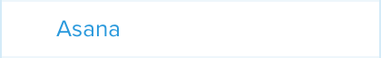

= Asana

Asana is a popular project tracking application used by many agile
development teams. Buddybuild offers a first-class integration with
Asana, creating tasks for build status, feedback submissions, and crash
reports directly to the Asana projects that you use.

There are a number of sub-sections on this page:

- <<navigate>>
- <<connect>>
- <<editing>>
- <<delete_connection>>

[[navigate]]
== Navigate to the Asana integration settings

This section describes how to navigate to the Asana integration
settings, and is referred to by several procedures described on this
page.

. Log in to the link:https://dashboard.buddybuild.com/[buddybuild
  dashboard].

. image:../builds/img/button-app_settings.png["The App Settings button",
  118, 64, role="right"]
  Click **App Settings** button in the top toolbar. The **Default build
  configuration** screen is displayed:
+
image:img/screen-build_settings.png["The Default build configuration
screen", 1280, 739, role="frame"]

. image:img/button-integrations.png["The Integrations button", 210, 42,
  role="right"]
  In the left navigation bar, click the **Integrations** button. The
  first of the **Integrations** screens (**Apple Dev Connection**) is
  displayed:
+
image:img/screen-apple_dev_connection.png["The Apple Dev Connection
screen", 1280, 765, role="frame"]

. 
  In the left navigation, click the **Asana** button. The **Asana**
  screen is displayed:
+
image:img/screen-asana-unconfigured.png["The Asana screen", 1280, 765,
role="frame"]
+
If you have previously configured Asana, you might instead see:
+
image:img/screen-asana-connected.png["The Asana screen with existing
configuration", 1280, 765, role="frame"]

[[connect]]
== Connect your Asana project

These steps describe how to establish a connection between buddybuild
and a specific Asana project.

. <<navigate>>

. Depending on whether you have an existing connection, or not, perform
  _one_ of the following:
+
--
[loweralpha]
. image:img/button-connect_with_asana.png["The Connect with Asana
  button", 158, 42, role="right"]
  If you _do not_ already have an Asana connection configured, click
  the **Connect with Asana** button, and proceed to the next numbered
  step.

. If you do have an Asana connection configured, see <<editing>>.
--

. When you are not logged in to Asana, the **Asana authentication**
  screen is displayed:
+
image:img/screen-asana-login.png["The Asana authentication screen",
1280, 718, role="frame"]
+
image:img/button-asana-login.png["The Asana Log In button", 70, 40,
role="right"]
Click the **Use Google Account** button to authenticate using your
Google account, or enter your email address and password and click **Log
In** to login to Asana.

. Once you are logged in to Asana, the **Grant Permission** screen
  is displayed:
+
image:img/screen-asana-authorize.png["The Asana Grant Permission screen",
1280, 575, role="frame"]

. image:img/button-asana-allow.png["The Asana Allow button", 60, 30,
  role="right"]
  Here, you are giving permission to buddybuild to connect to Asana on
  your behalf, and to create tasks in your projects. Click the **Allow**
  button. The **Configure Asana for Feedback** screen is displayed:
+
image:img/screen-asana-configure_feedback.png["The Configure Asana for
Feedback screen", 1280, 616, role="frame"]

. Configure automatic task creation for feedback, and select a
  workspace, project, and section where feedback should be reported:
+
--
. Check **Automatically create tasks for Feedback** if you wish to have
  new tasks created every time a user sends feedback via the buddybuild
  SDK in your app.

. Select an Asana **workspace** (contains multiple projects).

- Select an Asana **project** (contains multiple tasks).

- Select an Asana **section** (a section is a labeled state describing
  the disposition of a task).
--

. 
  Click the **Continue** button. The **Configure Asana for Crash
  Reports** screen is displayed:
+
image:img/screen-asana-configure_crash_reports.png["The Configure Asana
for Crash Reports screen", 1280, 616, role="frame"]

. Configure automatic task creation for crash reports, and select a
  workspace, project, and section where crash reports should be
  reported.

. 
  Click the **Continue** button. The **Connection confirmation** screen
  is displayed:
+
image:img/screen-asana-connection_confirmation.png["The Connection
confirmation screen", 1280, 477, role="frame"]
+
At this point, you can choose whether the configuration you just created
should become the default for any new apps that you add to buddybuild:
+
--
[loweralpha]
. image:img/button-asana-default_integration.png["The Yes, save as a
  default integration button", 242, 42, role="right"]
  Click **Yes, save as a default integration** to make the Asana
  configuration the default for new apps.

. image:img/button-no_thanks.png["The No thanks! button", 230, 42,
  role="right"]
  Click **No thanks!** to defer configuring defaults until another time.
--
+
After clicking either button, the **Asana** screen is displayed:
+
image:img/screen-asana-connected.png["The Asana screen", 1280, 765,
role="frame"]

At this point, the initial connection process is complete! You can
adjust the configuration any time you wish.

[[editing]]
== Edit feedback and crash report configuration

The feedback and crash report settings can be adjusted at any time.
Adjustments take effect immediately for all future feedback or crash
report events.

Check **Automatically create tasks for Feedback** if you wish to have
new tasks created every time a user sends feedback via the buddybuild
SDK in your app. Similarly, check **Automatically create tasks for crash
reports** if you wish to have new tasks created every time your app
(with the buddybuild SDK enabled) crashes.

Both Feedback and Crash Reports have their own instances of the
following fields:

- Select the Asana **workspace** where tasks should be created.

- Select the Asana **project** where tasks should be created.

- Optionally, select the Asana **section** to apply to tasks.

- Optionally, select the default assignee for new tasks. Whenever new
  tasks are created, the selected user would see those tasks appear in
  Asana's **My Tasks** screen.

Changes to any of the selections is automatically saved.

[[delete_connection]]
== Delete Asana connection

image:img/button-trashcan.png["The Trashcan icon", 57, 47, role="right"]
When you need to delete the Asana connection settings, click the
**Trashcan** icon to the right of **Connected account** panel.

image:img/panel-asana-connected_account.png["The Connected account
panel", 900, 46]

The panel is replace by a confirmation panel:

image:img/panel-asana-delete_confirmation.png["The Connection delete
confirmation panel", 900, 46]

Click **Delete** to delete the connection to Asana, or **Cancel** to
keep the configuration.
