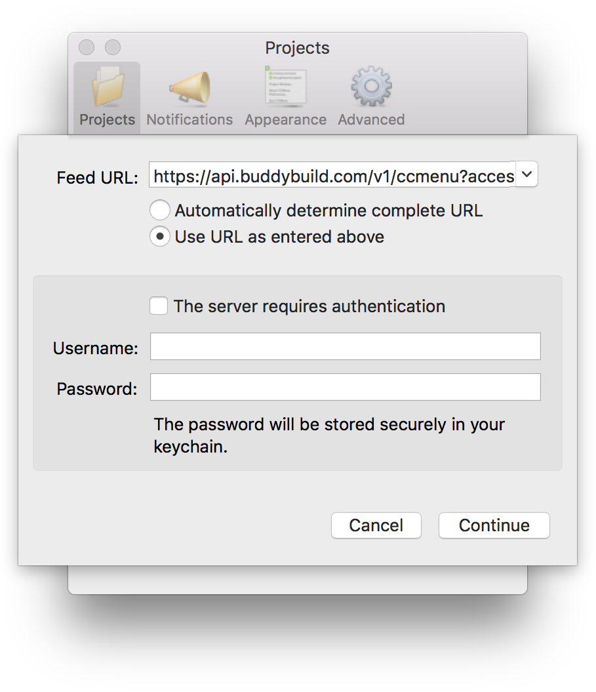

= CCMenu

CCMenu displays the build status of your apps on buddybuild as an item
in the MacOS menu bar.

== How to install CCMenu

You can read more about CCMenu and how to install it at
http://ccmenu.org/.

== Configure CCMenu in buddybuild

You can add a buddybuild app to CCMenu by following these steps:

. Open CCMenu, then select the **Projects** tab, then click the plus
  button to add projects from buddybuild.

. In the popup dialog that appears select the *Use URL as entered above*
  option.

. In the *Feed URL* field enter:
+
[source,bash]
----
https://api.buddybuild.com/v1/ccmenu?access_token=API_TOKEN
----
+
where `API_TOKEN` is your
link:https://apidocs.buddybuild.com/#authentication[buddybuild API
access token]. You can also specify a branch by appending the
`branch=BRANCH_NAME` query parameter. This presents a list of your
buddybuild apps to choose from.

