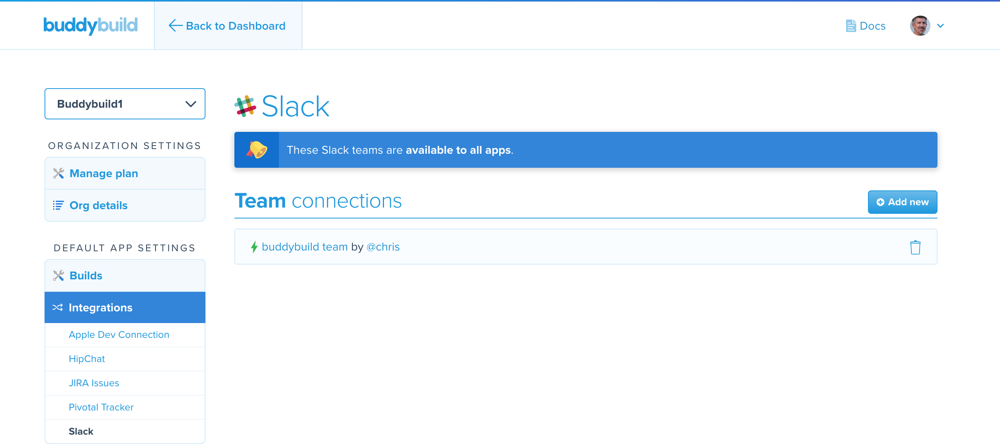

= Default integration settings

Each of the available link:../README.adoc[integration] settings are
app-specific. This section describes how you can specify default
integration settings that automatically apply to new apps, or that can
be applied to any applications that already exist within an
organization.

[IMPORTANT]
Default integration settings are available for the following
integrations: the link:../itunes_connect.adoc[Apple Developer Portal],
link:../hipchat.adoc[HipChat], link:../jira.adoc[JIRA],
link:../pivotal_tracker.adoc[Pivotal Tracker], and
link:../slack.adoc[Slack]. For the remaining integrations, the settings
need to be configured for each individual app.

This page contains the following sub-sections:

- <<access>>
- <<apple>>
- <<hipchat>>
- <<jira>>
- <<pivotal>>
- <<slack>>

[[access]]
== How to access default integration settings

. Log in to the link:https://dashboard.buddybuild.com/[buddybuild
  dashboard].

. image:../../_img/dropdown-user-manage_org.png["Select Manage Org in
  the avatar dropdown", 121, 207, role="right"]
  Move your mouse pointer over your avatar in the top right corner. A
  dropdown menu appears.

. Select **Manage Org**. The **Manage Organization** screen appears:
+
image:../../_img/screen-manage_org.png["The Manage Organization", 1280,
568, role="frame"]

. image:../../_img/dropdown-organizations.png["The current
organization", 206, 40, role="right"]
  In the left navigation, a dropdown menu exists with the current
  organization selected. Click the dropdown menu to list all of the
  organizations that you currently belong to.

. Select the organization that requires a change to the default
  integration settings.

. image:img/panel-default_app_settings.png["Default App Settings", 206,
102, role="right"]
  On the left side of screen, find the **Default App Settings** links.
  Click **Integrations**. The **Apple Developer Connection** screen is
  displayed:
+
image:img/screen-apple_developer_connection.png["The Apple Developer
Connection screen", 1280, 569, role="frame"]

. image:img/panel-default_app_settings-integrations.png["Default App
  Settings for Integrations", 206, 256, role="right"]
  On the left side of the screen, click the name of an integration that
  needs default settings. The appropriate screen is displayed.
+
Find coverage of each integration's default settings below:
+
--
- <<apple>>
- <<hipchat>>
- <<jira>>
- <<pivotal>>
- <<slack>>
--

[[apple]]
== Apple Developer Connection

Buddybuild can automatically sync with your Apple Developer Portal
account(s). With this integration, buddybuild can:

- link:../../quickstart/ios/apple_developer_portal_sync.adoc[Automatically
  sync your Provisioning Profiles]

- link:../../deployments/ios/itunes_connect.adoc[Upload specific builds
  to iTunes Connect and TestFlight]

The default settings screen lets you connect multiple accounts:

image:img/screen-apple_developer_connection-bb.png["The Apple Developer
Connection screen for buddybuild", role="frame"]

Learn more about the settings for link:../itunes_connect.adoc[Apple
Developer Connection].

[[hipchat]]
== HipChat

HipChat is a popular group chat service, with video chat and screen
sharing. Buddybuild's integration with HipChat can automatically notify
you and your team of build status, feedback submissions, and crash
reports directly in the rooms you use.

image:img/screen-hipchat.png["The HipChat default settings", 1280, 569
role="frame"]

Learn more about the settings for link:../hipchat.adoc[HipChat].

[[jira]]
== JIRA Issues

JIRA is a powerful issues and project tracker used by many agile teams.
Buddybuild's integration can automatically open a JIRA issue for each
piece of feedback and crash report that you receive for your apps.

image:img/screen-jira.png["The JIRA default settings", 1280, 716
role="frame"]

Learn more about the settings for link:../jira.adoc[JIRA].

[[pivotal]]
== Pivotal Tracker

Pivotal Tracker is a lightweight, agile project management tool for
software teams. Buddybuild's integration with Pivotal Tracker can
automatically open a Pivotal Tracker issue for each piece of feedback
that you receive for your apps.

image:img/screen-pivotal_tracker.png["The Pivotal Tracker default settings",
1280, 569, role="frame"]

Learn more about the settings for link:../pivotal_tracker.adoc[Pivotal
Tracker].

[[slack]]
== Slack

Buddybuild offers a first-class integration with Slack, which allows
you and your team to be notified of build status, feedback submissions,
and crash reports directly in the channels you use.

The default Slack settings allow you to configure the Slack teams that
buddybuild should use. The Slack channel is configured for each app
individually.

Learn more about the settings for link:../slack.adoc[Slack].
