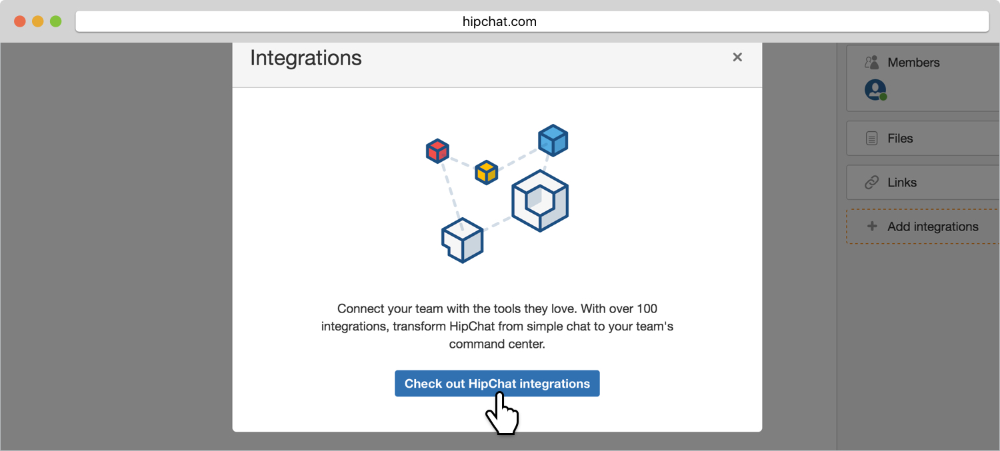
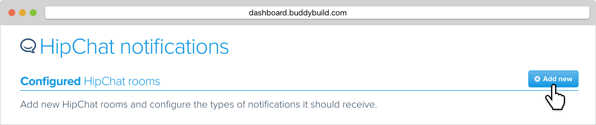

= HipChat

Buddybuild offers integration with HipChat, directly in the rooms you
use.

Let's get started.

Log in to HipChat and navigate to the Room that you would like to
integrate with buddybuild. In the bottom right corner, click on
**Integrations**.

image:img/hipchat-1.jpg[,1500,496]

In the dialogue box that opens, click on **Check out HipChat
integrations**. If you already have other integrations added, you can
click on **Install new integrations**.

Click on **Build your own integration.**

image:img/hipchat-3.jpg[,1500,713]

Fill in the **Name your integration** field and click **Create**.

image:img/hipchat-4.jpg[,1500,381]

Copy the URL in the field labeled **Send messages to this room by
posting to this URL**.

image:img/hipchat-5.jpg[,1500,308]

Head back over to buddybuild and click on **App Settings**.

image:img/Builds---Settings.png[,1500,483]

In the left navigation, select **Notifications**, then **HipChat**.

image:img/hipchat-6.jpg[,1500,520]

Click on **Add new** to configure a new HipChat room.

In the **Webhook URL** field, paste in the copied URL and click **Save**.

image:img/hipchat-8.jpg[,1500,713]

You can now select the types of notification events to send to this
HipChat room. You can also configure multiple HipChat rooms by clicking
**Add new**.

That's it! You're now connected via HipChat.
