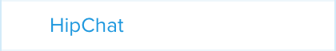

= HipChat

HipChat is a chat service designed for groups, providing video chat and
screen sharing. Buddybuild offers a first-class integration with
HipChat, providing notifications for build status, feedback submissions,
and crash reports directly to the rooms that you use.

There are a number of sub-sections on this page:

- <<navigate>>
- <<connect>>
- <<branches>>
- <<room>>
- <<notifications>>
- <<editing>>
- <<delete_config>>
- <<delete_connection>>

[[navigate]]
== Navigate to the HipChat integration settings

This section describes how to navigate to the HipChat integration
settings, and is referred to by several procedures described on this
page.

. Log in to the link:https://dashboard.buddybuild.com/[buddybuild
  dashboard].

. image:../builds/img/button-app_settings.png["The App Settings button",
  118, 64, role="right"]
  Click the **App Settings** button in the top toolbar. The **Default
  build configuration** screen is displayed:
+
image:img/screen-build_settings.png["The Default build configuration
screen", 1280, 737, role="frame"]

. image:img/button-integrations.png["The Integrations button", 210, 42,
  role="right"]
  In the left navigation bar, click the **Integrations** button. The
  first of the **Integrations** screens (**Apple Dev Connection**) is
  displayed:
+
image:img/screen-apple_dev_connection.png["The Apple Dev Connection
screen", 1280,734, role="frame"]

. 
  In the left navigation, click the **HipChat** button. The **HipChat**
  screen is displayed:
+
image:img/screen-hipchat-unconfigured.png["The HipChat screen", 1280, 734,
role="frame"]
+
If you have previously configured HipChat, you might instead see:
+
image:img/screen-hipchat-configured.png["The HipChat screen with existing
configuration", 1280, 734, role="frame"]

[[connect]]
== Connect your HipChat room

These steps describe how to establish a connection between buddybuild
and a specific HipChat room. You can create as many HipChat room
connections as required.

. In a separate browser window or tab,
link:https://www.hipchat.com/sign_in[log in to HipChat].
+
image:img/screen-hipchat-login.png["The HipChat login screen", 1280,
474, role="frame"]

. Navigate to the room you would like to connect with buddybuild.
+
image:img/screen-hipchat-room.png["A HipChat room", 1280, 780,
role="frame"]

. image:img/button-hipchat-integrations.png["The HipChat Integrations
button", 201, 47, role="right"]
  In the bottom right corner, click the **Integrations** button.

. At this point, how you proceed depends on whether you already have
integrations or not. Proceed with _one_ of the following:
+
--
[loweralpha]
. If you _do not_ have any configured integrations, the following dialog
  appears:
+
image:img/screen-hipchat-integrations_dialog-unconfigured.png["The
HipChat Integrations dialog", 1280, 780, role="frame"]
+
image:img/button-hipchat-check_out_hipchat_integrations.png["The Check
out HipChat integrations button", 232, 30, role="right"]
Click the **Check out HipChat integrations button**.

. If you _do_ have configured integrations, the following dialog
appears:
+
image:img/screen-hipchat-integrations_dialog-configured.png["The HipChat
Integrations dialog, with configured integrations", 1280, 780,
role="frame"]
+
image:img/button-hipchat-install_new_integrations.png["The Install new
integrations button", 156, 14, role="right"]
Click the **Install new integrations** button.
--
+
In either case, the **Integrations showcase** screen is displayed:
+
image:img/screen-hipchat-integrations.png["The Integrations showcase
screen", 1280, 565, role="frame"]

. image:img/button-hipchat-build_your_own.png["The Build your own
  integration button", 320, 150, role="right"]
  Click the **Build your own integration** button. The **Build your
  own** screen is displayed;
+
image:img/screen-hipchat-build_your_own.png["The Build your own screen",
1280, 671, role="frame"]

. Enter a name for the integration in the **Name your integration
  field**. We recommend calling this integration `buddybuild`.

. image:img/button-hipchat-create.png["The Create button", 66, 30,
  role="right"]
  Click the **Create** button. The **Integration configuration** screen
  is displayed:
+
image:img/screen-hipchat-integration_configuration.png["The Integration
configuration screen", 1280, 861, role="frame"]

. Copy the contents of the **Send messages to this room by posting to
  this URL** field.

. In your original browser window or tab, <<navigate>>.

. Depending on whether you have an existing connection or not, perform
  _one_ of the following:
+
--
[loweralpha]
. image:img/button-hipchat-add_room.png["The Add a HipChat room button",
  161, 42, role="right"]
  If you _do not_ already have a HipChat connection configured, click
  the **Add a HipChat room** button.

. image:img/tab-hipchat-connected_rooms.png["The Connected rooms tab",
239, 63, role="right"]
  If you _do_ have an existing HipChat connection, click the **Connected
  rooms** tab. The **Connected rooms** screen is displayed:
+
image:img/screen-hipchat-connected_rooms.png["The Connected rooms
screen", 1280, 617, role="frame"]
+
image:img/button-add_new.png["The Add new button", 89, 30, role="right"]
Click the **Add new** button.
--
+
For both options, the **Add a HipChat room** screen is displayed:
+
image:img/screen-hipchat-add_room.png["The Add a HipChat room screen",
1280, 379, role="frame"]

. Enter a name for the room connection in the **Room name** field.

. Paste the URL that you copied from the HipChat **Integration
  configuration** screen into the **Webhook URL** field.

. 
  Click the **Add room** button. The **Connection confirmation** screen
  is displayed:
+
image:img/screen-hipchat-connection_confirmation.png["The Connection
confirmation screen", 1280, 447, role="frame"]
+
. Here, you have a choice:
+
--
[loweralpha]
. image:img/button-share_with_all_apps.png["The Yes, share with all apps
  button", 230, 42, role="right"]
  If you _do_ wish to share this room connection with all apps, click
  the **Yes, share with all apps** button.

. image:img/button-no_thanks.png["The No thanks! button", 230, 42,
  role="right"]
  If you _do not_ wish to share this room connection with all apps,
  click the **No thanks!** button. The room connection is associated
  only with the current application.
--
+
For both options, the **HipChat** screen is displayed:
+
image:img/screen-hipchat-no_branches.png["The HipChat screen, with no
notifications yet configured", 1280, 617, role="frame"]

[[branches]]
== Configure branches

This section describes how to configure buddybuild's HipChat integration
for branches, including for <<all>>, <<specific,specific branches>>, or
<<pattern,patterns that can match branches and/or tags>>.

[[all]]
=== All branches

You can configure notifications for all branches.

. <<navigate>>

. image:img/button-add_new.png["The Add new button", 89, 30,
  role="right"]
  You can configure buddybuild notifications for all branches of your
  application, or you can configure notifications for a
  <<per-branch,specific branch>>.
  Click the appropriate **Add new** button. The **HipChat** screen is
  displayed, which now includes the **All branches** notifications
  configuration panel:
+
image:img/panel-hipchat-all_branches-unconfigured.png["The All branches
notifications configuration panel", 900, 446, role="frame"]

. Continue with <<room>>.

[[per-branch]]
=== Branch specification

You can configure notifications for a specific branch, or a pattern that
can match branches and/or tags.

. <<navigate>>

. image:img/button-add_new.png["The Add new button", 89, 30,
  role="right"]
  Click the **Add new** button beside the **Notifications for specific
branches** subheading.
+
You can <<specific>> which configures notifications for one branch, or
<<pattern>> which configures notifications for any matching branches or
tags.

[[specific]]
==== Choose a specific branch

. Click the **Choose a specific branch** tab. The **Specific Branch
  selection** screen is displayed:
+
image:img/screen-choose_branch-specific.png["The Specific Branch selection
screen", 1280, 484, role="frame"]

. If you have many branches, click the **branch filter field** and enter
the name of the desired branch (or portion thereof); the list of
branches displays only matching branches.

. image:img/button-add.png["The Branch add button", 46, 30, role="right"]
  Move your pointer over the branch you want to choose. An **Add**
  button appears at the right of the row. Click the **Add** button.
  The **HipChat** screen is displayed, which now includes a
  branch-specific notifications configuration panel:
+
image:img/panel-slack-specific_branch-unconfigured.png["A
branch-specific notification configuration panel", 900, 232,
role="frame"]

. Continue with <<room>>.

[[pattern]]
==== Define a pattern to match

. Click the **Define a pattern to match** tab. The **Branch pattern
  selection** screen is displayed:
+
image:img/screen-choose_branch-pattern.png["The Branch pattern selection
screen", 1280, 484, role="frame"]

. Click the **branch filter field** and enter the pattern that the
desired branches should match; the list of branches displays only
matching branches.

. By default, the pattern applies to both tags and branches. You can
choose to apply the pattern to **Tags only**, or to **Branches only**.
Click the appropriate checkbox. The list of branches updates
accordingly.

. image:img/button-create.png["The Create button", 61, 40, role="right"]
  Click the **Create** button. The **HipChat** screen is displayed, which
  now includes a pattern-specific notifications configuration panel:
+
image:img/panel-hipchat-pattern-unconfigured.png["A pattern-specific
notifications configuration panel", 900, 232, role="frame"]

. Continue with <<room>>.

[[room]]
== Room selection

This section describes how to select the HipChat room to which
buddybuild should send notifications.

. image:img/button-hipchat-room_dropdown.png["The Room selection
  dropdown", 208, 46, role="right"]
  In the appropriate notifications configuration panel,
  click the **Room selection** dropdown. The **Room selection
  menu** is displayed.

. image:img/dropdown-hipchat-room.png["The Room selection menu",
  219, 187, role="right"]
  Select the channel to which buddybuild should send notifications. The
  **Notifications configuration** tabs become enabled:
+
image:img/tab-notifications-build.png["The Build tab", 598, 193,
role="frame"]

[[notifications]]
== Configure notifications

This section describes the available kinds of notifications and their
options.

[[build]]
=== Build notifications

image:img/tab-notifications-build.png["The Build tab", 598, 193,
role="frame"]

On the **Build** tab, the following notification configuration options
are available:

- image:img/dropdown-notifications-build_success.png["The Build success
  menu", 231, 132, role="right"]
  **Build success**: You can choose to receive buddybuild notifications
  for:
+
--
- **All successful builds**: whenever your application builds
  successfully.

- **Only when the build gets fixed**: for the first successful build
  after one or more build failures.

- **None**: no notifications for build success are sent.
--

- image:img/dropdown-notifications-build_failures.png["The Build
  failures menu", 231, 132, role="right"]
  **Build failures**: You can choose to receive buddybuild notifications
  for:
+
--
- **All build failures**: whenever your application fails to build
  successfully.

- **Only when the build breaks**: for the first failed build after one
  or more successful builds.

- **None**: no notifications for build failures are sent.
--

- **Xcode updates**: Click the toggle button to enable/disable
  notifications whenever buddybuild makes a new version of Xcode
  available.
+
[NOTE]
This option is only available for **All branches**. It is not available
for specific-branch or pattern-specific configuration.

[[deployment]]
=== Deployment notifications

image:img/tab-notifications-deployment.png["The Deployment tab", 598, 240,
role="frame"]

[NOTE]
Deployment notifications are only available for **All branches**. They
are not available for specific-branch or pattern-specific configuration.

Click the associated toggle button to adjust these notification
configuration options:

- **User failed to install a build**: when enabled, receive a
  notification whenever a test user fails to install a build.

- **Device added to Apple account**: when enabled, receive a
  notification whenever a new device is associated with your iTunes
  Connect account.

- **Failed upload to App Store**: when enabled, receive a notification
  when buddybuild's attempt to upload a build to iTunes Connect fails
  for any reason.

- **Tester unsubscribed from a deployment group**: when enabled, receive a
  notification when one of your test users elects to stop receiving
  announcements of new builds.

[[feedback]]
=== Feedback notifications

image:img/tab-notifications-feedback.png["The Feedback tab", 598, 240,
role="frame"]

- **User Feedback**: Click the toggle button to enable/disable
  notifications whenever a test users sends feedback about your
  application.

- image:img/dropdown-notifications-crash_reports.png["The Crash reports
  menu", 231, 132, role="right"]
  **Crash reports**: You can choose to receive buddybuild notifications
  for:
+
--
- **All crash reports**: whenever your application crashes on a test
  user's device.

- **New crash report types**: for new types of crashes that have not
  previously been reported.

- **None**: no notifications for application crashes are sent.
--

[[editing]]
== Edit notification configuration

Individual notification settings can be adjusted at any time.
Adjustments take effect immediately for all future notifications.

=== All branches

You can only adjust individual settings in the **all branches** panel,
or by <<delete_config,deleting notification configuration>>; there are
no other editing options.

=== Branch-specific notifications

Once branch-specific notifications settings are established, it is not
possible to adjust which branch they apply to. If you need to accomplish
this, create branch-specific settings for the "new" branch and then
delete the original branch-specific settings. See <<per-branch>> and
<<delete_config>> for details.

=== Pattern-specific notifications

image:img/button-pencil.png["The pencil button", 45, 47, role="right"]
You can adjust the pattern for pattern-specific notification settings,
by clicking the **Pencil** icon at the top right of the appropriate
panel. The **Edit branch pattern** screen is displayed:

image:img/screen-edit_branch_pattern.png["The Edit branch pattern
screen", 1280, 354, role="frame"]

image:img/button-save.png["The Save button", 51, 40, role="right"]
Adjust the pattern as necessary (see <<pattern>> for more details), then
click the **Save** button.

[[delete_config]]
== Delete notification configuration

image:img/button-trashcan.png["The Trashcan icon", 57, 47, role="right"]
When you need to delete notification configuration settings,
for all branches, specific branches, or pattern-specific branches or
tags, click the **Trashcan** icon at the top right of the appropriate
panel. The panel is removed, and notifications based on the deleted
configuration cease immediately.

[[delete_connection]]
== Delete room connection

The steps to delete a room connection differ between connections that
are available for all apps and connections available for select apps.

[loweralpha]
. image:img/badge-all_apps.png["The all-apps indicator", 187, 47,
role="right"]
  **For connections available for all apps**
+
--
. Log in to the link:https://dashboard.buddybuild.com/[buddybuild
  dashboard].

. image:../_img/dropdown-user-manage_org.png["Select Manage Org in
  the avatar dropdown", 121, 207, role="right"]
  Move your mouse pointer over your avatar in the top right corner. A
  dropdown menu appears.

. Select **Manage Org**. The **Manage Organization** screen appears:
+
image:../_img/screen-manage_org.png["The Manage Organization screen",
1280, 589, role="frame"]

. image:../_img/button-integrations.png["The Integrations button", 206,
  42, role="right"]
  In the left navigation, click the **Integrations** link. The first of
  the **Integrations** screens (**Apple Dev Connection**) is displayed:
+
image:../_img/screen-apple_dev_connection.png["The Apple Dev Connection
screen", 1280, 569, role="frame"]

. 
  In the left navigation, click the **HipChat** button. The **HipChat**
  screen is displayed, showing all of the shared HipChat rooms:
+
image:img/screen-hipchat.png["The HipChat screen", 1280, 569,
role="frame"]

. image:img/button-trashcan.png["The Trashcan icon", 57, 47, role="right"]
  Click the **Trashcan** icon beside the room connection you wish to
  delete. A delete confirmation dialog appears:
+
image:img/screen-hipchat-delete_confirmation.png["The HipChat connection
delete confirmation dialog", 1280, 569, role="frame"]

. image:img/button-delete_confirmation-delete_hipchat_room.png["The Delete
  HipChat room button", 249, 42, role="right"]
  Click the **Delete HipChat room** button to complete the deletion of
  the connection.
+
image:img/button-delete_confirmation-cancel.png["The Cancel button",
249, 42, role="right"]
  If you want to continue using the HipChat room connection, click the
  **Cancel** button.
--

. **For other connections, not available to all apps**
+
--
. <<navigate>>

. Click the **Connected rooms** tab. The connected room are displayed:
+
image:img/panel-hipchat-connected_rooms.png["The list of connected rooms",
905, 219]

. image:img/button-trashcan.png["The Trashcan icon", 57, 47, role="right"]
  Click the **Trashcan** icon beside the room connection you wish to
  delete. A delete confirmation appears:
+
image:img/panel-connection_delete_confirmation.png["The Connection delete
confirmation panel", 900, 46]

. image:img/button-delete.png["The Delete button",61, 30, role="right"]
  Click the **Delete** button to complete the deletion of the
  connection.
--
