= JIRA

JIRA is a powerful issues and project tracker used by a lot of agile
teams. Buddybuild can be configured to automatically open a JIRA issue
for each piece of feedback and crash report you receive on your app.

[NOTE]
======
**How to grant permissions for the API?**

You can read more about it here: link:https://confluence.atlassian.com/display/APPLINKS/OAuth+security+for+application+links[OAuth security for application links]
======

Start by launching the buddybuild dashboard and clicking on **App
Settings**.

image:img/Builds---Settings.png[,1500,483]

In the left navigation, select **Integrations**, then **JIRA Issues**.

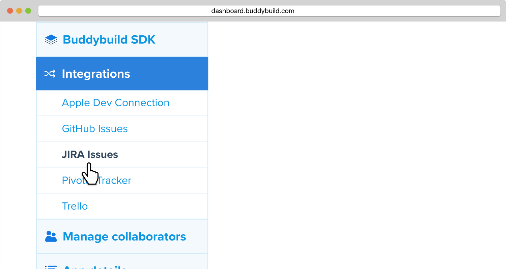

Enter your **JIRA base URL** in the specified field. Take note of your
**Consumer key**, **Public key** and **Consumer callback URL,** as
you'll need it for the next step.

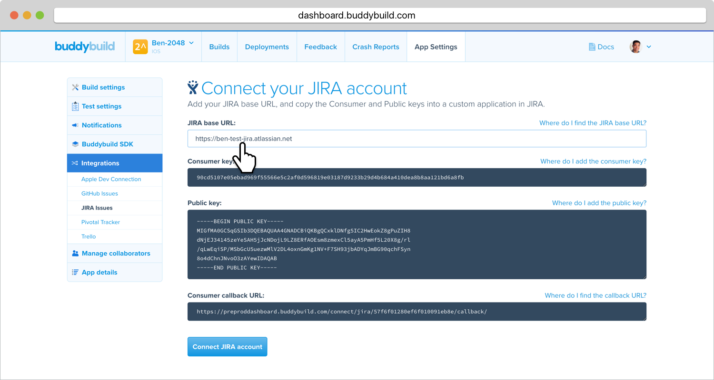

== Edit your JIRA Application Configuration

Open JIRA in a new tab. Click on the **Settings** icon and select
**Applications**.

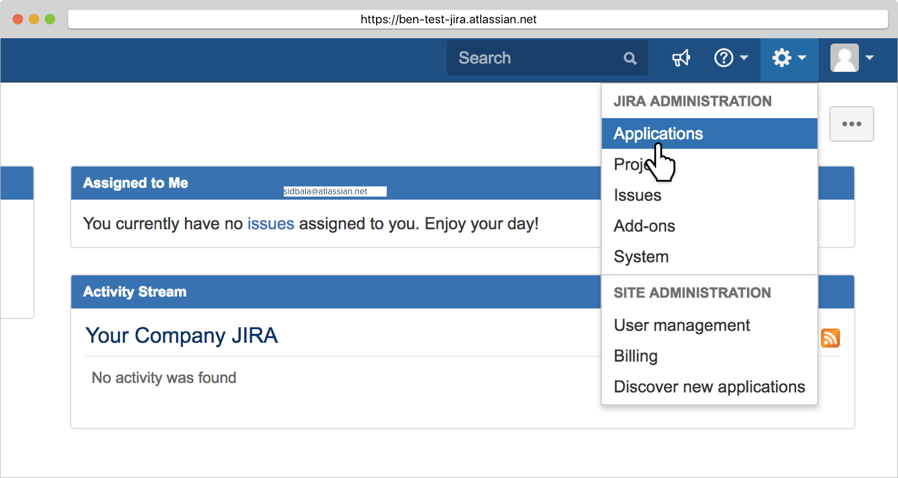

== Create a New Application Link

In the left navigation, click on **Application links**. Next, copy the
dashboard URL below into the Application URL field and click on **Create
New Link**.

[WARNING]
=========
**What if I have multiple JIRA integrations with buddybuild?**

You can append your app id to the URL, e.g.:

https://dashboard.buddybuild.com/57acc935dfda60010066a000
=========

[[code-samples]]
--
[source,xml]
----
https://dashboard.buddybuild.com
----
--

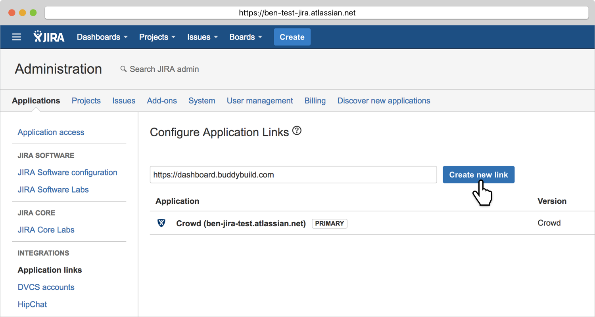

== Click Continue

Ignore the warning and click Continue.

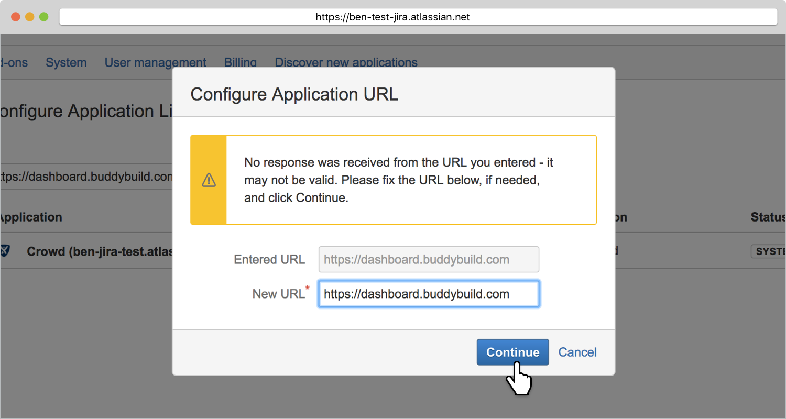

== Enter App Name and Continue

Use **buddybuild** as the Application Name. A new Application Link will
be created.

image:img/Settings---Jira-Issues---5.png[,1500,688]

== Edit the Application Link

Edit the newly created application link.

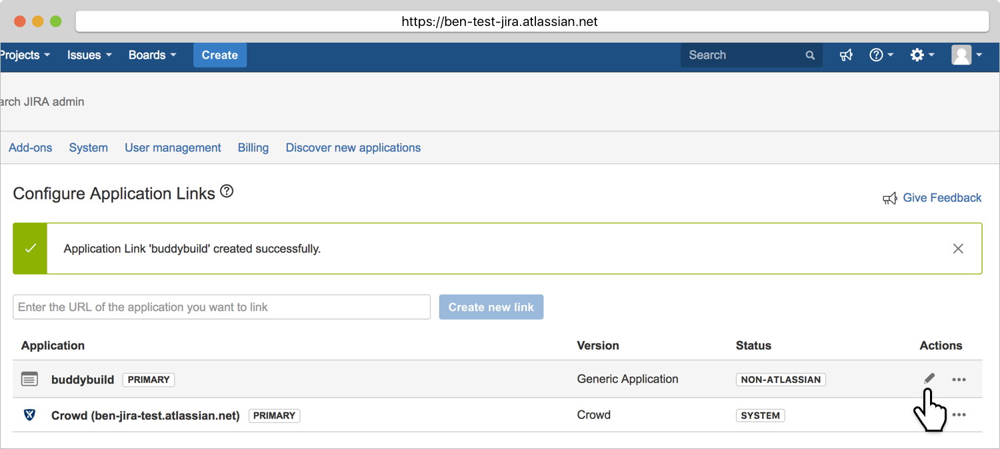

== Configure the Incoming Authentication

Navigate to the Incoming Authentication Section.

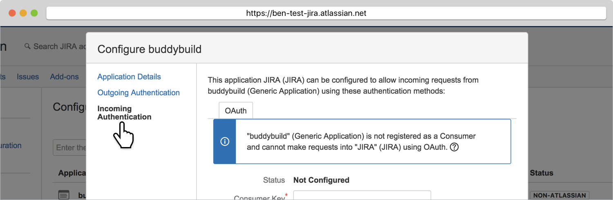

== Paste in your Keys and CallbackURL

Buddybuild will generate your Public Key, your Consumer Key and the
Consumer callback URL. Navigate to buddybuild, copy the above items from
the JIRA Issues settings page and paste them into your JIRA Application.

Use **buddybuild** as the consumer name.

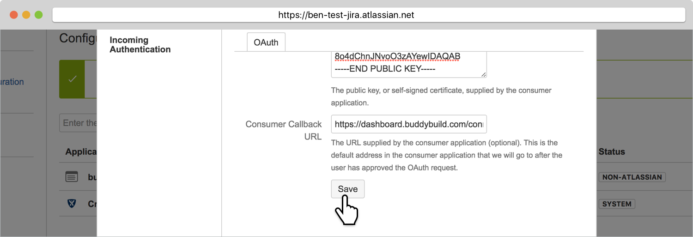

== Navigate back to buddybuild and hit Connect

Now that you have JIRA configured, head back over to buddybuild and
click on **Connect JIRA account**.

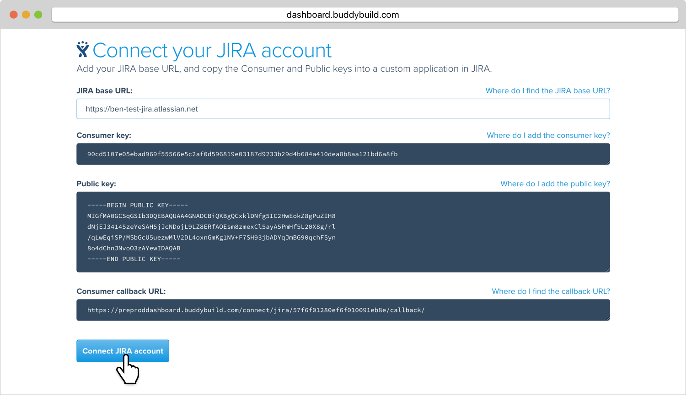

== Authorize buddybuild to connect to your JIRA

Click on the **Allow** button.

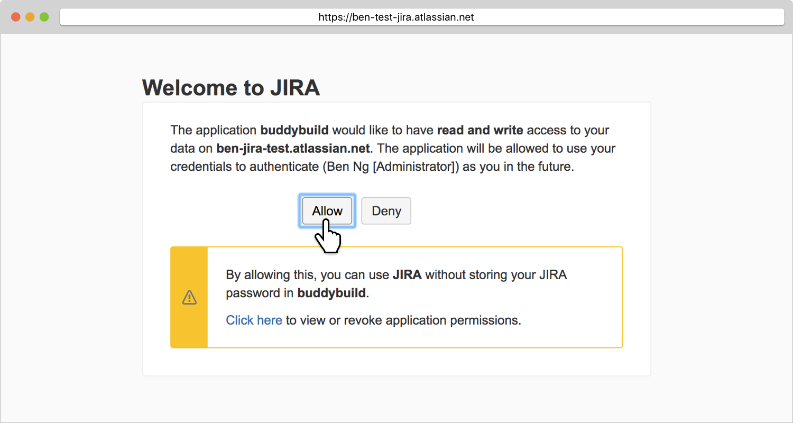

== Select your JIRA Project and Issue Type

Next, configure JIRA for Feedback and Crash Reports.  You can
automatically create issues, and set the default **project**, **type**
and **reporter** for new issues.

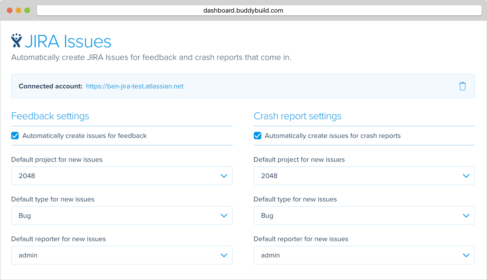

That's it! Buddybuild is now connected to your JIRA. We will
automatically create an issue for every piece of feedback you receive.
