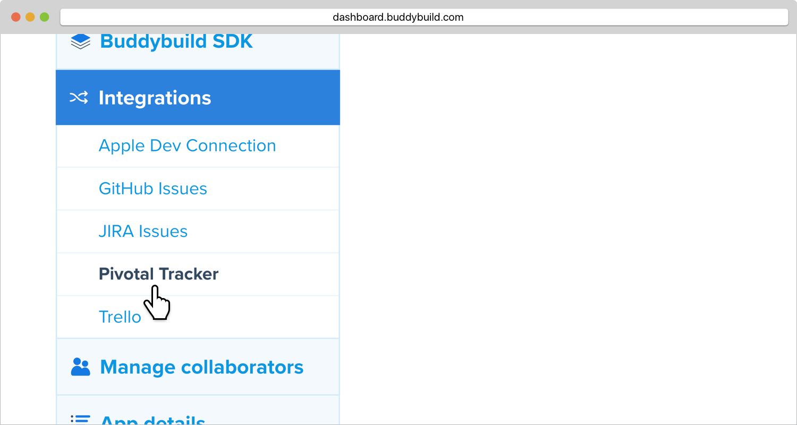

= Pivotal Tracker

Pivotal Tracker is a lightweight, agile project management tool for
software teams.

Buddybuild can be configured to automatically open a Pivotal Tracker
issue for each piece of feedback you receive on your app.

To configure this integration, generate a new API token from your
Pivotal Tracker account.

Once created, copy this API token.

image:img/Pivotal---1.png["The Pivotal Tracker API Token screen", 1500,
330]

Navigate back to buddybuild, and click on the **App Settings** button.

image:img/Builds---Settings.png["The buddybuild dashboard", 1500, 483]

Select **Pivotal Tracker** in the left navigation.

Paste the API token in the specified field, and click **Connect Pivotal
Tracker account**.

image:img/Pivotal---3.png["The Connect your Pivotal Tracker account
screen", 1500, 472]

Next, configure Pivotal Tracker for Feedback and Crash Reports. You can
automatically create issues, and select the default project.

image:img/Pivotal---4.png["The Pivotal Tracker integration configuration
screen", 1500, 635]

That's it! You're now connected with Pivotal Tracker.
