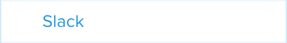
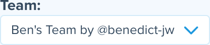
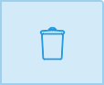

= Slack

Slack is a popular team-based chat application that has revolutionized
the way that development teams communicate. Buddybuild offers a
first-class integration with Slack, providing notifications for build
status, feedback submissions, and crash reports directly to the Slack
channels that you use.

There are a number of sub-sections on this page:

- <<navigate>>
- <<connect>>
- <<branches>>
- <<channel>>
- <<notifications>>
- <<editing>>
- <<remove_config>>
- <<remove_connection>>

[[navigate]]
== Navigate to the Slack integration settings

This section describes how to navigate to the Slack integration
settings, and is referred to by several procedures described on this
page.

. Log in to the link:https://dashboard.buddybuild.com/[buddybuild
  dashboard].

. image:../builds/img/button-app_settings.png["The App Settings button",
  118, 64, role="right"]
  Click **App Settings** button in the top toolbar. The **Default build
  configuration** screen is displayed:
+
image:img/screen-build_settings.png["The Default build configuration
screen", 1280, 1024, role="frame"]

. image:img/button-integrations.png["The Integrations button", 210, 42,
  role="right"]
  In the left navigation bar, click the **Integrations** button. The
  first of the **Integrations** screens (**Apple Dev Connection**) is
  displayed:
+
image:img/screen-apple_dev_connection.png["The Apple Dev Connection screen", 1280,734,
role="frame"]

. 
  In the left navigation, click the **Slack** button. The **Slack**
  screen is displayed:
+
image:img/screen-slack-unconfigured.png["The Slack screen", 1280, 734,
role="frame"]
+
If you have previously configured Slack, you might instead see:
+
image:img/screen-slack-configured.png["The Slack screen with existing
configuration", 1280, 1024, role="frame"]

[[connect]]
== Connect your Slack team

These steps describe how to establish a connection between buddybuild
and a specific Slack team. You can create as many Slack team connections
as required.

. <<navigate>>

. Depending on whether you have an existing connection, or not, perform
  _one_ of the following:
+
--
[loweralpha]
. image:img/button-connect_with_slack.png["The Connect with Slack
  button", 154, 42, role="right"]
  If you _do not_ already have a Slack connection configured, click
  the **Connect with Slack** button.

. 
  image:img/tab-slack-connected_teams.png["The Connected teams tab", 237,
  63, role="right"]
  If you _do_ have an existing Slack connection, click the **Connected
  teams** tab and then the **Add new** button.
--

. When you are not logged in to Slack, the **Slack authentication**
screen is displayed:
+
image:img/screen-slack-login.png["The Slack authentication screen",
1280, 1024, role="frame"]
+
Enter your Slack team, email address, and then password to login to
Slack.

. Once you are logged in to Slack, the **Slack authorization** screen
is displayed:
+
image:img/screen-slack-authorize.png["The Slack authorization screen",
1280, 568, role="frame"]

. image:img/button-slack-authorize.png["The Slack authorize button",
  200, 36, role="right"]
  Here, you are giving permission to buddybuild to connect to your Slack
  team and send notifications to your channels. Click the **Authorize**
  button. The **Connection confirmation** screen is displayed:
+
image:img/screen-slack-connection_confirmation.png["The Connection
confirmation screen", 1280, 451, role="frame"]

. Choose whether you want to use this Slack connection for all apps, or
  just the current app:
+
--
[loweralpha]
. image:img/button-share_with_all_apps.png["The Yes, share with all apps
  button", 230, 41, role="right"]
  Click the **Yes, share with all apps** button if you want to use this
  Slack connection with all apps.

. image:img/button-no_thanks.png["The No thanks! button", 230, 41,
  role="right"]
  Click the **No thanks!** button if you want to use this Slack
  connection with only the current app.
--
+
In either case, the **Slack** screen is displayed again, showing the
**Configure Slack** tab:
+
image:img/screen-slack-configure_slack-connected.png["The Slack Screen
with initial all branches configuration", 1280, 734, role="frame"]

At this point, the initial connection process is complete! By default, a
configuration panel for **All branches** is opened; continue with the
<<channel>> section.

[[branches]]
== Configure branches

This section describes how to configure buddybuild's Slack integration
for branches, including for <<all>>, <<specific,specific branches>>, or
<<pattern,patterns that can match branches and/or tags>>.

[[all]]
=== All branches

You can configure notifications for all branches.

. <<navigate>>

. image:img/button-slack-add_new.png["The Add new button", 89, 30,
  role="right"]
  You can configure buddybuild notifications for all branches of your
  application, or you can configure notifications for a
  <<per-branch,specific branch>>.
  Click the appropriate **Add new** button. The **Slack** screen is
  displayed, which now includes the **All branches** notifications
  configuration panel:
+
image:img/panel-slack-all_branches-unconfigured.png["The All branches
notifications configuration panel", 900, 446, role="frame"]

. Continue with <<channel>>.

[[per-branch]]
=== Branch specification

You can configure notifications for a specific branch, or a pattern that
can match branches and/or tags.

. <<navigate>>

. image:img/button-slack-add_new.png["The Add new button", 89, 30,
  role="right"]
  Click the **Add new** button beside the **Notifications for specific
branches** subheading.
+
You can <<specific>> which configures notifications for one branch, or
<<pattern>> which configures notifications for any matching branches or
tags.

[[specific]]
==== Choose a specific branch

. Click the **Choose a specific branch** tab. The **Specific Branch
  selection** screen is displayed:
+
image:img/screen-choose_branch-specific.png["The Specific Branch selection
screen", 1280, 484, role="frame"]

. If you have many branches, click the **branch filter field** and enter
the name of the desired branch (or portion thereof); the list of
branches displays only matching branches.

. 
  Move your pointer over the branch you want to choose. An **Add**
  button appears at the right of the row. Click the **Add** button.
  The **Slack** screen is displayed, which now includes a
  branch-specific notifications configuration panel:
+
image:img/panel-slack-specific_branch-unconfigured.png["A
branch-specific notification configuration panel", 900, 232,
role="frame"]

. Continue with <<channel>>.

[[pattern]]
==== Define a pattern to match

. Click the **Define a pattern to match** tab.  The **Branch pattern
  selection** screen is displayed:
+
image:img/screen-choose_branch-pattern.png["The Branch pattern selection
screen", 1280, 484, role="frame"]

. Click the **branch filter field** and enter the pattern that the
desired branches should match; the list of branches displays only
matching branches.

. By default, the pattern applies to both tags and branches. You can
choose to apply the pattern to **Tags only**, or to **Branches only**.
Click the appropriate checkbox. The list of branches updates
accordingly.

. 
  Click the **Create** button. The **Slack** screen is displayed, which
  now includes a pattern-specific notifications configuration panel:
+
image:img/panel-slack-pattern-unconfigured.png["A
pattern-specific notifications configuration panel", 900, 232,
role="frame"]

. Continue with <<channel>>.

[[channel]]
== Channel selection

This section describes how to select the Slack channel to which
buddybuild should send notifications.

. image:img/button-slack-channel_dropdown.png["The Channel selection
  dropdown", 208, 46, role="right"]
  In the appropriate notifications configuration panel,
  click the **Channel selection** dropdown. The **Channel selection
  menu** is displayed.
+
If your team uses many Slack channels, you might notice a slight delay
before the **Channel selection menu** is ready.

. image:img/dropdown-slack-channel.png["The Channel selection menu",
  219, 187, role="right"]
  Select the channel to which buddybuild should send notifications. The
  **Notifications configuration** tabs become enabled:
+
image:img/tab-notifications-build.png["The Build tab", 598, 193,
role="frame"]

[NOTE]

When you have multiple teams configured, each notification configuration
panel includes the team selection dropdown. Click the dropdown and
select the appropriate team. When you select a different team, the
Channel dropdown updates accordingly.

At this point, you can adjust the configuration for **Build**,
**Deployment**, and **Feedback** notifications. Click the associated tab
to display and adjust those specific settings.

[[notifications]]
== Configure notifications

This section describes the available kinds of notifications and their
options.

[[build]]
=== Build notifications

image:img/tab-notifications-build.png["The Build tab", 598, 193,
role="frame"]

On the **Build** tab, the following notification configuration options
are available:

- image:img/dropdown-notifications-build_success.png["The Build success
  menu", 231, 132, role="right"]
  **Build success**: You can choose to receive buddybuild notifications
  for:
+
--
- **All successful builds**: whenever your application builds
  successfully.

- **Only when the build gets fixed**: for the first successful build
  after one or more build failures.

- **None**: no notifications for build success are sent.
--

- image:img/dropdown-notifications-build_failures.png["The Build
  failures menu", 231, 132, role="right"]
  **Build failures**: You can choose to receive buddybuild notifications
  for:
+
--
- **All build failures**: whenever your application fails to build
  successfully.

- **Only when the build breaks**: for the first failed build after one
  or more successful builds.

- **None**: no notifications for build failures are sent.
--

- **Xcode updates**: Click the toggle button to enable/disable
  notifications whenever buddybuild makes a new version of Xcode
  available.
+
[NOTE]
This option is only available for **All branches**. It is not available
for specific-branch or pattern-specific configuration.

[[deployment]]
=== Deployment notifications

image:img/tab-notifications-deployment.png["The Deployment tab", 598, 240,
role="frame"]

[NOTE]
Deployment notifications are only available for **All branches**. They
are not available for specific-branch or pattern-specific configuration.

Click the associated toggle button to adjust these notification
configuration options:

- **User failed to install a build**: when enabled, receive a
  notification whenever a test user fails to install a build.

- **Device added to Apple account**: when enabled, receive a
  notification whenever a new device is associated with your iTunes
  Connect account.

- **Failed upload to App Store**: when enabled, receive a notification
  when buddybuild's attempt to upload a build to iTunes Connect fails
  for any reason.

- **Tester unsubscribed from a deployment group**: when enabled, receive a
  notification when one of your test users elects to stop receiving
  announcements of new builds.

[[feedback]]
=== Feedback notifications

image:img/tab-notifications-feedback.png["The Feedback tab", 598, 240,
role="frame"]

- **User Feedback**: Click the toggle button to enable/disable
  notifications whenever a test users sends feedback about your
  application.

- image:img/dropdown-notifications-crash_reports.png["The Crash reports
  menu", 231, 132, role="right"]
  **Crash reports**: You can choose to receive buddybuild notifications
  for:
+
--
- **All crash reports**: whenever your application crashes on a test
  user's device.

- **New crash report types**: for new types of crashes that have not
  previously been reported.

- **None**: no notifications for application crashes are sent.
--

[[editing]]
== Edit notification configuration

Individual notification settings can be adjusted at any time.
Adjustments take effect immediately for all future notifications.

=== All branches

You can only adjust individual settings in the **all branches** panel,
or that <<remove_config>>; there are no other editing options.

=== Branch-specific notifications

Once branch-specific notifications settings are established, it is not
possible to adjust which branch they apply to. If you need to accomplish
this, create branch-specific settings for the "new" branch and then
remove the original branch-specific settings. See <<per-branch>> and
<<remove_config>> for details.

=== Pattern-specific notifications

You can adjust the pattern for pattern-specific notification settings,
by clicking the **Pencil** icon at the top right of the appropriate
panel. The **Edit branch pattern** screen is displayed:

image:img/screen-edit_branch_pattern.png["The Edit branch pattern
screen", 1280, 354, role="frame"]

Adjust the pattern as necessary (see <<pattern>> for more details), then
click the **Save** button.

[[remove_config]]
== Remove notification configuration

When you need to remove notification configuration settings,
for all branches, specific branches, or pattern-specific branches or
tags, click the **Trashcan** icon at the top right of the appropriate
panel. The panel is removed, and notifications based on the removed
configuration cease immediately.

[[remove_connection]]
== Remove team connection

The steps to remove a team connection differ between connections that
are available for all apps and connections available for select apps.

[loweralpha]
. image:img/badge-all_apps.png["The all-apps indicator", 187, 47,
role="right"]
  **For connections available for all apps**
+
--
. Log in to the link:https://dashboard.buddybuild.com/[buddybuild
  dashboard].

. image:../_img/dropdown-user-manage_org.png["Select Manage Org in
  the avatar dropdown", 121, 207, role="right"]
  Move your mouse pointer over your avatar in the top right corner. A
  dropdown menu appears.

. Select **Manage Org**. The **Manage Organization** screen appears:
+
image:../_img/screen-manage_org.png["The Manage Organization", 1280,
568, role="frame"]

. image:../_img/button-integrations.png["The Integrations button", 206,
  42, role="right"]
  In the left navigation, click the **Integrations** link. The first of
  the **Integrations** screens (**Apple Dev Connection**) is displayed:
+
image:../_img/screen-apple_dev_connection.png["The Apple Dev Connection
screen", 1280, 569, role="frame"]

. 
  In the left navigation, click the **Slack** button. The **Slack**
  screen is displayed, showing all of the shared Slack teams:
+
image:../_img/screen-slack.png["The Slack screen", 1280, 1024,
role="frame"]

. 
  Click the **Trashcan** icon beside the team connection you wish to
  remove. A delete confirmation dialog appears:
+
image:img/screen-slack-delete_confirmation.png["The Slack connection
delete confirmation dialog", 1280, 1024, role="frame"]

. image:img/button-delete_confirmation-delete_slack_team.png["The Delete
  button", 249, 42, role="right"]
  Click the **Delete Slack team** button to complete the deletion of the
  connection.
+
image:img/button-delete_confirmation-cancel.png["The Cancel button",
249, 42, role="right"]
  If you want to continue using the Slack team connectio, click the
  **Cancel** button.
--

. **For other connections, not available to all apps**
+
--
. <<navigate>>

. Click the **Connected teams** tab. The connected teams are displayed:
+
image:img/panel-slack-connected_teams.png["The list of connected teams",
905, 219]
If you are not signed into your Slack account, you are asked to enter
your Slack credentials.

. 
  Click the **Trashcan** icon beside the team connection you wish to
  remove. A delete confirmation appears:
+
image:img/panel-connection_delete_confirmation.png["The Connection delete
confirmation panel", 900, 46]

. 
  Click the **Delete** button to complete the deletion of the
  connection.
--

[NOTE]
======
If buddybuild's authorization to send notifications to a teams is ever
revoked, notifications for this team connection are not sent and the
**Connected teams** tab displays a banner indicating the situation:

image:img/screen-slack-connected_teams-revoked.png["The Connected Teams
screen showing the removed app", 1280, 734, role="frame"]

You now have a choice:

[loweralpha]
. image:img/button-reconnect.png["The Re-connect button", 88, 30,
  role="right"]
  Click the **Re-connect** button to re-authorize notifications from
  buddybuild; the <<connect>> process begins.

. image:img/button-delete-banner.png["The Delete button", 62, 31,
  role="right"]
  To remove of the connection from buddybuild, click the
  **Delete** button.

After reconnection, you may have to perform <<channel>> again,
especially if you use different credentials to authorize buddybuild.
======
