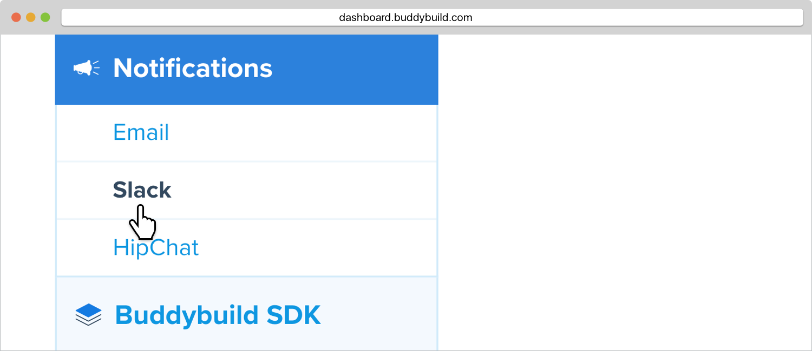
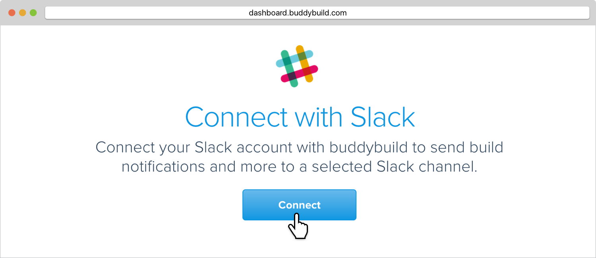
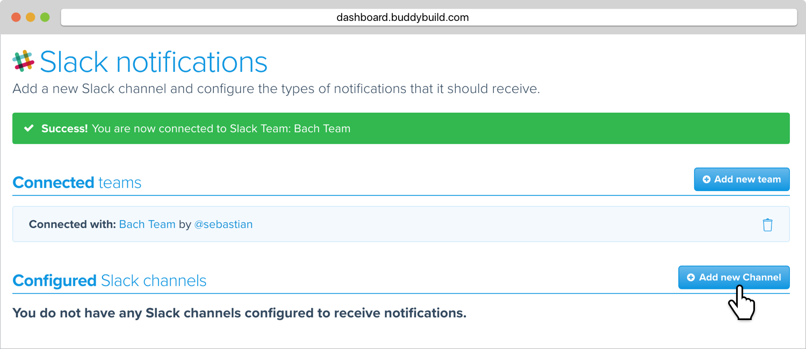
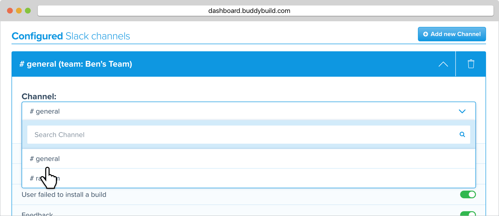

= Slack

Slack is revolutionizing the way teams communicate. Buddybuild offers
first-class integration with Slack. Be notified of build status,
feedback submissions and crash reports directly in the channels you use.

Let's get started by launching the buddybuild dashboard and click the
**App Settings** button.

image:img/Builds---Settings.png[,1500,483]

Select **Slack** in the left panel.

Click on **Connect**.

You will now be prompted to authorize buddybuild use your Slack account.
Click on **Authorize**.

[NOTE]
If you are not signed into your Slack account, you will be asked to
enter your Slack credentials.

Click on **Add New Channel**.

In the **Channel** field, select the channel you'd like buddybuild to
send notifications to from the drop-down list. Next, select the types of
notification events buddybuild should send to this Slack channel.

You can also configure multiple Slack channels by clicking **Add New
Channel**.

image:img/Slack---5.png[,1500,268]

That's it! Your Slack account is now connected to buddybuild.
