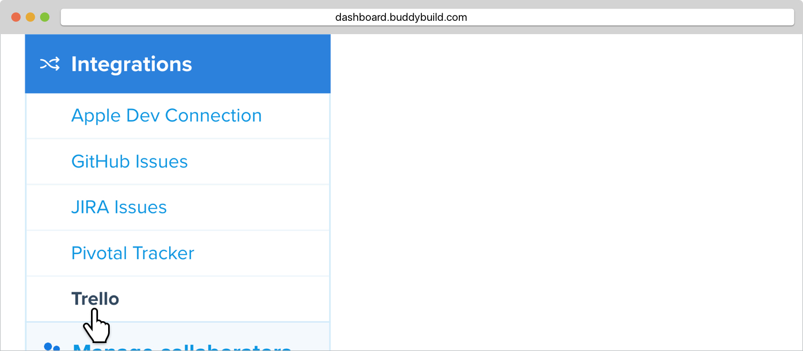
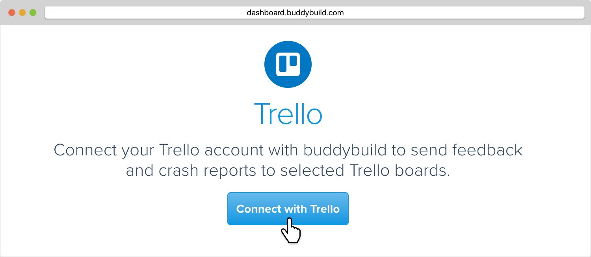
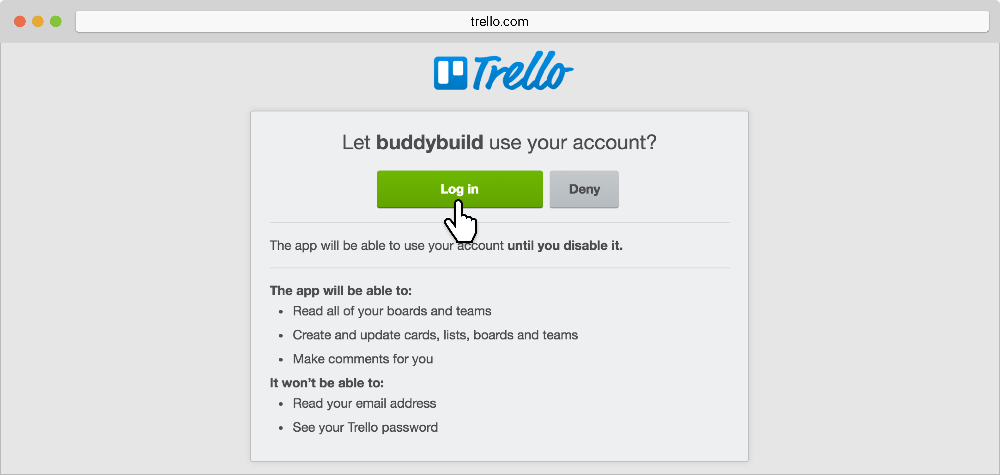
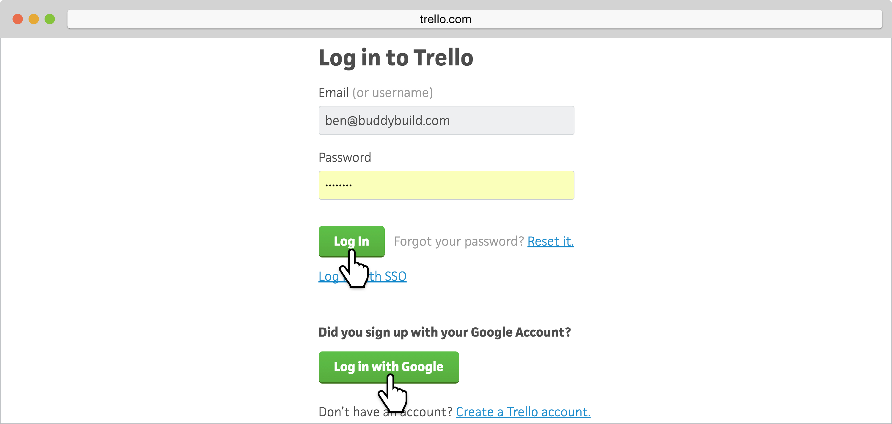
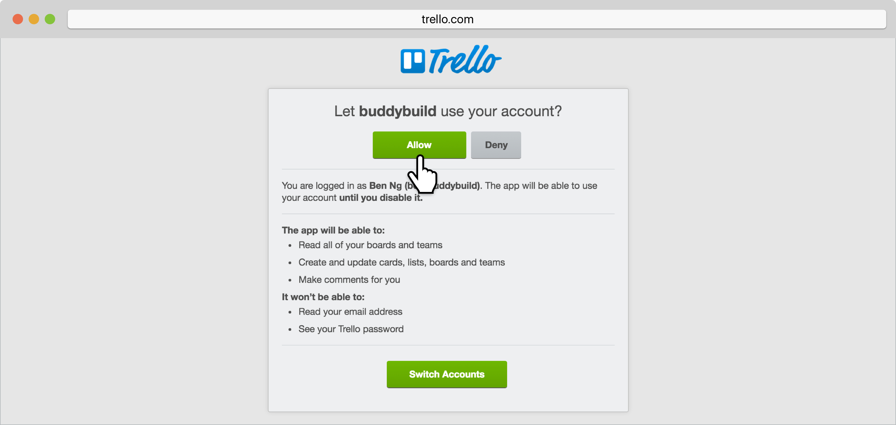
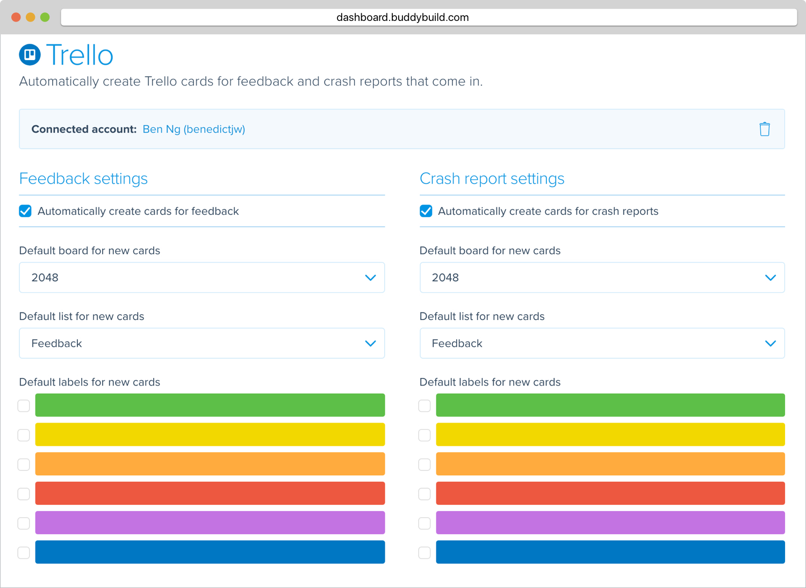

= Trello

Trello’s boards, lists, and cards enable you to organize and prioritize
your feedback in a flexible way. Buddybuild can be configured to
automatically open a Trello card for each piece of feedback you receive
on your app.

Start by launching the buddybuild dashboard and select **App Settings**.

image:img/Builds---Settings.png[,1500,483]

In the left navigation, select **Integrations**, then **Trello**.

Click on **Connect with Trello**.

Next, under "Let buddybuild use your account?", select **Log In**.

Enter the **Email and Password** to your Trello account. Alternatively,
if you have authorized your Trello account with Google, you can click on
  **Log in with Google**.

Next, you'll be prompted to let buddybuild use your account. Select
**Allow**.

Next, configure Trello for Feedback and Crash Reports.  You can
automatically create issues, and set the default **board**, **list** and
**labels** for new cards.

That's it! Your Trello account is now connected! Buddybuild will
automatically create a Trello card for every piece of feedback you
receive.
