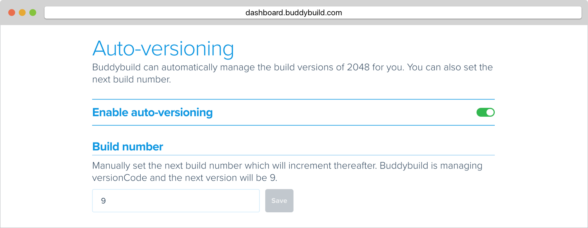

= Auto versioning Android builds

== VersionCode

Buddybuild can update the VersionCode automatically for you. The process
is done on the fly, does not require write access to the repo, and no
changes will be committed back to the repo.

All you need to do is to turn on **Auto-Versioning** in the settings.

== VersionName

The best practice is to update VersionName in the `build.gradle`, and
Buddybuild will simply respect that. Here is a quick example to change
the VersionName to git tag:

[[code-samples]]
--
[source,groovy]
----
/*
 * Gets the version name from the latest Git tag
 */
def getVersionName = { ->
    def stdout = new ByteArrayOutputStream()
    exec {
        commandLine 'git', 'describe', '--tags'
        standardOutput = stdout
    }
    return stdout.toString().trim()
}

...

android {
    ...
    buildTypes {
        debug {
            versionName getVersionName()
        }
    }
    ...
}
----
--

You also have access to the environment variables listed here:
link:../../builds/custom_build_steps.adoc[Custom Build Steps]
