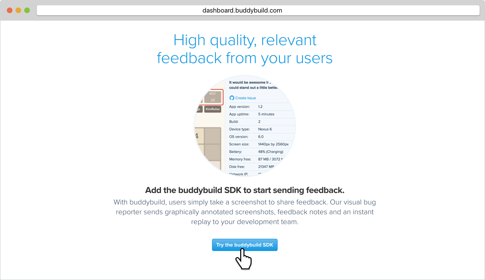
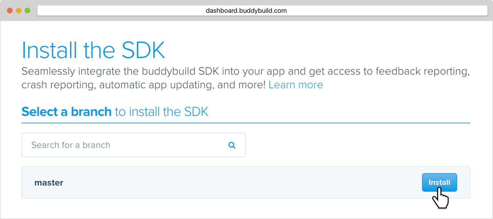

= Integrating SDK

== About the buddybuild SDK

The buddybuild SDK is a lightweight yet powerful suite of tools that
integrates seamlessly into your application. The SDK includes a
graphical feedback reporter, a crash reporting and analysis tool,
automatic app updating and usage tracking. The SDK is regularly updated
with new features.

[WARNING]
=========
**What's the minimum API version supported?**

android:minSdkVersion="8"
=========

=== Feedback Reporter

With buddybuild, you simply shake the device to share feedback. Our
feedback reporter sends graphically annotated screenshots, feedback
notes and device metadata to your team. Integrate with GitHub, JIRA and
Pivotal Tracker to track feedback as issues.
link:../../sdk/feedback_reporter.adoc[Learn more.]

=== Automatic Update

Receiving feedback on old builds is pointless - you've probably already
fixed the issue you've received feedback on! It is crucial to keep your
testers and beta users updated on the very latest builds. If a newer
build is available, the buddybuild SDK can automatically prompt to
install the latest version of your app.
link:../../sdk/automatic_update.adoc[Learn more.]

=== Usage Tracking

Know when your testers download and launch your app in real time.
Identify who tested your app, when they launched it and what version
they tested. Correlate this with feedback and crash reports to
understand your customers' experience.
link:../../sdk/usage_tracking.adoc[Learn more.]



== How to install

Enabling the buddybuild Android SDK requires no code changes. Enabling
the SDK is as simple as clicking a button.

=== Step 1: Configure SDK Installation

On your App's page, under the **Feedback** tab, click on the **Try the
buddybuild SDK** button.

=== Step 2: Enable the SDK

Enable the SDK in whatever branch you'd like. Typically, the SDK will be
used by your testers, so you'll want to enable the SDK on the branches
that deploy to your testers.

That's it! A new build will be kicked off with the SDK enabled. Install
this build on your device. Open your app and shake your device. See what
happens!

You're all set now to deploy your app broadly to all your testers and to
receive graphically annotated feedback from them!
