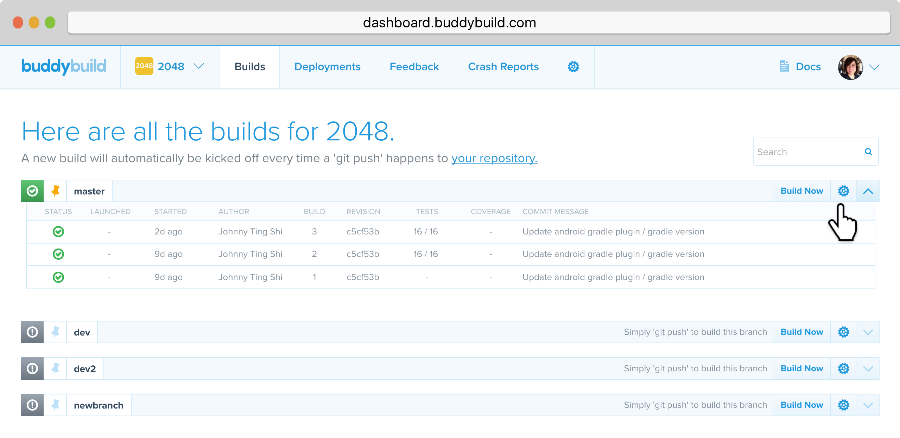
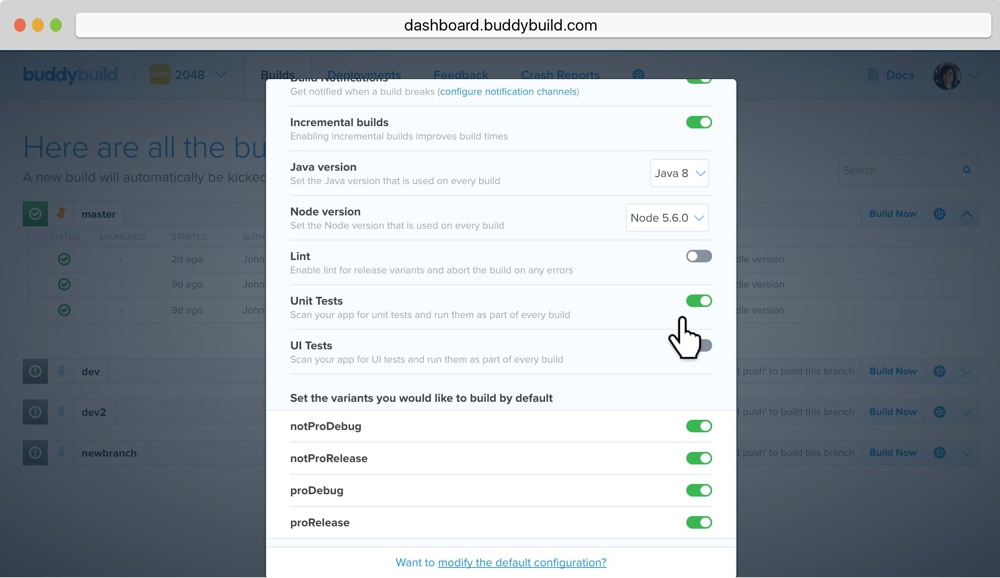
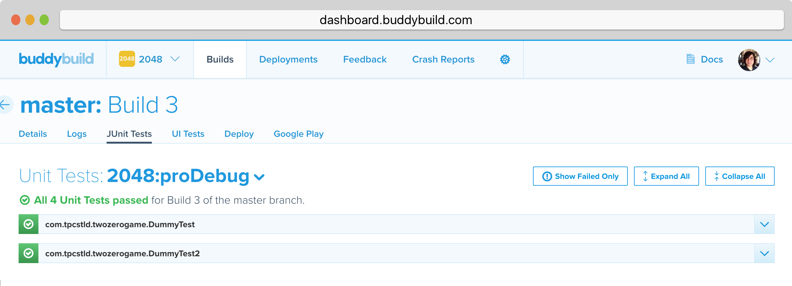

= Testing

== Unit Test

Buddybuild supports Unit Tests right out of the box, and here's how to
set them up:

. Click on the gear icon
+

. Toggle on the **Unit Tests** switch
+

. Now trigger a new build and wait for the build to finish

. Click on the selected build and go to the **JUnit Tests** tab to see
the test results
+

// === Emulator UI Test

// === On-Device UI Test
