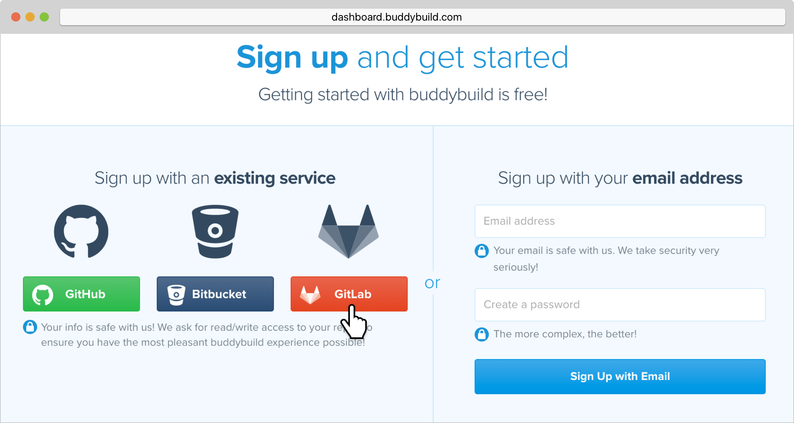
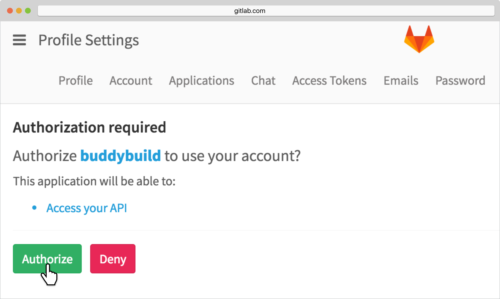

= Signing up with GitLab

First things first! Let's sign up with buddybuild.

Signing up with buddybuild via GitLab allows buddybuild to access your
iOS apps' source code. Buddybuild associates with your repository, and
builds your app every time a commit is pushed by you or your team --
ensuring that you always have a green build that you can deploy to your
testers.

[NOTE]
======
**Using Beanstalk, Gitolite, TFS or any other git server?**

Follow the instructions link:ssh.adoc[here] to get
started.
======

[CAUTION]
====
Buddybuild rejects connecting to repositories via HTTPS that are
provisioned with self-signed certificates.

Using a self-signed certificate could make it possible for someone to
spoof your repository and inject malicious code into your builds.
====

== Step 1: Signing up with an existing service

Let's get started by visiting the
link:https://dashboard.buddybuild.com/signup[Sign up page].

Simply click on the **GitLab** button to sign up with your credentials.

== Step 2: Enter Credentials

Enter your GitLab credentials and click **Sign in**.

image:img/Gitlab---OAuth-1.png["The GitLab Sign in screen", 3000, 1280]

== Step 3: Grant buddybuild access to your GitLab account by clicking Authorize

That's it! You're now connected to buddybuild!

The next step is to link:../select.adoc[select a repository to build
with buddybuild!]
