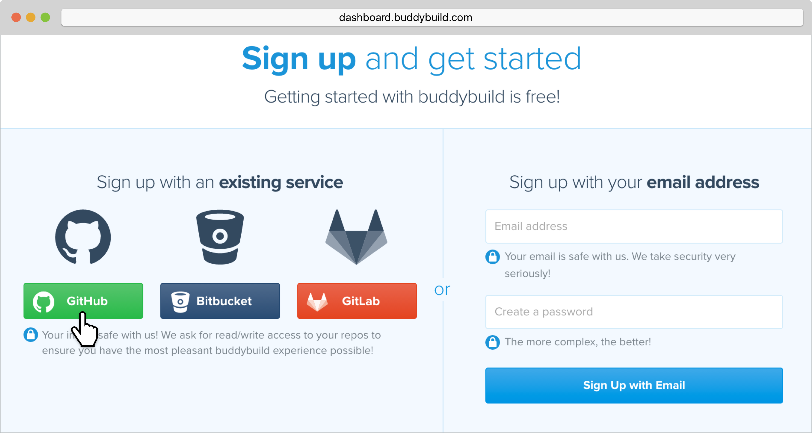

= Signing up with GitHub

First things first! Let's sign up with buddybuild.

Signing up with buddybuild via GitHub allows buddybuild to access your
iOS App's source code. Buddybuild will associate with your repository
and build your App every time a commit is pushed by you or your team --
ensuring you always have a green build that you can deploy to your
testers.

[NOTE]
======
**Using Beanstalk, Gitolite, TFS or any other git server?**

Follow the instructions link:ssh.adoc[here] to get started.
======

[CAUTION]
====
Buddybuild rejects connecting to repositories via HTTPS that are
provisioned with self-signed certificates.

Using a self-signed certificate could make it possible for someone to
spoof your repository and inject malicious code into your builds.
====

== Step 1: Signing up with an existing service

Let's get started by visiting the
link:https://dashboard.buddybuild.com/signup[Sign up page].

Simply click on the **GitHub** button to sign up with your credentials.

== Step 2: Enter Credentials

Enter your GitHub credentials and Sign in.

image:img/github_oauth-1.png["The Sign in the GitHub screen", 3000,
1600]

That's it! You're now connected to buddybuild!

**The next step is to select a repository to build with buddybuild!**

- For iOS apps, continue to the
  link:ios/select_a_repo_and_app_to_build.adoc[iOS
  Quickstart]

- For Android apps, continue to the
  link:android/select_an_app.adoc[Android Quickstart]
