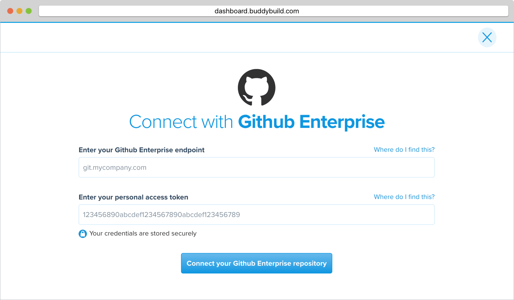
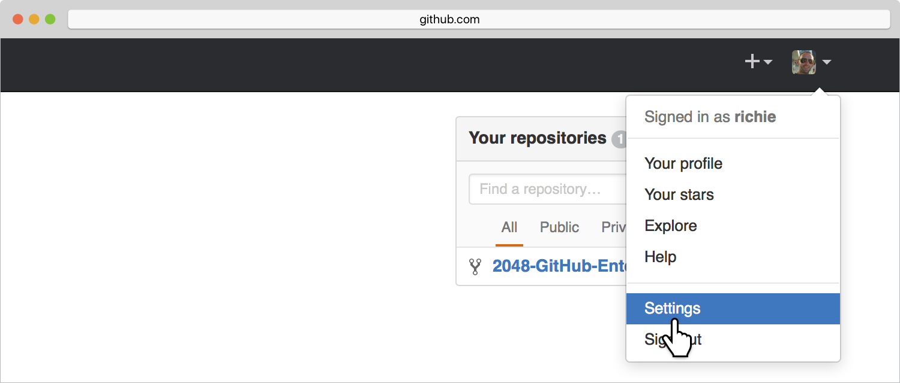
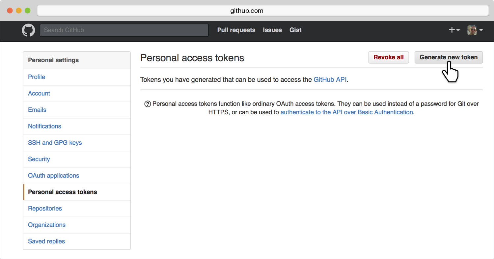
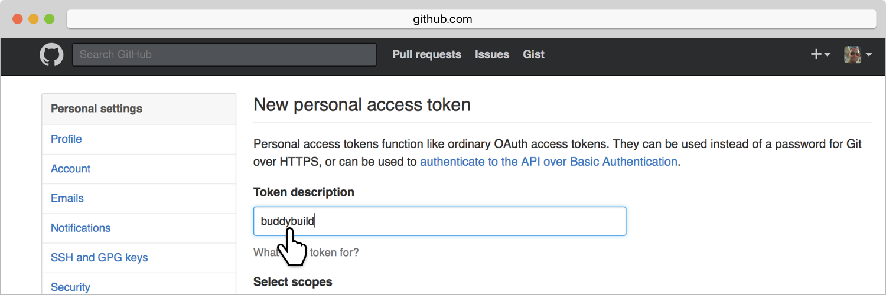
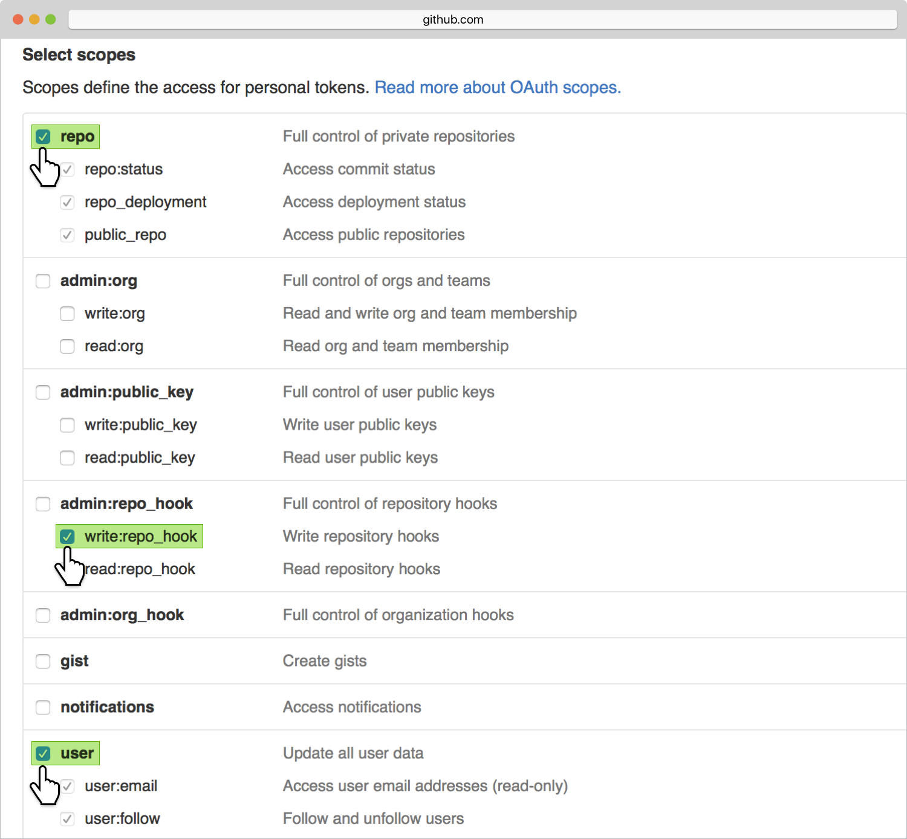
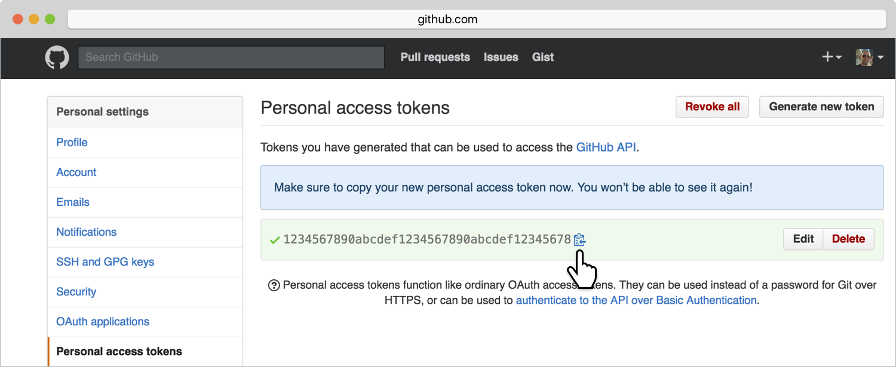
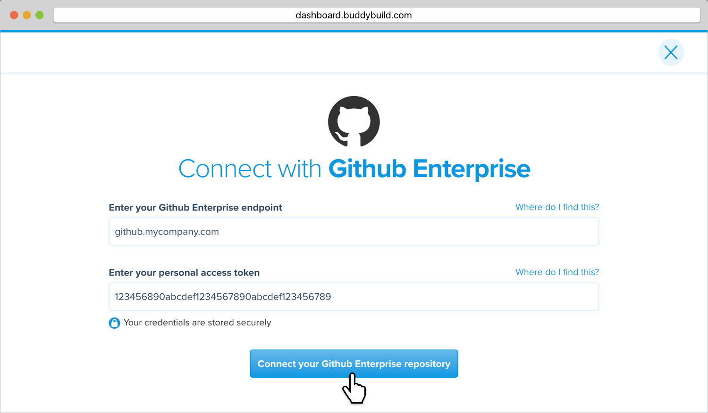

= Connect with GitHub Enterprise

Connecting with GitHub Enterprise grants buddybuild access to your
repository so that it can build your app when you push code to your
repository. Connecting also grants buddybuild API access to manage
webhooks for you, generate commit status, integrate with the GitHub
issue tracker, enables the pull request flow, synchronizes access
control for team management and more.

Each member of your team that uses buddybuild should go through this
guide to connect with GitHub Enterprise. This is encouraged so that you
can take advantage of team management features.

== Prerequisite

First make sure you have created an account with buddybuild by signing
up with link:github.adoc[GitHub], link:bitbucket.adoc[Bitbucket],
link:gitlab.adoc[GitLab] or by link:ssh.adoc#step1[email].

[CAUTION]
====
Buddybuild rejects connecting to repositories via HTTPS that are
provisioned with self-signed certificates.

Using a self-signed certificate could make it possible for someone to
spoof your repository and inject malicious code into your builds.
====

== Connect your GitHub Enterprise account

To connect your GitHub Enterprise account follow this URL:

https://dashboard.buddybuild.com/apps/wizard/build/select-repo/github-enterprise

You will see a dialog with two input fields. If you already know your
GitHub Enterprise endpoint and have a personal access token, then enter
those now. Otherwise continue reading the next sections to learn how to
get the endpoint name and generate a personal access token.

== Configure your GitHub Enterprise endpoint

Your GitHub Enterprise endpoint is the hostname part of the URL when you
visit your repositories in GitHub Enterprise. Copy the hostname part of
your GitHub Enterprise server URL, which often looks something like
`git.mycompany.com`. If your server uses a non-default HTTPS port, then
please also copy the port part of the URL. For example,
`git.mycompany.com:1234`.

=== Do you have a private DNS?

Your GitHub Enterprise hostname must be publicly addressable on the
internet. If you use private DNS for your GitHub Enterprise
installation, then you can use the IP address of the server instead.

=== Do you have a firewall configured?

If your network infrastructure restricts inbound access over HTTPS from
a set of IP addresses, then you may need to whitelist the IP addresses
used by the buddybuild fleet. Please contact us for the latest CIDR
range used by buddybuild.

== Create a personal access token

Navigate to your GitHub Enterprise instance and sign in with your
individual account credentials. You do not need to sign in with the
GitHub Enterprise admin account.

Choose **Settings** from the top right menu under your profile picture.

You will see a list of menu items of the left side of the page. Click on
**Personal access tokens**. Then create a new token by clicking on
**Generate new token**. 

Enter *buddybuild* as the **Token description**.

Carefully select the `repo`, `write:repo_hook` and `user` scopes. When
you are done it should look like this.

[NOTE]
======
**What are these scopes used for?**

The `repo` scope is required so that buddybuild can read from your
repositories when building your app, post issues to the GitHub issue
tracker and automatically install the buddybuild SDK if you choose to
enable those features later.

The `write:repo_hook` scope is required to automatically configure your
webhook, so that buddybuild knows when to build your app.

The `user` scope if required so that buddybuild can access your GitHub
username for team management features.
======

Copy the personal access token, a 40 character hexadecimal string.

In buddybuild, paste the personal access token into the **Enter your
Personal Access Token** field. Then click **Connect Your GitHub
Enterprise Repositories**.

The dialog should close and display a list of your repositories. At this
point you have successfully completed connecting buddybuild with GitHub
Enterprise!
