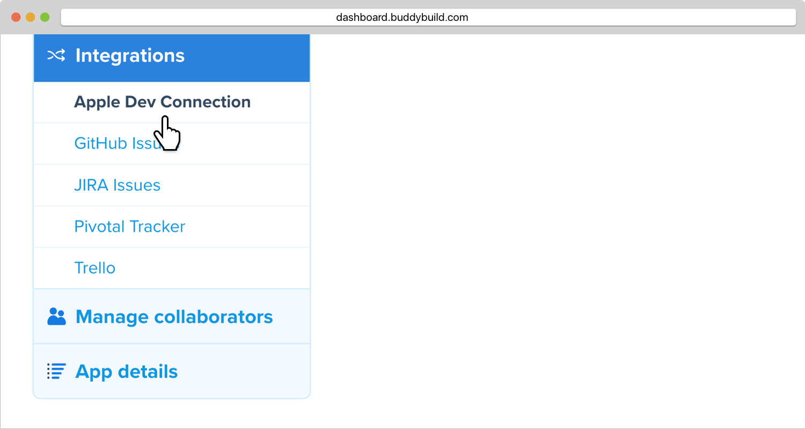
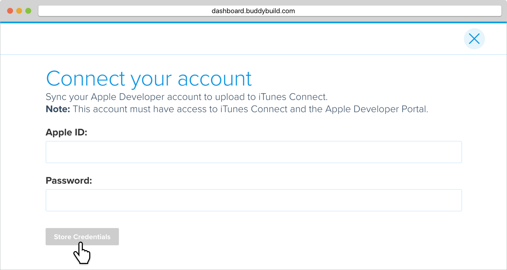

= Auto-Syncing Provisioning Profiles

Now that you're deploying builds, it is time to connect your Apple
Developer Account.

Managing testing and development device UDIDs in your provisioning
profiles can be a huge pain. Buddybuild can manage this entire process
for you. All we need to manage your provisioning profiles on your behalf
are your Apple Developer Credentials. Let's get started!

== Step 1: Configure Apple Developer Portal

Click on the **App Settings** button.

image:img/Deployments---Settings.png[,1500,644]

In the left navigation, select **Integrations**, then **Apple Dev
Connection**.

Click on **Connect New Apple Account.**

image:img/Settings---Apple-Developer.png[,1500,800]

[NOTE]
======
**Apple Developer Team Roles**

Please make sure that your Apple Developer account has the proper Team
privileges to create provisioning profiles.
======

== Step 2: Enter your credentials

Type in your Apple Developer Credentials. We'll securely manage them for
you.

Buddybuild will validate the credentials for you and may prompt you to
select a Team if you're part of multiple.

That's it! You're good to go. Now all of your testers will be able to
install builds of your App. Buddybuild will transparently retrieve their
device IDs and add them to your Provisioning Profiles!
