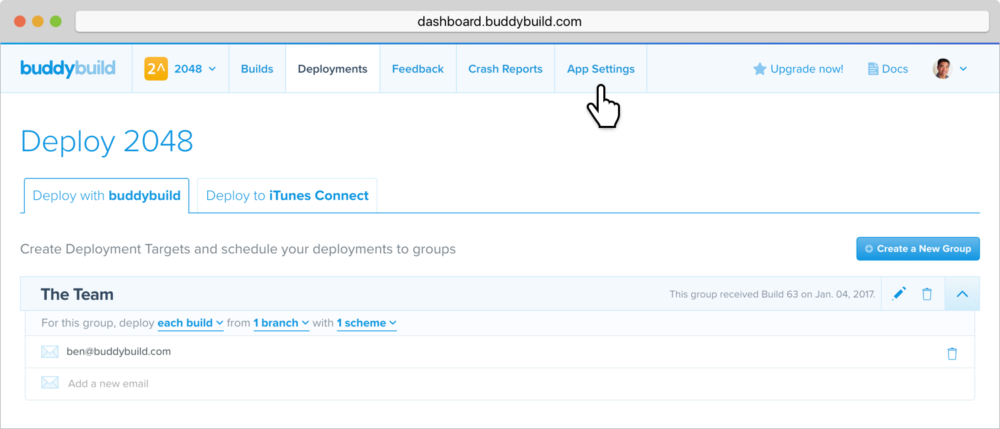

--- 
titletext: Auto-Syncing Provisioning Profiles for dev and test UDIDs
description: >
  Buddybuild can manage and automate provisioning profile management simply
  connect your Apple Developer Account and buddybuild will handle the rest.
---
= Auto-Syncing Provisioning Profiles

Now that you're deploying builds, it is time to connect your Apple
Developer Account.

Managing testing and development device UDIDs in your provisioning
profiles can be a huge pain. Buddybuild can manage this entire process
for you. All we need to manage your provisioning profiles on your behalf
are your Apple Developer Credentials.



Let's get started!

== Step 1: Configure Apple Developer Portal

Click on the **App Settings** button.

In the left navigation, select **Integrations**, then **Apple Dev
Connection**.

image:img/Settings---Apple-Developer---menu.png["The App settings
screen, focused on the Integrations settings", 1500, 800]

Click on **Connect New Apple Account.**

image:img/Settings---Apple-Developer.png["The Connect your Apple
Developer Account screen", 1500, 800]

[NOTE]
======
**Apple Developer Team Roles**

Please make sure that your Apple Developer account has the proper Team
privileges to create provisioning profiles.
======

== Step 2: Enter your credentials

Type in your Apple Developer Credentials. We'll securely manage them for
you.

image:img/Settings---Apple-Developer---credentials.png["The Connect your
account screen", 1500, 800]

Buddybuild validates the credentials for you and may prompt you to
select a Team if you're part of multiple teams.

That's it! You're good to go. Now all of your testers are able to
install builds of your App. Buddybuild transparently retrieves their
device IDs and adds them to your provisioning profiles!
