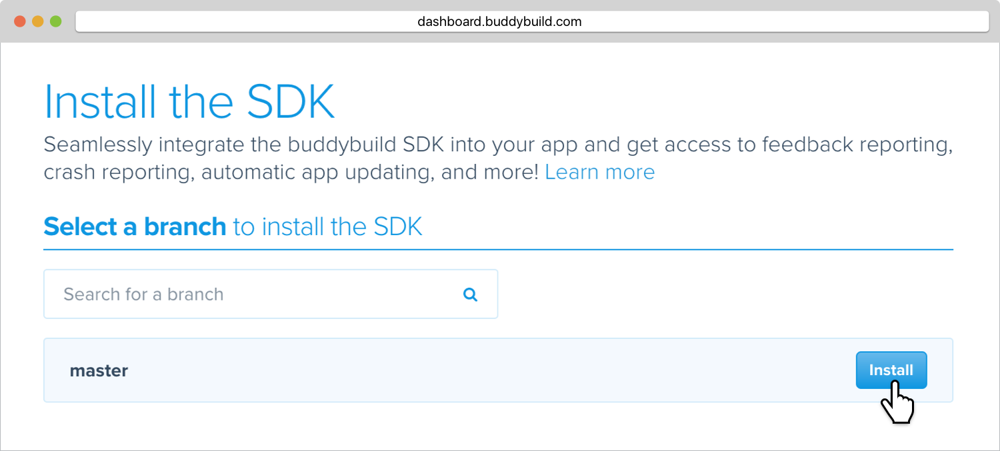

--- 
titletext: How to integrated buddybuild's iOS SDK 
description: >
  Integrate the buddybuild iOS SDK to access graphical user feedback reports,
  crash reporting, tester usage and analytics, and automatic app updates.
---
= Integrate the buddybuild SDK

== About the buddybuild SDK

The buddybuild SDK is a lightweight yet powerful suite of tools that
integrates seamlessly into your application. The SDK includes a
graphical feedback reporter, a crash reporting and analysis tool,
automatic app updating and usage tracking. The SDK is regularly updated
with new features.

The buddybuild SDK is available for both iOS and Android platforms and
enables the following features:

[NOTE]
======
**File size of the buddybuild SDK**

Integrating the buddybuild SDK will increase the size of the resulting
`.ipa` by less than 1 MB.
======

=== Feedback Reporter

With buddybuild, you simply take a screenshot to share feedback. Our
feedback reporter sends graphically annotated screenshots, feedback
notes and device metadata to your team. Integrate with GitHub, JIRA and
Pivotal Tracker to track feedback as issues.
link:../../sdk/feedback_reporter.adoc[Learn more.]

=== Instant Replay

No more emailing testers for repro steps. Along with each crash report,
buddybuild will also attach a 15 second video of your testers'
interactions with your App's UI right up to the point where it crashed
-- allowing you to instantly see what they did to cause a crash.

=== Automatic Update

Receiving feedback on old builds is pointless -- you've probably already
fixed the issue you've received feedback on! It is crucial to keep your
testers and beta users updated on the very latest builds. If a newer
build is available, the buddybuild SDK can automatically prompt to
install the latest version of your app.
link:../../sdk/automatic_update.adoc[Learn more.]

=== Usage Tracking

Know when your testers download and launch your app in real time.
Identify who tested your app, when they launched it and what version
they tested. Correlate this with feedback and crash reports to
understand your customers' experience.
link:../../sdk/usage_tracking.adoc[Learn more.]

== How to install

Enabling the SDK requires code changes in your iOS Application. We can
make these changes automatically so you don't have to! Enable the
buddybuild SDK in just two easy steps.



[[step1]]
=== Step 1: Configure SDK Installation

On your App's page, under the **Feedback** tab, click on the **Try the
buddybuild SDK** button.

image:img/SDK---iOS-Install-Button.png["The SDK screen, when it is not
yet installed", 1500, 792]

[[step2]]
=== Step 2: Install the SDK

Install the SDK in whatever branch you'd like. Typically, the SDK is
used by your testers, so install the SDK on the branches that deploy to
your testers.

That's it! A new build will be kicked off with the SDK enabled. Install
this build on your device. Open your app and take a screenshot -- and
see what happens!

You're all set now to deploy your app broadly to all your testers. There
is just one more thing.

Typically, development and testing devices need to be manually added to
your provisioning profiles before they will accept deployed builds. This
requires app developers to acquire the UDID (the device unique id) of
the testing devices from the testers and then add them to the
provisioning profiles used to build the app. This process is manual and
is the source of a lot of headache for developers.

We've automated this process as well. Buddybuild can acquire UDIDs of
your testers' devices, add them to your provisioning profiles completely
automatically and transparently.

To enable this, connect your link:apple_developer_portal_sync.adoc[Apple
Developer account] with buddybuild.

[NOTE]
======
**Prefer to manually integrate the SDK?**

Follow the link:../../sdk/integration.adoc[Manual SDK Integration
Guide].
======

[[update]]
=== Update the SDK

. Open the Terminal and `cd` to your root directory of your repo.

. Run the following command:
+
[source,bash]
curl -Ls tools.buddybuild.com.s3-website-us-west-2.amazonaws.com/UpdateSDK | sh

. Commit and push the changes.

[[uninstall]]
=== Uninstall the SDK

If for some reason, you wish to uninstall the SDK, you simply need to
revert the commit which installed it in the first place.
