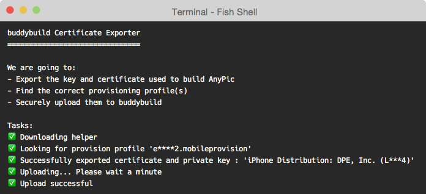

= Inviting Testers

Now that we have a green build of your app, the next step is to deploy
it to your testers.

But before we do that, buddybuild requires your
link:../../deployments/ios/code_signing/README.adoc[Code Signing
Identities and Provisioning Profiles] to create signed device builds.

image:img/Onboarding---first-step.png["The Invite testers screen", 1500,
800]

[[step1]]
== Step 1: Upload Certificates

Finding and uploading specific items from your keychain can be painful
and confusing. We have automated this entire process. Upon completing a
successful build, you'll be prompted to upload certificates using the
buddybuild Cert-Uploader tool.

Simply **copy the `curl` line in the page and paste it into your
terminal**.

image:img/Onboarding---cert-tool-quick-way.png["The Upload Certificates
screen", 1500, 800]

This `curl` script automatically exports certificates and
provisioning profiles that are required for creating signed builds of
your app. We've already analyzed your project during your first build --
and so we only pull what you need to build your project and nothing
more.

[NOTE]
======
**Prefer the manual way?**

Manually upload your certificates from your keychain by clicking on
**The Manual Way**.

Follow the guide
link:../../deployments/ios/code_signing/upload_manually.adoc[here]
if you have any trouble.
======

Once the upload is complete, buddybuild will have everything it needs to
perform device builds. Now all we need is a set of emails to send these
builds to -- which brings us to the next step!

image:img/Onboarding---cert-tool-success.png["The Apple Developer Portal
Synced screen", 1500, 800]



== Step 2: Invite Testers

Here you can create groups you would like to send builds to. We've
already created a default group with your email in it.

Feel free to add more groups and emails in whatever configuration you
want.

You can also configure deployment frequencies and branch targets
specific to each group. These options allow you to fine tune who gets
which build and how often.

image:img/Onboarding---invite-testers.png["The Invite Testers screen",
1500, 800]

Once you're done configuring your groups, click the **Invite Testers**
button. We'll spin up a device build and email it to the groups you've
specified.

[NOTE]
======
**Wondering what your testers receive?**

Follow the link:../../testers/install_builds.adoc[Tester's
Manual] to see their experience.
======

That's it! Now that we have device builds going out to your testers,
you'll now want a way to solicit feedback from them.

The buddybuild SDK's Feedback Visual Reporter makes this process very
simple. Proceed to the next step to link:integrate_sdk.adoc[integrate
the buddybuild SDK] into your app.
