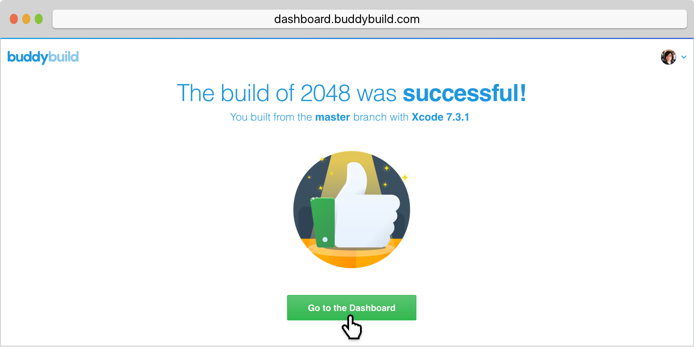

= Selecting an App

Now that we've connected with to your source control system, you'll need
to select the repository containing your iOS App.

link:../github.adoc[Sign up with buddybuild] if you haven't done so
already.

After signing up, buddybuild presents you with a list of repositories
you have access to. Simply choose the one you want to build.

[NOTE]
======
**One target per app**

Each buddybuild app maps to a single target in your Xcode project.
You'll need to follow this process for each target you'd like to build.
======

image:img/First-Build---Select-Repo.png["The Choose a repository to
build screen", 1500, 677]

Buddybuild pulls down your source code and analyzes the repo for apps.

If we find multiple Apps, you'll be prompted to select one. If you have
a single app, it'll be automatically detected and buddybuild will kick
off a build!

image:img/Selecting-an-app---2.jpg["The Preparing to build your app...
screen", 2360, 1074]

Once the build is finished, **Go to the Dashboard.**

That's it! You've just created a build of your app in buddybuild.
Proceed to the next step to link:invite_testers.adoc[invite testers] to
try your app.
