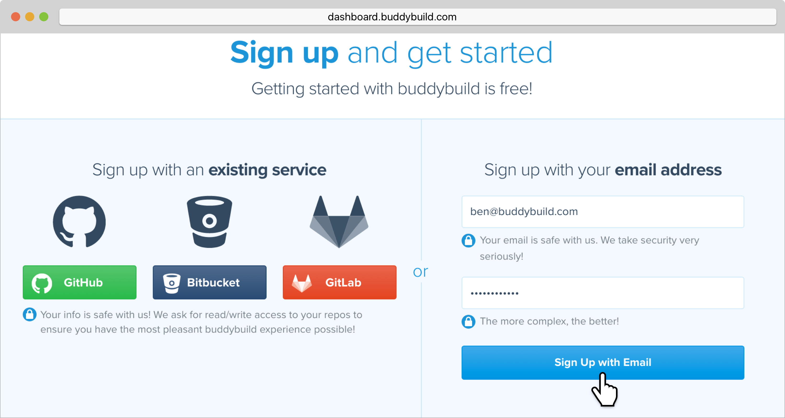
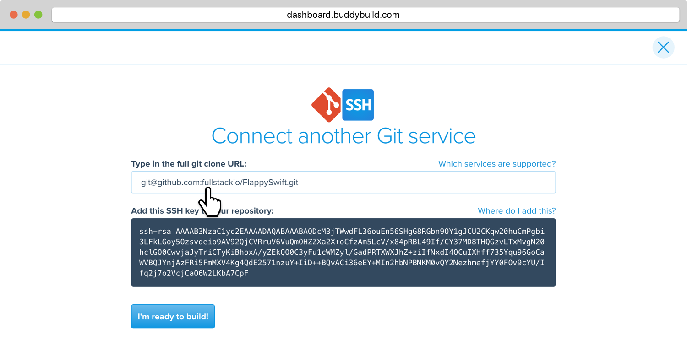
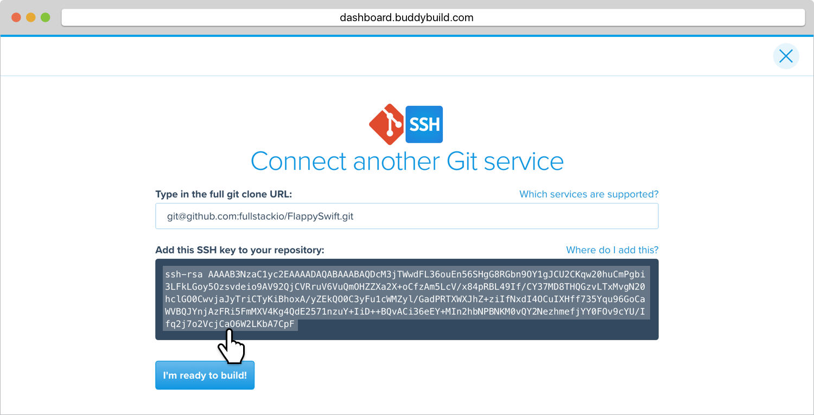

= Signing up with SSH

If your repository lives in link:https://beanstalkapp.com/[Beanstalk] or
your own source control system, you can sign up with buddybuild using
SSH. Buddybuild automatically generates a secure SSH key for you to
install into your source control system. Buddybuild uses this key to
clone your repository.



Let's get started!

[[step1]]
== Step 1: Sign up with email

Let's get started by visiting the
link:https://dashboard.buddybuild.com/signup[Sign up page].

Create a new buddybuild account by entering your email and desired
password, then click on the **Sign up with Email** button.

On the next screen, select **Add with SSH.**

image:img/First-Build---Select-Source---SSH.png[,1500,800]

[[step2]]
== Step 2: Enter the SSH Git Clone URL

Navigate to your source control system and copy the SSH git clone URL.
Paste this URL into buddybuild.

[NOTE]
======
**Need help finding the Git Clone URL? Select your source control system
for specific instructions.**

- link:../repository/beanstalk/README.adoc[Beanstalk]
- link:../repository/bitbucket/README.adoc[Bitbucket]
- link:../repository/github/README.adoc[GitHub]
- link:../repository/gitlab/README.adoc[GitLab]
- link:../repository/gitolite/README.adoc[Gitolite]
- link:../repository/kiln/README.adoc[Kiln]
- link:../repository/visual_studio_online/README.adoc[Visual Studio
  Online / Team Foundation Server (TFS)]
======

If your repo is public, buddybuild can immediately start a build. Hit
the build button to complete sign up.

If your repo is private, you will need to install an SSH key. This SSH
key authenticates buddybuild to checkout your source code.

[[step3]]
== Step 3: Add the SSH Key to Your Account Settings in your Source Control System

[NOTE]
======
**Need help adding the SSH key to your source control system? Select
your source control system for specific instructions.**

- link:../repository/beanstalk/README.adoc[Beanstalk]
- link:../repository/gitlab/README.adoc[GitLab]
- link:../repository/gitolite/README.adoc[Gitolite]
- link:../repository/visual_studio_online/README.adoc[Visual Studio
  Online / Team Foundation Server (TFS)]
======

[IMPORTANT]
===========
**Public Repo?**

You don't need to perform this step if your repository is public. Simply
hit the build button.
===========

Once the key is installed, navigate back to buddybuild and hit the
**Build** button.

That's it! You're now connected to buddybuild!

**The next step is to select a repository to build with buddybuild!** 

- For iOS apps, continue to the
  link:ios/select_a_repo_and_app_to_build.adoc[iOS
  Quickstart]

- For Android apps, continue to the
  link:android/select_an_app.adoc[Android Quickstart]
