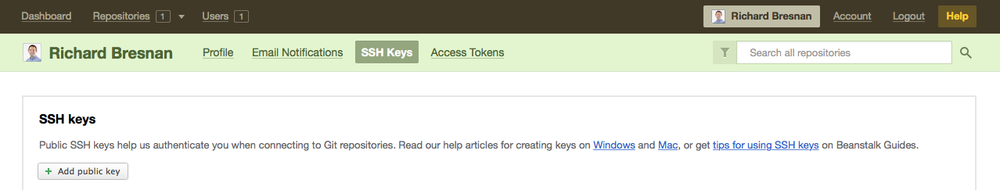
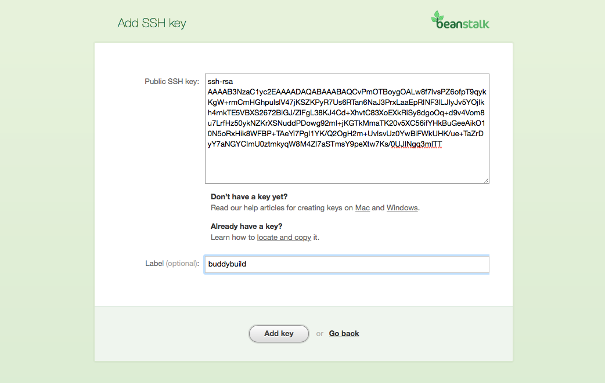

= Beanstalk repositories

If your repository lives in Beanstalk, you can connect to it via SSH.
Buddybuild automatically generates a secure SSH key for you to install
into your source control system. Buddybuild uses this key to clone your
repository.

Let's get started!

[NOTE]
======
**Quick Links**

- link:#step1[Step 1: Enter the SSH Git Clone URL]

- link:#step2[Step 2: Add the SSH Key to Your Beanstalk Account]
======

[[step1]]
== Step 1: Enter the SSH Git Clone URL

Within the main page of your repository, look to the right of the page
for the SSH URL. Click on the **SSH** button (if it is not already
selected). Highlight and copy the **SSH URL**.

image:img/copy-clone-url.png["A Beanstalk project screen, focused on
the Git Repository URL", 967, 272]

Head over to dashboard, visit
link:https://dashboard.buddybuild.com/apps/wizard/build/select-source[Select
source] and choose **SSH**.

image:../img/select_source-ssh.png["The buddybuild Select source
screen", 1500, 800]

Paste the SSH URL you copied into the **Git clone URL** field.

image:img/paste-clone-url.png["The buddybuild Connect another Git
service screen", 1500, 765]

[[step2]]
== Step 2: Add the SSH Key to Your Beanstalk Account

Highlight and copy the buddybuild SSH key.

image:img/ssh-key.png["The buddybuild Connect another Git service
screen, with the SSH key selected", 1500, 765]

Navigate to your Beanstalk settings by selecting your **name** in the
top right navigation. Then, select **SSH Keys**. Next, select the **Add
public key** button.

Paste the copied SSH key into the **Public SSH key** field and enter
**buddybuild** as the **Label**. Next, click **Add Key.**

[WARNING]
=========
**Private git submodules and private cocoapods**

If your project depends on any code in other private git repos, the SSH
key needs to be added to those repos as well.
=========

Navigate back to buddybuild and click on the **Build** button.

image:img/build.png["The buddybuild Connect another Git service screen,
clicking the I'm ready to build! button", 1500, 765]

Buddybuild clones your project code and starts a simulator build. The
build should finish within a few minutes.

That's it! Your Beanstalk repository is now connected to buddybuild, and
your first build is under way. The next steps are:

- link:webhook.adoc[Add a Beanstalk webhook] to automatically notify
  buddybuild of repository changes.

- link:../../quickstart/invite_testers.adoc[invite testers] to try out
  your app.
