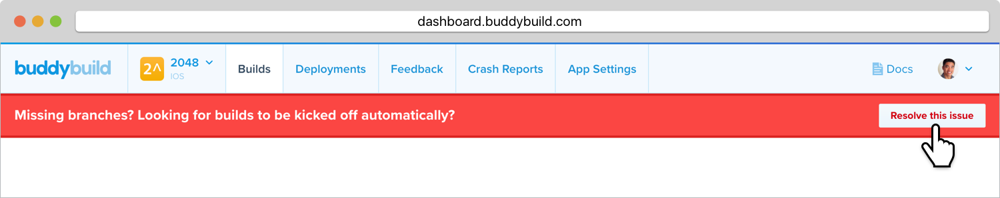
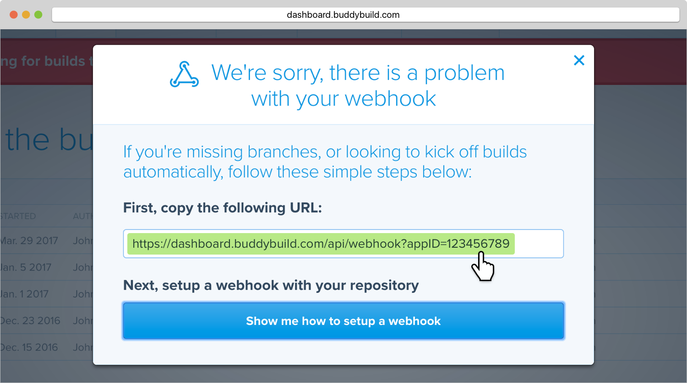
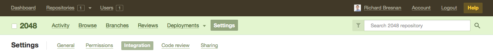
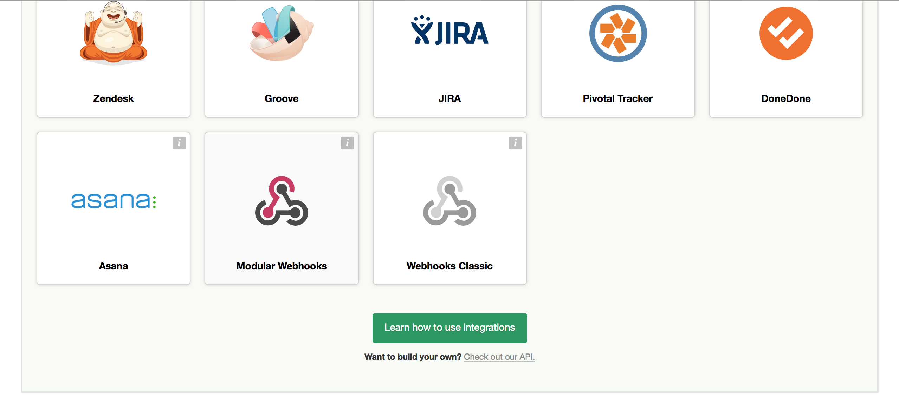
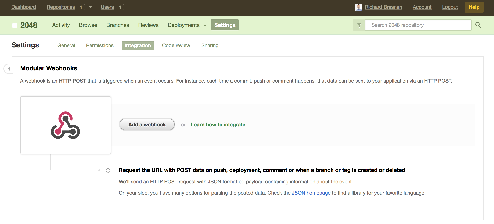
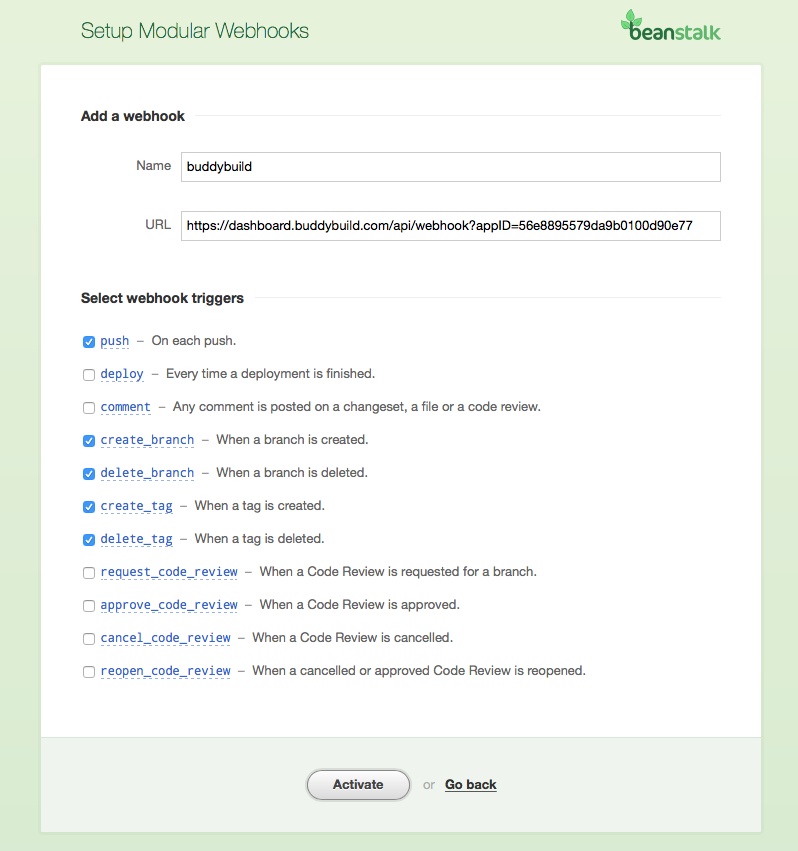
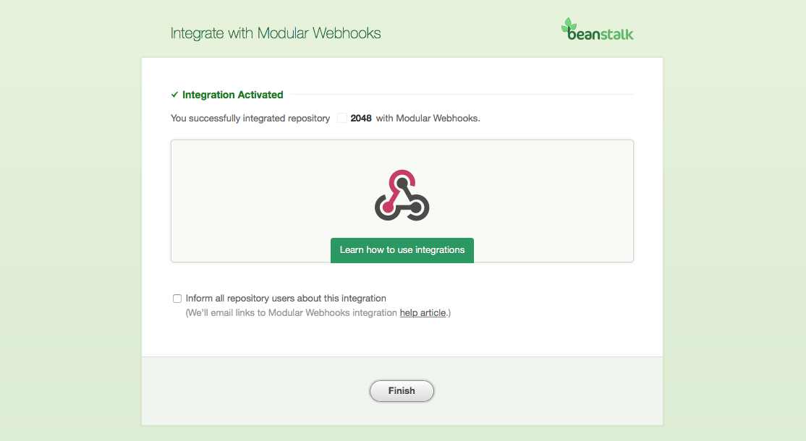

= Adding a Beanstalk Webhook

A webhook notifies buddybuild of code changes you make to your repo.
Whenever a new change is pushed, buddybuild will automatically kick off
a new build -- ensuring you have up-to-date build status and your
testers have the very latest builds.

Let's get started!

On the Builds page, in the red banner at the top of the page, click on
**Resolve this issue**.

In the dialog box that appears, **select and copy the webhook URL**.
This URL is specific to your app and will be used to identify your app
when sending webhooks from Beanstalk.

Navigate to your Beanstalk repository. In the top navigation, select
**Settings**. Then select **Integration**.

A list of integrations is displayed. Select the integration button that
is labeled **Modular Webhooks**.

Next, select the **Add a webhook** button.

In the webhook dialog that appears, perform the following steps:

- Name the webhook *buddybuild*.

- Paste the buddybuild webhook URL you first copied into the **URL** field.

- Select the *push*, *create_branch*, *delete_branch*, *create_tag* and
  *delete_tag* webhook triggers.

- Then click **Activate**

Finally, click **Finish** to complete the Beanstalk webhook setup.

