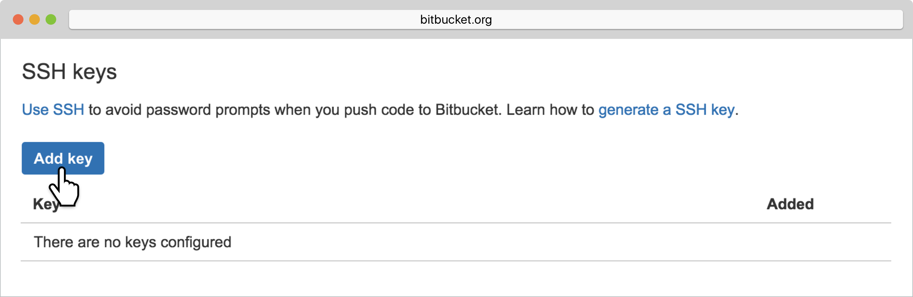

= Add a Bitbucket Repository

If your repository lives in Bitbucket, you can
link:{{readme.path}}/quickstart/connect/bitbucket.adoc[connect your
repository automatically], or connect via SSH if you prefer.

If you prefer SSH, buddybuild automatically generates a secure SSH key
for you to install into Bitbucket. Buddybuild uses this key to clone
your repository.



Let's get started!

[NOTE]
======
**Quick Links**

- link:#step1[Step 1: Enter the SSH Git Clone URL]

- link:#step2[Step 2: Add the SSH Key to Your Bitbucket Account]
======

[[step1]]
== Step 1: Enter the SSH Git Clone URL

Head over to Bitbucket and find the repository you would like to connect
with buddybuild. Within the main page of that repository, look to the
top-right for **HTTPS URL.** Click on the HTTPS dropdown menu and select
**SSH**.

image:img/select-ssh.png["A Bitbucket project screen, selecting SSH",
3000, 1138]

Highlight and copy the **SSH URL.**

image:img/copy-clone-url.png["A Bitbucket project screen, copying the
clone URL", 3000, 978]

Head over to dashboard, visit link:https://dashboard.buddybuild.com/apps/wizard/build/select-source[Select source] and choose **SSH**.

image:../img/select_source-ssh.png["The buddybuild Select source
screen", 1500, 800]

Paste the SSH URL you copied into the **Git clone URL** field.

image:img/clone-url.png["The buddybuild Connect another Git service
screen", 1500, 765]

[[step2]]
== Step 2: Add the SSH Key to Your Bitbucket Account

Highlight and copy the generated SSH key.

image:img/ssh-key.png["The buddybuild Connect another Git service
screen, with the SSH selected", 1500, 765]

Navigate to your Bitbucket Account by first selecting your account
photo, and then selecting **Settings.**

image:img/select-bitbucket-settings.png["A Bitbucket project screen,
with the user account dropdown open", 3000, 1138]

Select **SSH keys.**

image:img/select-ssh-keys.png["The Bitbucket Settings screen, clicking
the SSH keys button", 3000, 1138]

Next, select **Add key.**

Enter **Buddybuild** as the title, and paste the copied SSH key into the
**key** field.

image:img/paste-ssh-key.png["The Bitbucket SSH keys screen, pasting the
buddybuild SSH key", 3000, 1600]

Next, click **Add key**.

image:img/paste-key-add-button.png["The Bitbucket SSH keys screen,
clicking the Add key button", 3000, 1544]

[WARNING]
=========
**Private git submodules and private cocoapods**

If your project depends on any code in other private git repos, the SSH
key will need to be added to those repos as well.
=========

Navigate back to buddybuild and click on the **Build** button.

image:img/build.png["The buddybuild Connect another Git service screen",
1500, 765]

Buddybuild clones your project code and starts a simulator build. The
build should finish within a few minutes.

That's it! Your Bitbucket repository is now connected to buddybuild, and
your first build is under way. The next steps are:

- link:webhook.adoc[Add a Bitbucket webhook] to automatically notify
  buddybuild of repository changes.

- link:{{readme.path}}/quickstart/ios/invite_testers.adoc[invite
  testers] to try out your app.
