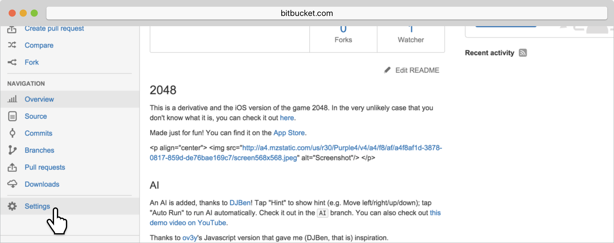
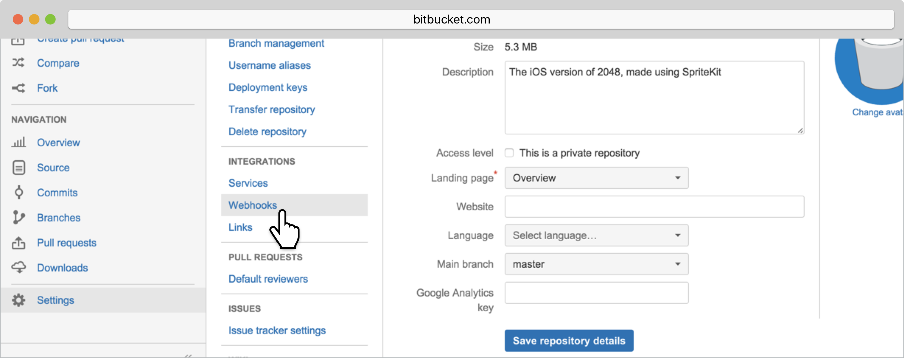
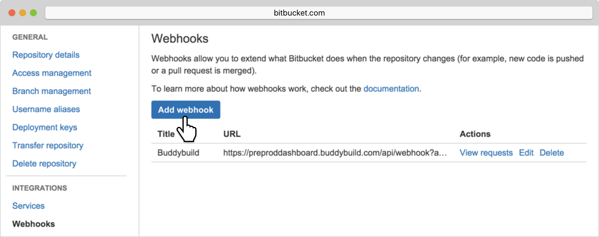

= Adding a Bitbucket Webhook

A webhook notifies buddybuild of code changes you make to your repo.
Whenever a new change is pushed, buddybuild will automatically kick off
a new build -- ensuring you have up-to-date build status and your testers
have the very latest builds.

Let's get started!

On the Builds page, in the red banner at the top of the page, click on
**Resolve this issue**.

image:../img/resolve-banner.png["The auto-build resolution banner in the
buddybuild dashboard", 1500, 298]

In the dialog box that appears, **select and copy the webhook URL**.
This URL is specific to your app and is used to identify your app
when sending webhooks from Bitbucket.

image:../img/modal.png["The webhook URL dialog",1500,838]

Navigate to your Bitbucket repository. In the left navigation, select
**Settings**.

Select **Webhooks**.

Next, select **Add webhook**.

In the **Title** field, enter **Buddybuild** and paste the URL you first
copied into the **URL** field.

image:img/paste-webhook-url.png["Specifying webhook details in
Bitbucket", 3000, 1188]

Select **choose from a full list of triggers.**

image:img/click-choose-triggers.png["Specifying triggers in the
Bitbucket Webhooks screen", 3000, 1188]

Once that expands, select **Push, Created, Updated, Merged, Declined,**
and click **Save**. You're now done!

image:img/click-save.png["Saving the webhook in the Bitbucket Webhooks
screen", 3000, 1760]
