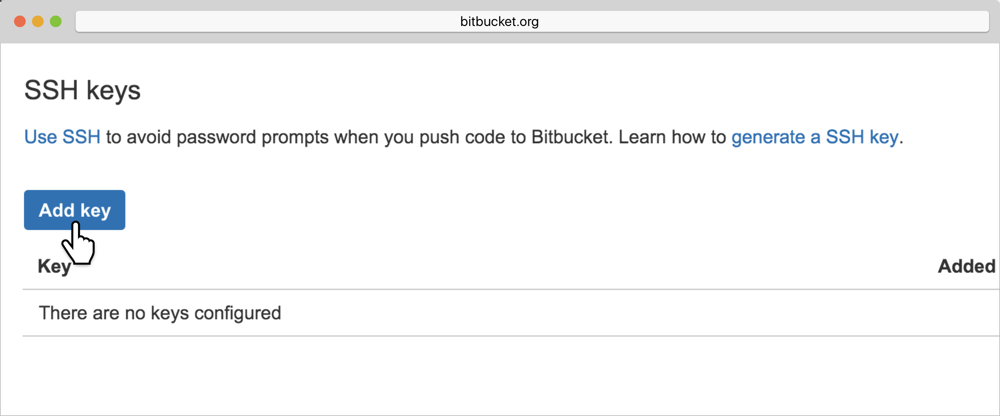
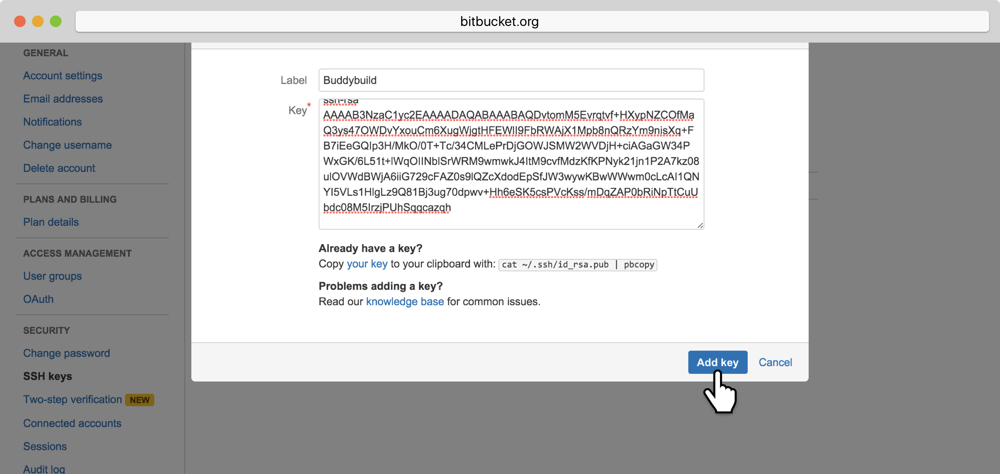
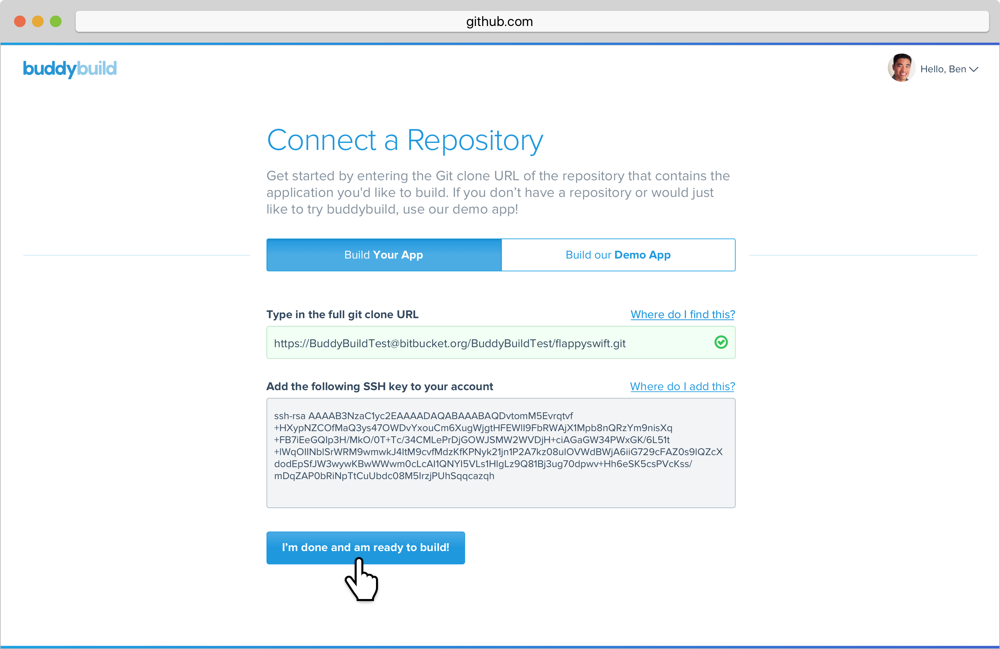

--- 
titletext: How to add a BitBucket Server repo to your mobile CI/CD
description: >
  For Bitbucket Server (or Stash) repositories, buddybuild automatically
  generates a secure SSH key which is used to close the repository.
---
= Adding a Bitbucket Server Repository

If your repository lives in Bitbucket Server (or Stash), you can sign
into buddybuild with your email. Buddybuild automatically generates
a secure SSH key for you to install into your source control system.
Buddybuild uses this key to clone your repository.

Let's get started!

[NOTE]
======
**Quick Links**

- <<step1>>
- <<step2>>
======

[[step1]]
== Step 1: Enter the SSH Git Clone URL

Head over to Bitbucket and find the repository you would like to connect
with buddybuild. Within the main page of that repository, look to the
top-right for **HTTPS URL.** Click on the HTTPS dropdown menu and select
**SSH**.

image:img/select-ssh.png["A Bitbucket project screen, showing the clone
method dropdown menu", 3000, 796]

Highlight and copy the **SSH URL.**

image:img/copy-clone-url.png["A Bitbucket project screen, with the clone
URL selected", 3000, 796]

Head back over to buddybuild and paste the SSH URL you copied into the
**Git Clone URL** field.

image:img/paste-clone-url.png["The buddybuild Connect a Repository
screen, where the git clone URL can be pasted", 3000, 1948]

[[step2]]
== Step 2: Add the SSH Key to Your Bitbucket Account

Highlight and copy the generated SSH key.

image:img/copy-ssh-key.png["The buddybuild Connect a Repository screen,
with the SSH key selected", 3000, 1948]

Navigate to your Bitbucket Account by first selecting your account
photo, and then selecting **Settings.**

image:img/select-settings.png["A Bitbucket project screen, with the user
account dropdown menu displayed", 3000, 1188]

Select **SSH keys**.

image:img/select-ssh-keys.png["The Bitbucket account settings screen,
showing the SSH keys button", 3000, 1188]

Next, select **Add key**.

Enter **Buddybuild** as the title, and paste the copied SSH key into the
**key** field.

image:img/paste-ssh-key.png["The Bitbucket Add SSH key dialog, where the
buddybuild SSH key can be pasted", 3000, 1424]

Next, click **Add key.**

[WARNING]
=========
**Private git submodules and private cocoapods**

If your project depends on any code in other private git repos, the SSH
key will need to be added to those repos as well.
=========

Navigate back to buddybuild and click on the **Build** button.

Buddybuild will checkout your project code and kick off a simulator
build. The build should finish within a few seconds.

That's it. You're now connected to buddybuild. The next step is to
link:../../quickstart/ios/invite_testers.adoc[invite testers] to try out
your App.
