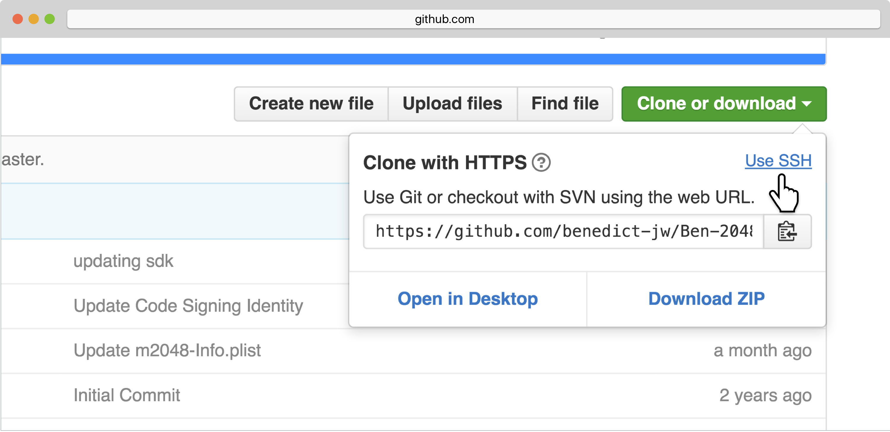
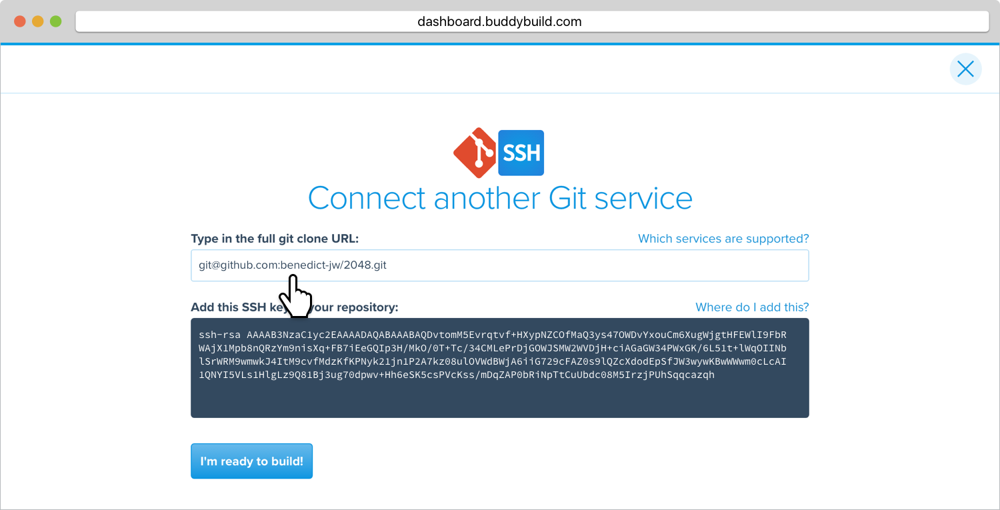
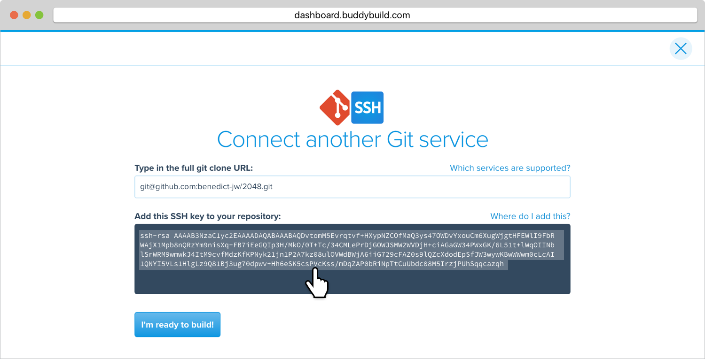
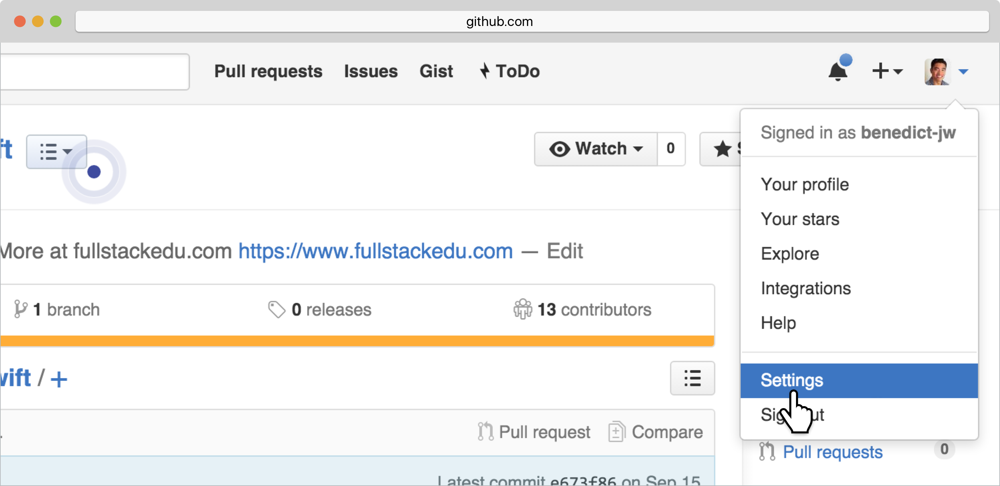
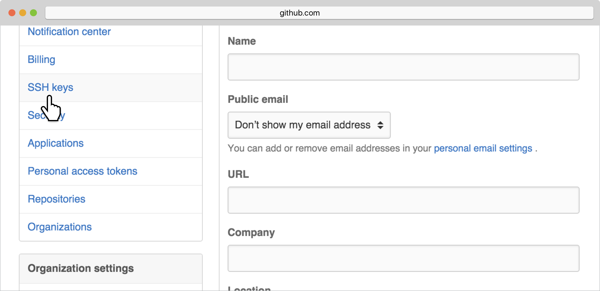
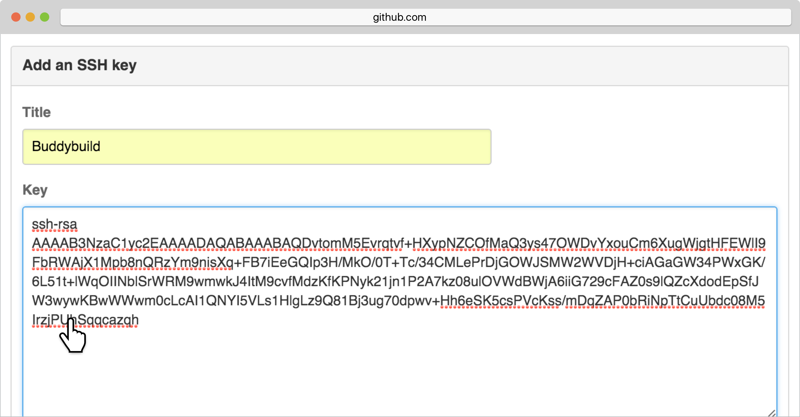
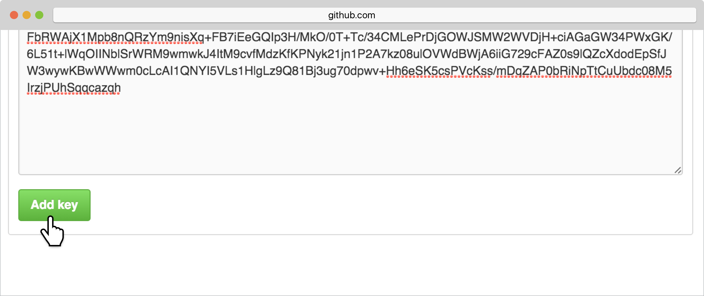
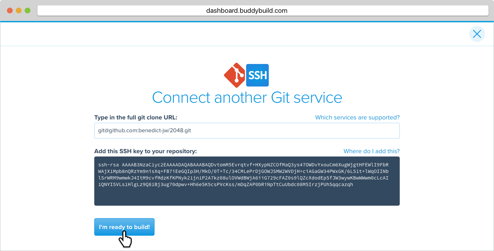

= Adding a GitHub Repository

If your repository lives in GitHub, you can
link:../../quickstart/github.adoc[connect your repository
automatically], or connect via SSH if you prefer.

If you prefer SSH, buddybuild will automatically generate a secure SSH
key for you to install into your source control system. Buddybuild will
use this key to clone your repository.

Let's get started!

[NOTE]
======
**Quick Links**

- link:#step1[Step 1: Enter the SSH Git Clone URL]

- link:#step2[Step 2: Add the SSH Key to Your GitHub Account]
======

[[step1]]
== Step 1: Enter the SSH Git Clone URL

Within the main page of your repository, look for the green **Clone or
Download** button and click it to reveal a dropdown window. Click on
**Use SSH.**

With SSH selected, copy the SSH URL by clicking the **copy to
clipboard** button.

image:img/copy-clone-url.png[,3000,1460]

Head over to dashboard, visit
link:https://dashboard.buddybuild.com/apps/wizard/build/select-source[Select
source] and choose **SSH**.

image:../img/select_source-ssh.png[,1500,800]

Paste the SSH URL you copied into the **Git clone URL** field.

[[step2]]
== Step 2: Add the SSH Key to Your GitHub Account

Highlight and copy the generated SSH key.

Navigate to your GitHub Account by first selecting your account photo,
and then selecting **Settings.**

In the left navigation, select **SSH keys**.

Next, select **Add SSH key**.

image:img/click-add-ssh-key.png[,3000,770]

Enter **Buddybuild** as the title, and paste the copied SSH key into the
**key** field.

Next, click **Add key.**

[WARNING]
=========
**Private git submodules and private cocoapods**

If your project depends on any code in other private git repos, the ssh
key will need to be added to those repos as well.
=========

Navigate back to buddybuild and click on the **Build** button.

Buddybuild will checkout your project code and kick off a simulator
build. The build should finish within a few seconds.

That's it. You're now connected to buddybuild. The next step is to
link:../../quickstart/ios/invite_testers.adoc[invite testers] to try out
your App.
