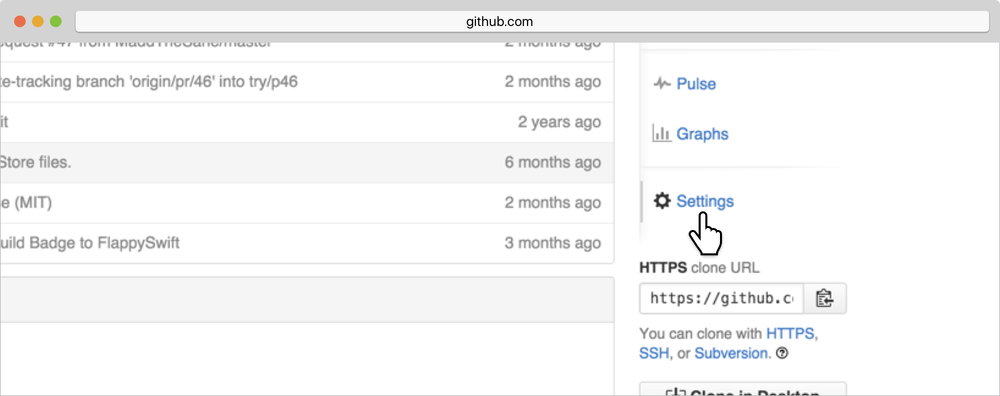
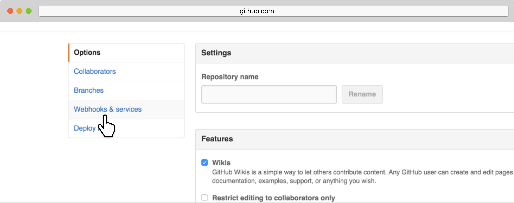
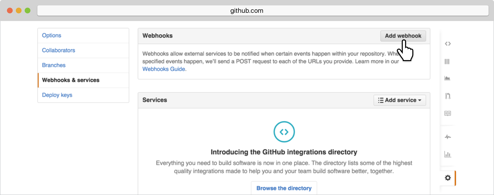
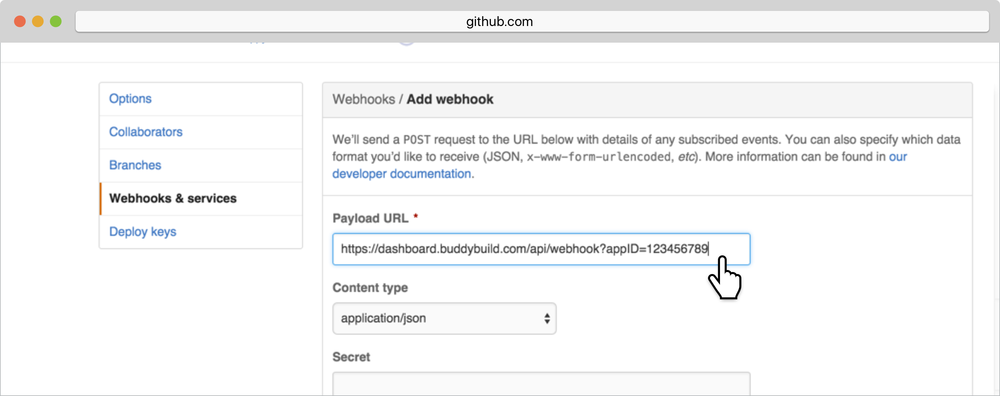
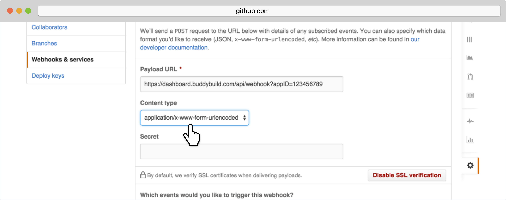
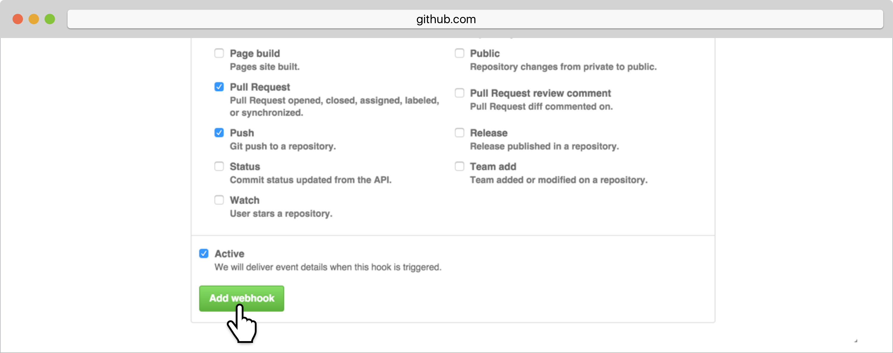

= Adding a GitHub Webhook

A webhook notifies buddybuild of code changes you make to your repo.
Whenever a new change is pushed, buddybuild will automatically kick off
a new build -- ensuring you have up-to-date build status and your
testers have the very latest builds.

Let's get started!

On the Builds page, in the red banner at the top of the page, click on
**Resolve this issue.**

image:../img/resolve-banner.png[,1500,298]

In the dialog box that appears, **select and copy the webhook URL.**
This URL is specific to your app and will be used to identify your app
when sending webhooks from GitHub.

image:../img/modal.png[,1500,838]

Navigate to your GitHub repository. In the right panel, select
**Settings**.

In the left navigation, select **Webhooks and services**.

Next, select **Add webhook.**

Paste the URL you first copied into the **Payload URL** field.

Under **Content type,** select **application/x-www-form-urlencoded.**
You can leave the **Secret** field blank.

Next, choose **let me select individual events**.

image:img/select-individual-events.png[,3000,1188]

Once that expands, select **Pull Request** and **Push.** Ensure that
**Active** is selected, and click **Add webhook**. You're now done!

